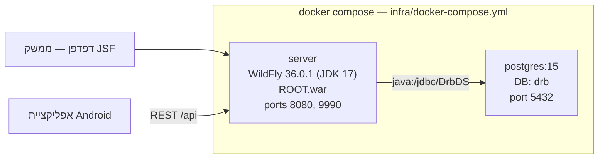

# Digital Returns Bridge — מדריך התקנה והפעלה

מסמך זה מסביר כיצד להתקין ולהפעיל את המערכת: שרת `Jakarta EE` הרץ על `WildFly` מול בסיס נתונים
`PostgreSQL`, ואפליקציית `Android` המשרתת נהגים ומחסנאים. התיאור התפקודי המלא של המערכת ותיעוד
המימוש נמצאים במסמכי ההגשה הנלווים.

---

## תוכן עניינים

1. [דרישות מוקדמות](#1-דרישות-מוקדמות)
2. [התקנה והרצה](#2-התקנה-והרצה)
3. [בסיס הנתונים](#3-בסיס-הנתונים)
4. [משתמשי ברירת מחדל להתחברות](#4-משתמשי-ברירת-מחדל-להתחברות)
5. [כתובות וגישה](#5-כתובות-וגישה)
6. [אפליקציית האנדרואיד](#6-אפליקציית-האנדרואיד)
7. [הרצת הבדיקות](#7-הרצת-הבדיקות)
8. [מבנה הפרויקט](#8-מבנה-הפרויקט)

---

## 1. דרישות מוקדמות

| רכיב | גרסה נדרשת | נחוץ עבור |
|---|---|---|
| `Docker Desktop` | 24 ומעלה, עם `Docker Compose v2` | הרצת השרת ובסיס הנתונים |
| `JDK` | 17 | קומפילציה מקומית והרצת הבדיקות |
| `Maven` | 3.9 ומעלה | בנייה מקומית של מודול `server` |
| `Android Studio` | Hedgehog‏ (2023.1) ומעלה, `Android SDK 34` | בנייה של אפליקציית האנדרואיד |
| מכשיר או אמולטור `Android` | `API 24` ומעלה | הרצת אפליקציית האנדרואיד |
| חשבון `Cloudinary` | דרגת השירות החינמית מספיקה | העלאת תמונות וחתימות |

גרסת ה-`JDK` נקבעת ב-`pom.xml` שבשורש הפרויקט (`maven.compiler.source` ו-`maven.compiler.target`
מוגדרים ל-`17`). גם שלב הבנייה בתוך `Docker` וגם תמונת ה-`runtime` משתמשים ב-`JDK 17`
(`maven:3.9-eclipse-temurin-17` ו-`quay.io/wildfly/wildfly:36.0.1.Final-jdk17` בהתאמה), ולכן בהרצה
דרך `Docker` אין צורך ב-`JDK` או ב-`Maven` מותקנים מקומית — הם נדרשים רק לבנייה מקומית ולהרצת
הבדיקות.

> **הערה על `Cloudinary`:** התמונות והחתימות אינן נשמרות בבסיס הנתונים אלא ב-`Cloudinary`. ערכי
> ברירת המחדל (`placeholder`) מאפשרים למערכת לעלות, אך כל זרימה שמעלה תמונה — יצירת קריאת החזרה,
> אישור איסוף וקליטת מחסן — תיכשל עד להזנת פרטי גישה אמיתיים.

---

## 2. התקנה והרצה

### שלב א׳ — קובץ הסביבה

כל הפקודות מורצות משורש הפרויקט. קובץ ההגדרות `infra/.env` נדרש על ידי כל פקודות ה-`make`
(ה-`Makefile` מריץ `docker compose --env-file infra/.env`), ולכן יש ליצור אותו תחילה:

```bash
cp infra/.env.example infra/.env
```

לאחר מכן יש לערוך את `infra/.env` ולהזין ערכים אמיתיים עבור `POSTGRES_PASSWORD`, שלושת המשתנים
`CLOUDINARY_CLOUD_NAME` / `CLOUDINARY_API_KEY` / `CLOUDINARY_API_SECRET`, ו-`WILDFLY_ADMIN_PASSWORD`.

### שלב ב׳ — בנייה והעלאה

```bash
make build   # בניית תמונת ה-Docker של השרת (Maven רץ בתוך התמונה)
make up      # הפעלת postgres + server ברקע
make logs    # מעקב אחר יומן השרת; המערכת מוכנה כשמופיע Deployed "ROOT.war"
```

הפעלה ראשונה אורכת כדקה: `docker compose` ממתין לבדיקת התקינות (`healthcheck`) של `PostgreSQL`
לפני שהוא מפעיל את השרת, ו-`WildFly` פורס את `ROOT.war` לאחר מכן.

### יעדי ה-`Makefile`

| פקודה | פעולה |
|---|---|
| `make build` | בניית תמונות ה-`Docker` |
| `make up` | הפעלת כל השירותים ברקע (מייצר `infra/.env` מהתבנית אם אינו קיים) |
| `make down` | עצירת השירותים, שמירת ה-`volumes` |
| `make logs` | מעקב רציף אחר יומן השרת |
| `make shell` | פתיחת מעטפת `bash` בתוך מכולת השרת |
| `make clean` | עצירה ומחיקת מכולות ו-`volumes` (כולל בסיס הנתונים), ולאחר מכן `mvn clean` |

### מה `infra/docker-compose.yml` מפעיל בפועל



שני שירותים בלבד:

- **`postgres`** — `postgres:15`, מאזין על `5432`, נתונים נשמרים ב-`volume` בשם `postgres_data`.
- **`server`** — נבנה מ-`server/Dockerfile` כאשר ההקשר (`context`) הוא שורש הפרויקט. השרת מבוסס
  `WildFly 36.0.1.Final`, מותקן בו מודול של דרייבר `JDBC` ל-`PostgreSQL`, ומקור הנתונים נרשם
  בשם ה-`JNDI‏` `java:/jdbc/DrbDS`. ה-`WAR` נפרס בשם `ROOT.war`, כלומר שורש ההקשר הוא `/` ואין
  תחילית נתיב. יומני השרת נשמרים ב-`volume` בשם `wildfly_logs`.

---

## 3. בסיס הנתונים

הסכימה נכתבה ידנית ואינה נוצרת על ידי `Hibernate`: קובץ `persistence.xml` מגדיר
`hibernate.hbm2ddl.auto=validate`, כלומר `Hibernate` רק מאמת שהמיפוי של הישויות תואם לטבלאות
הקיימות. אי-התאמה בין ישות לבין `database/schema.sql` תגרום לכשל בפריסה.

### כיצד הקבצים מוחלים

`docker-compose.yml` מחבר את שני הקבצים אל תיקיית האתחול של `PostgreSQL`:

| קובץ במאגר | שם בתוך המכולה |
|---|---|
| `database/schema.sql` | `/docker-entrypoint-initdb.d/01_schema.sql` |
| `database/seed.sql` | `/docker-entrypoint-initdb.d/02_seed.sql` |

`PostgreSQL` מריץ את הקבצים לפי סדר אלפביתי — תחילה יצירת הטבלאות והאינדקסים, אחר כך נתוני
הדגימה — **ורק כאשר ה-`volume` ריק לחלוטין**. אם `postgres_data` כבר קיים, סקריפטי האתחול
מדולגים והשינויים לא ייקלטו. לאתחול מלא מחדש:

```bash
make clean   # מוחק את המכולות ואת ה-volume, כולל כל הנתונים
make up      # volume חדש — schema ואחריו seed מורצים מחדש
```

### תיקיית `database/migrations/`

לצד `schema.sql`, שמייצג תמיד את המצב העדכני, קיימת תיקיית `database/migrations/` המיועדת
לבסיסי נתונים קיימים שאין רצון למחוק. כרגע היא מכילה קובץ אחד:

- `001-add-version.sql` — הוספת עמודת `version BIGINT NOT NULL DEFAULT 0` לטבלה `return_requests`,
  התומכת בנעילה אופטימית (`@Version` ב-`JPA`) למניעת עדכונים מתנגשים על אותה קריאת החזרה.

העמודה כלולה כבר ב-`schema.sql`, ולכן על בסיס נתונים חדש אין צורך להריץ את קובץ המיגרציה. על בסיס
נתונים ותיק יש להריץ אותו ידנית:

```bash
docker compose -f infra/docker-compose.yml exec -T postgres \
  psql -U drb -d drb < database/migrations/001-add-version.sql
```

---

## 4. משתמשי ברירת מחדל להתחברות

ההזדהות במערכת מתבצעת **באמצעות מספר טלפון בלבד, ללא סיסמה** — הן בממשק ה-`JSF` והן באפליקציית
האנדרואיד. משתמשי הדגימה הבאים מוגדרים ב-`database/seed.sql`:

| מספר טלפון | שם | תפקיד (`Role`) | מסך הבית לאחר התחברות |
|---|---|---|---|
| `0501111111` | Alice Cohen | `SERVICE_REP` — נציג שירות | `Dashboard` |
| `0502222222` | Bob Levi | `DRIVER` — נהג | רשימת איסופים (אנדרואיד) |
| `0506666666` | Dana Avraham | `DRIVER` — נהג | רשימת איסופים (אנדרואיד) |
| `0503333333` | Carol Mizrahi | `WAREHOUSE` — מחסנאי | מסך קליטת מחסן |
| `0505555555` | Eli Bar-On | `WAREHOUSE` — מחסנאי | מסך קליטת מחסן |
| `0504444444` | David Katz | `MANAGER` — מנהל | `Dashboard` |

בנוסף למשתמשים, קובץ ה-`seed` מכניס שני נהגים, 20 לקוחות ו-25 מוצרים לצורך הדגמת האשף והמסכים.

---

## 5. כתובות וגישה

הפורטים נלקחים ממיפוי הפורטים ב-`infra/docker-compose.yml`.

| כתובת | תיאור |
|---|---|
| `http://localhost:8080/login.xhtml` | מסך ההתחברות של ממשק ה-`Web` |
| `http://localhost:8080/dashboard.xhtml` | לוח המחוונים לאחר התחברות |
| `http://localhost:8080/api` | נתיב הבסיס של שירותי ה-`REST` |
| `http://localhost:9990` | קונסולת הניהול של `WildFly` |
| `localhost:5432` | `PostgreSQL` (בסיס `drb`, משתמש `drb`) |

נתיב הבסיס `‎/api` מוגדר בהערת `@ApplicationPath("/api")` שבמחלקה `JaxRsApplication`. מכיוון
שה-`WAR` נפרס כ-`ROOT.war`, אין תחילית של שם היישום בנתיב. לדוגמה, נקודת הקצה של ההתחברות היא
`POST http://localhost:8080/api/auth/login`.

מסכי ממשק ה-`Web` הזמינים:

| נתיב | מסך |
|---|---|
| `/login.xhtml` | התחברות |
| `/dashboard.xhtml` | לוח מחוונים |
| `/returns/list.xhtml` | רשימת קריאות החזרה |
| `/returns/details.xhtml` | פרטי קריאת החזרה |
| `/returns/create/identify-customer.xhtml` | אשף — שלב 1: זיהוי לקוח |
| `/returns/create/select-item.xhtml` | אשף — שלב 2: בחירת פריט |
| `/returns/create/new-return.xhtml` | אשף — שלב 3: פרטי ההחזרה |
| `/warehouse/receiving.xhtml` | קליטת מחסן |
| `/reports.xhtml` | דוחות |
| `/admin/users.xhtml`, `/admin/customers.xhtml`, `/admin/products.xhtml`, `/admin/drivers.xhtml` | ניהול נתוני מערכת |


---

## 6. אפליקציית האנדרואיד

אפליקציה אחת משרתת שני תפקידים: לאחר ההתחברות היא מנתבת משתמש בתפקיד `DRIVER` לזרימת האיסופים
ומשתמש בתפקיד `WAREHOUSE` לזרימת המחסנאי.

### הגדרת כתובת השרת

כתובת הבסיס נקבעת דרך מאפיין `Gradle` בשם `drbApiBaseUrl`. הערך נצרך ב-`android-driver-app/app/build.gradle`
ומוזרק לקוד כקבוע `BuildConfig.API_BASE_URL`:

```groovy
def drbApiBaseUrl = project.findProperty("drbApiBaseUrl") ?: "http://10.0.2.2:8080/api/"
buildConfigField "String", "API_BASE_URL", "\"${drbApiBaseUrl}\""
```

הערך בפועל מוגדר ב-`android-driver-app/gradle.properties`. **הכתובת חייבת להסתיים ב-`‎/api/`.**

- **אמולטור:** `http://10.0.2.2:8080/api/` — הכתובת `10.0.2.2` היא הכינוי של האמולטור ל-`localhost`
  של המחשב המארח.
- **מכשיר פיזי:** יש להזין את כתובת ה-`IP` של המחשב ברשת המקומית, למשל
  `http://192.168.1.50:8080/api/`. המכשיר והמחשב חייבים להיות באותה רשת, והפורט `8080` חייב להיות
  פתוח בחומת האש.

> קובץ `gradle.properties` המצורף למאגר מכיל כתובת `LAN` של סביבת הפיתוח. יש לעדכן אותה לכתובת
> המתאימה לסביבה שלכם, או לעקוף אותה בזמן הבנייה בעזרת `-PdrbApiBaseUrl=...`.

### בנייה והתקנה

```bash
cd android-driver-app
./gradlew :app:assembleDebug
# קובץ ה-APK: app/build/outputs/apk/debug/app-debug.apk
```

התקנה על מכשיר או אמולטור מחובר:

```bash
adb install app/build/outputs/apk/debug/app-debug.apk
```

לחלופין, בנייה והתקנה בפקודה אחת:

```bash
./gradlew installDebug
```

או פתיחת התיקייה `android-driver-app` ב-`Android Studio` והרצה בלחיצה על **Run**. הפרויקט משתמש
ב-`Gradle 8.4` (דרך ה-`wrapper`) וב-`Android Gradle Plugin 8.2.0`, ולכן אין צורך בהתקנת `Gradle`
בנפרד. בהפעלה הראשונה יש לאשר את הרשאת המצלמה — היא נדרשת לסריקת ברקודים ולצילום הפריטים.


---

## 7. הרצת הבדיקות

בדיקות היחידה של השרת (`JUnit 5` + `Mockito` + `AssertJ`) מורצות משורש הפרויקט:

```bash
mvn -pl server -am test
```

נכון להגשה עוברות 81 בדיקות ללא כשלים. אם `Maven` מדווח `Nothing to compile - all classes are up
to date`, ניתן לאלץ קומפילציה מלאה מחדש:

```bash
mvn -pl server -am clean test
```

בדיקות אפליקציית האנדרואיד:

```bash
cd android-driver-app
./gradlew :app:test
```

> **חבילת בדיקות ה-`end-to-end`**: תיקיית `e2e/` מכילה חבילת בדיקות `Playwright` הבודקת את ממשק
> ה-`Web` מקצה לקצה. **החבילה אינה ניתנת להרצה במצבה הנוכחי** ואינה חלק מההגשה. הממצאים שנאספו
> ממנה מתועדים ב-`docs/e2e-findings.md`, ומלאי המסכים והפקדים שנגזר ממנה
> (`e2e/inventory/routes-and-controls.ts`) עדיין מהווה מקור מדויק לרשימת המסכים.

---

## 8. מבנה הפרויקט

```
digital-returns-bridge/
├── pom.xml                  פרויקט Maven אב (JDK 17), מכיל את מודול server
├── Makefile                 עטיפה נוחה לפקודות docker compose
├── dev.sh                   סקריפט עזר לפיתוח (בנייה מחדש, יומנים, התקנת האפליקציה)
├── server/                  מודול ה-WAR של Jakarta EE 10 — JSF, JAX-RS, JPA
│   ├── Dockerfile           בנייה דו-שלבית: Maven ואחריה WildFly 36
│   └── src/main/java/com/drb/server/
│       ├── domain/          ישויות JPA וטיפוסי enum
│       ├── repository/      שכבת גישה לנתונים מעל EntityManager
│       ├── service/         לוגיקה עסקית וחריגות עסקיות
│       ├── rest/            משאבי JAX-RS, אובייקטי DTO, מיפוי חריגות ואבטחה
│       ├── web/             מחלקות גיבוי (backing beans) של JSF
│       └── cloudinary/      אינטגרציה לאחסון תמונות
│   └── src/main/webapp/     מסכי Facelets‏ (.xhtml) וגיליון העיצוב drb.css
├── android-driver-app/      אפליקציית Android מקורית בשפת Java (נהג ומחסנאי)
├── database/                schema.sql, seed.sql, erd.md ותיקיית migrations/
├── infra/                   docker-compose.yml, הגדרות WildFly וסקריפטי עזר
├── docs/                    תכנון ראשוני, ארכיטקטורה, תיעוד API ותיאורי מסכים
└── e2e/                     חבילת בדיקות Playwright (אינה ניתנת להרצה כרגע)
```
