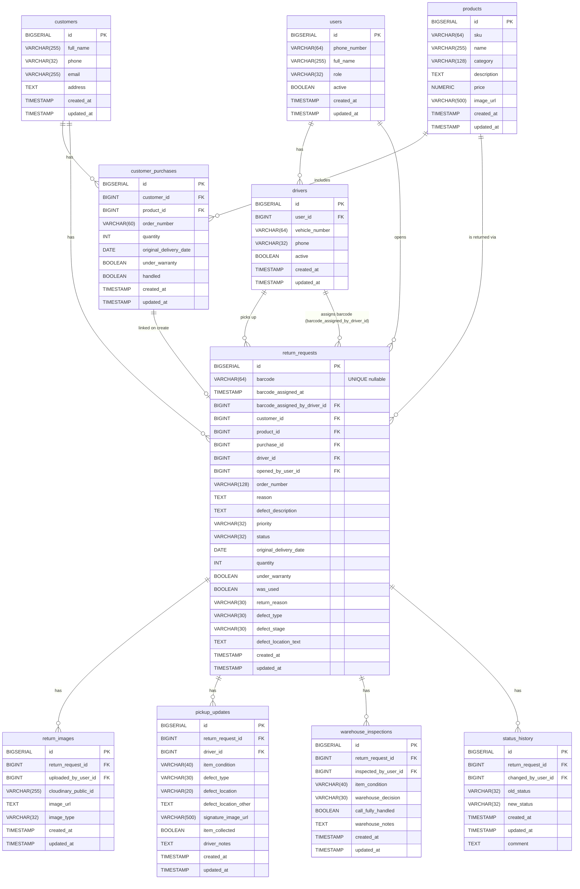

# Database ERD — Digital Returns Bridge

> **No BARCODES pool table. No rma_code field.**
> Barcodes are physical stickers; the system only records a barcode after a driver scans it onto a specific return request.

---

## Entity-Relationship Diagram

---

## Table Descriptions

### `users`
| Column       | Type         | Description                                      |
|--------------|--------------|--------------------------------------------------|
| id           | BIGSERIAL PK | Auto-generated primary key                       |
| phone_number | VARCHAR(64)  | Unique login identifier                          |
| full_name    | VARCHAR(255) | Display name                                     |
| role         | VARCHAR(32)  | Enum: SERVICE_REP, DRIVER, WAREHOUSE, MANAGER (WAREHOUSE = "Storekeeper") |
| active       | BOOLEAN      | Whether the account is active (default TRUE)     |
| created_at   | TIMESTAMP    | Row creation timestamp                           |
| updated_at   | TIMESTAMP    | Last modification timestamp                       |

---

### `customers`
| Column     | Type         | Description                  |
|------------|--------------|------------------------------|
| id         | BIGSERIAL PK | Auto-generated primary key   |
| full_name  | VARCHAR(255) | Customer full name           |
| phone      | VARCHAR(32)  | Contact phone (nullable)     |
| email      | VARCHAR(255) | Contact email (nullable)     |
| address    | TEXT         | Delivery/pickup address      |
| created_at | TIMESTAMP    | Row creation timestamp       |
| updated_at | TIMESTAMP    | Last modification timestamp  |

---

### `products`
| Column      | Type          | Description                       |
|-------------|---------------|-----------------------------------|
| id          | BIGSERIAL PK  | Auto-generated primary key        |
| sku         | VARCHAR(64)   | Unique stock-keeping unit code    |
| name        | VARCHAR(255)  | Product display name              |
| category    | VARCHAR(128)  | Product category (nullable)       |
| description | TEXT          | Long description (nullable)       |
| price       | NUMERIC(10,2) | Unit price (nullable)             |
| image_url   | VARCHAR(500)  | Catalog image URL (nullable)      |
| created_at  | TIMESTAMP     | Row creation timestamp            |
| updated_at  | TIMESTAMP     | Last modification timestamp       |

---

### `customer_purchases`
| Column                 | Type         | Description                                              |
|------------------------|--------------|----------------------------------------------------------|
| id                     | BIGSERIAL PK | Auto-generated primary key                               |
| customer_id            | BIGINT FK    | References `customers(id)` — NOT NULL                    |
| product_id             | BIGINT FK    | References `products(id)` — NOT NULL                     |
| order_number           | VARCHAR(60)  | Original order reference (nullable)                      |
| quantity               | INT          | Units purchased (nullable)                               |
| original_delivery_date | DATE         | When the product was originally delivered (nullable)    |
| under_warranty         | BOOLEAN      | Whether the item is still under warranty (nullable)     |
| handled                | BOOLEAN      | Whether a return was opened from this purchase row (default FALSE) |
| created_at             | TIMESTAMP    | Row creation timestamp                                   |
| updated_at             | TIMESTAMP    | Last modification timestamp                              |

When a return is created via the Create Return wizard with a selected purchase row, `handled` is set to `TRUE` in the same transaction and `return_requests.purchase_id` links back to this row.

---

### `drivers`
| Column         | Type        | Description                                  |
|----------------|-------------|----------------------------------------------|
| id             | BIGSERIAL PK| Auto-generated primary key                   |
| user_id        | BIGINT FK   | References `users(id)` — must be DRIVER role |
| vehicle_number | VARCHAR(64) | Vehicle plate / identifier (nullable)        |
| phone          | VARCHAR(32) | Driver contact phone (nullable)              |
| active         | BOOLEAN     | Whether driver is currently active           |
| created_at     | TIMESTAMP   | Row creation timestamp                       |
| updated_at     | TIMESTAMP   | Last modification timestamp                  |

---

### `return_requests`
| Column                        | Type         | Description                                                       |
|-------------------------------|--------------|-------------------------------------------------------------------|
| id                            | BIGSERIAL PK | Auto-generated primary key                                        |
| barcode                       | VARCHAR(64)  | Physical sticker barcode — UNIQUE, nullable until driver scans    |
| barcode_assigned_at           | TIMESTAMP    | When the barcode was scanned by the driver (nullable)             |
| barcode_assigned_by_driver_id | BIGINT FK    | References `drivers(id)` — who scanned the barcode (nullable)    |
| customer_id                   | BIGINT FK    | References `customers(id)` — NOT NULL                            |
| product_id                    | BIGINT FK    | References `products(id)` — NOT NULL                             |
| purchase_id                   | BIGINT FK    | References `customer_purchases(id)` — set when created from wizard (nullable) |
| driver_id                     | BIGINT FK    | References `drivers(id)` — assigned pickup driver (nullable)     |
| opened_by_user_id             | BIGINT FK    | References `users(id)` — service rep who opened the request      |
| order_number                  | VARCHAR(128) | Original order reference (nullable)                              |
| reason                        | TEXT         | Customer-stated reason for return (nullable)                     |
| defect_description            | TEXT         | Additional defect details (nullable)                             |
| priority                      | VARCHAR(32)  | HIGH / MEDIUM / LOW (nullable, no CHECK constraint)              |
| status                        | VARCHAR(32)  | Current lifecycle status (see Enums below)                       |
| original_delivery_date        | DATE         | When the product was originally delivered (nullable)            |
| quantity                      | INT          | Number of units being returned (nullable)                       |
| under_warranty                | BOOLEAN      | Whether the item is still under warranty (nullable)             |
| was_used                      | BOOLEAN      | Whether the customer used the item (nullable)                   |
| return_reason                 | VARCHAR(30)  | Enum: ReturnReason (see Enums below, nullable)                  |
| defect_type                   | VARCHAR(30)  | Enum: DefectType (see Enums below, nullable)                    |
| defect_stage                  | VARCHAR(30)  | Enum: DefectStage (see Enums below, nullable)                   |
| defect_location_text          | TEXT         | Free-text description of the defect location (nullable)         |
| created_at                    | TIMESTAMP    | Row creation timestamp                                           |
| updated_at                    | TIMESTAMP    | Last modification timestamp                                      |

---

### `return_images`
| Column               | Type         | Description                                           |
|----------------------|--------------|-------------------------------------------------------|
| id                   | BIGSERIAL PK | Auto-generated primary key                            |
| return_request_id    | BIGINT FK    | References `return_requests(id)` — NOT NULL           |
| uploaded_by_user_id  | BIGINT FK    | References `users(id)` (nullable)                     |
| cloudinary_public_id | VARCHAR(255) | Cloudinary asset public ID (nullable)                 |
| image_url            | TEXT         | Full Cloudinary delivery URL (nullable)               |
| image_type           | VARCHAR(32)  | Enum: ImageType — service/driver photos & signatures |
| created_at           | TIMESTAMP    | Row creation timestamp                                |
| updated_at           | TIMESTAMP    | Last modification timestamp                           |

---

### `pickup_updates`
| Column                | Type         | Description                                          |
|-----------------------|--------------|------------------------------------------------------|
| id                    | BIGSERIAL PK | Auto-generated primary key                           |
| return_request_id     | BIGINT FK    | References `return_requests(id)` — NOT NULL          |
| driver_id             | BIGINT FK    | References `drivers(id)` (nullable)                  |
| item_condition        | VARCHAR(40)  | Enum: ItemCondition — NOT NULL (renamed from package_condition) |
| defect_type           | VARCHAR(30)  | Enum: DefectType (see Enums below, nullable)         |
| defect_location       | VARCHAR(20)  | Enum: DefectLocation (see Enums below, nullable)     |
| defect_location_other | TEXT         | Free-text location when defect_location = OTHER (nullable) |
| signature_image_url   | VARCHAR(500) | Driver's drawn-signature image URL (nullable)        |
| item_collected        | BOOLEAN      | Whether driver physically collected the item         |
| driver_notes          | TEXT         | Free-text notes from driver                          |
| created_at            | TIMESTAMP    | Row creation timestamp                               |
| updated_at            | TIMESTAMP    | Last modification timestamp                          |

---

### `warehouse_inspections`
| Column               | Type        | Description                                              |
|----------------------|-------------|----------------------------------------------------------|
| id                   | BIGSERIAL PK| Auto-generated primary key                               |
| return_request_id    | BIGINT FK   | References `return_requests(id)` — NOT NULL              |
| inspected_by_user_id | BIGINT FK   | References `users(id)` (nullable)                        |
| item_condition       | VARCHAR(40) | Enum: ItemCondition (see Enums below, nullable)          |
| warehouse_decision   | VARCHAR(30) | Enum: WarehouseDecision — routing classification        |
| call_fully_handled   | BOOLEAN     | Whether the customer call was fully handled (nullable)  |
| warehouse_notes      | TEXT        | Free-text inspection notes                               |
| created_at           | TIMESTAMP   | Row creation timestamp                                   |
| updated_at           | TIMESTAMP   | Last modification timestamp                              |

---

### `status_history`
| Column             | Type        | Description                                           |
|--------------------|-------------|-------------------------------------------------------|
| id                 | BIGSERIAL PK| Auto-generated primary key                            |
| return_request_id  | BIGINT FK   | References `return_requests(id)` — NOT NULL           |
| changed_by_user_id | BIGINT FK   | References `users(id)` (nullable)                     |
| old_status         | VARCHAR(32) | Status before transition (nullable for initial entry) |
| new_status         | VARCHAR(32) | Status after transition                               |
| created_at         | TIMESTAMP   | When the transition occurred (row creation timestamp) |
| updated_at         | TIMESTAMP   | Last modification timestamp                           |
| comment            | TEXT        | Optional note about the reason for the change         |

---

## Indexes

| Index Name                                    | Table                  | Column(s)         | Notes                       |
|-----------------------------------------------|------------------------|-------------------|-----------------------------|
| idx_customer_purchases_customer_id            | customer_purchases     | customer_id       |                             |
| idx_customer_purchases_product_id             | customer_purchases     | product_id        |                             |
| idx_customer_purchases_handled                | customer_purchases     | handled           |                             |
| idx_return_requests_purchase_id               | return_requests        | purchase_id       |                             |
| idx_return_requests_barcode                   | return_requests        | barcode           | Partial: WHERE barcode IS NOT NULL |
| idx_return_requests_status                    | return_requests        | status            |                             |
| idx_return_requests_driver_id                 | return_requests        | driver_id         |                             |
| idx_return_requests_customer_id               | return_requests        | customer_id       |                             |
| idx_return_images_return_request_id           | return_images          | return_request_id |                             |
| idx_pickup_updates_return_request_id          | pickup_updates         | return_request_id |                             |
| idx_warehouse_inspections_return_request_id   | warehouse_inspections  | return_request_id |                             |
| idx_status_history_return_request_id          | status_history         | return_request_id |                             |

---

## Enum CHECK Constraints

### `users.role`
| Value       | Description                          |
|-------------|--------------------------------------|
| SERVICE_REP | Customer-facing service representative |
| DRIVER      | Field driver who collects returns    |
| WAREHOUSE   | Warehouse staff ("Storekeeper") who inspect items. Served by both the JSF web `warehouse/receiving.xhtml` screen and the Android app (mobile storekeeper flow); both reuse this same role — no separate enum value exists or is needed. |
| MANAGER     | Management / admin access            |

### `return_requests.status`
| Value                | Description                                              |
|----------------------|----------------------------------------------------------|
| OPEN                 | Return request created, awaiting action                  |
| WAITING_FOR_PICKUP   | Driver assigned, scheduled for pickup                    |
| BARCODE_ASSIGNED     | Driver scanned a physical barcode onto this request      |
| PICKED_UP            | Driver collected the item from customer                  |
| ARRIVED_TO_WAREHOUSE | Item delivered to warehouse                              |
| INSPECTED            | Warehouse completed inspection                           |
| CLOSED               | Return fully processed                                   |
| NEEDS_MORE_INFO      | Awaiting additional information before proceeding        |

### `return_images.image_type` (ImageType)
| Value                 | Description                                          |
|-----------------------|------------------------------------------------------|
| SERVICE_GENERAL_IMAGE | General product photo taken by the service rep       |
| SERVICE_DEFECT_IMAGE  | Focused defect photo taken by the service rep        |
| SERVICE_REP_SIGNATURE | Service rep's drawn signature                         |
| DRIVER_PRODUCT_IMAGE  | Product photo taken by the driver at pickup          |
| DRIVER_DISTANT_IMAGE  | Distant / contextual photo taken by the driver       |
| DRIVER_DEFECT_IMAGE   | Close-up defect photo taken by the driver            |
| DRIVER_SIGNATURE      | Driver's drawn signature                             |
| WAREHOUSE_IMAGE       | Photo taken by warehouse during inspection           |

### `pickup_updates.item_condition` / `warehouse_inspections.item_condition` (ItemCondition)
| Value                       | Description                                          |
|-----------------------------|------------------------------------------------------|
| LIKE_NEW_ORIGINAL_PACKAGING | Like new, in original packaging                      |
| LIKE_NEW_NO_PACKAGING       | Like new, without original packaging                 |
| USED                        | Used, no notable defects                             |
| USED_MINOR_DEFECT           | Used with a minor defect                             |
| SIGNIFICANTLY_DEFECTIVE     | Significantly defective                              |

### `return_requests.return_reason` (ReturnReason)
| Value             | Description                                  |
|-------------------|----------------------------------------------|
| NOT_AS_EXPECTED   | Product not as the customer expected         |
| DELIVERY_ERROR    | Error during delivery                        |
| SELLER_ERROR      | Error attributable to the seller             |
| SUPPLIER_ERROR    | Error attributable to the supplier           |
| WAREHOUSE_ERROR   | Error attributable to the warehouse          |
| DRIVER_ERROR      | Error attributable to the driver             |
| CUSTOMER_NOT_HOME | Customer was not home for delivery           |
| PRODUCT_DEFECT    | Product is defective                         |

### `return_requests.defect_type` / `pickup_updates.defect_type` (DefectType)
| Value            | Description                |
|------------------|----------------------------|
| TEAR             | Torn material              |
| SCRATCH          | Surface scratch            |
| BREAK            | Broken / cracked           |
| MISSING_PART     | A part is missing          |
| FADED_COLOR      | Faded or discolored        |
| RUST             | Rust / corrosion           |
| DENT             | Dented                     |
| REVERSED_SIDE    | Assembled on reversed side |
| ELECTRONIC_FAULT | Electronic / functional fault |

### `return_requests.defect_stage` (DefectStage)
| Value            | Description                              |
|------------------|------------------------------------------|
| INITIAL_SHIPPING | Defect present at initial shipping       |
| AFTER_USE        | Defect appeared after use                |
| MISSING_PART     | A part was missing                       |

### `pickup_updates.defect_location` (DefectLocation)
| Value      | Description            |
|------------|------------------------|
| RIGHT_SEAT | Right seat             |
| LEFT_SEAT  | Left seat              |
| SEAT       | Seat                   |
| LEGS       | Legs                   |
| BACK       | Back                   |
| OTHER      | Other (see free text)  |

### `warehouse_inspections.warehouse_decision` (WarehouseDecision)
| Value                   | Description                                     |
|-------------------------|-------------------------------------------------|
| STOCK_AS_NEW_114        | Return to stock as new (route 114)              |
| CLASS_B                 | Classify as Class B stock                       |
| SHAPIIM_155             | Route to refurbishment (Shapiim, route 155)     |
| REDESIGN_208            | Route to redesign (route 208)                   |
| FROZEN_FURTHER_HANDLING | Frozen, pending further handling                |
| REPAIR                  | Send for repair                                 |
| DISPOSE                 | Item must be discarded                          |
