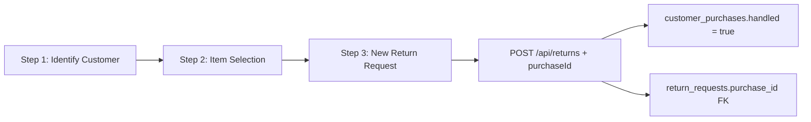
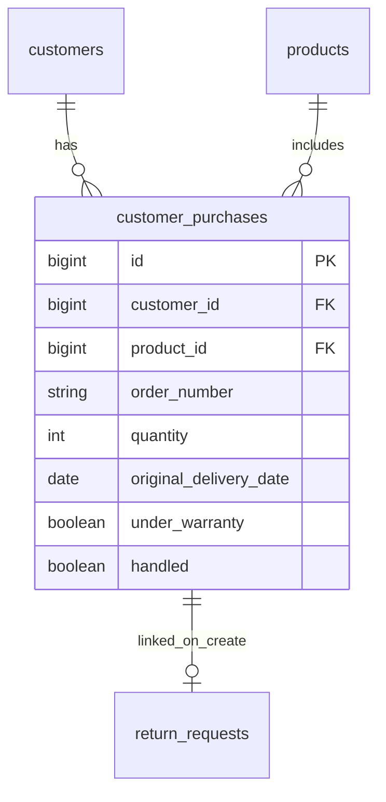

# Digital Returns Bridge — Architecture

## Overview

Digital Returns Bridge is a Jakarta EE 10 monorepo for managing reverse-logistics return requests. It has two client types:

- **JSF Web UI** — used by Service Reps, Warehouse staff (storekeepers), and Managers (runs inside the server WAR)
- **Android App** — **multi-role**: used by both drivers (pickup flow) and storekeepers / `WAREHOUSE` staff (warehouse receiving + inspection flow). It communicates via the REST API and routes by role after login (`DRIVER` → pickup screens, `WAREHOUSE` → storekeeper screens). Driver ID resolution uses `DriverIdResolver` (`userId` → `drivers.id`).

> The **storekeeper** (`WAREHOUSE` role) is served by **both** clients: the Android app and the JSF web Warehouse Receiving screen (`/warehouse/receiving.xhtml`), which remain interchangeable clients of the same role-restricted warehouse endpoints (`@RolesAllowed WAREHOUSE/MANAGER`).

> **UI**: All 24 Figma frames have code counterparts. Pixel-perfect styling is applied via `resources/css/drb.css` (web) and Android theme resources. See [figma-ui-gaps.md](figma-ui-gaps.md) — no gaps identified.

## Technology Stack

| Layer | Technology |
|---|---|
| Runtime | WildFly 30+, Java 17 |
| Build | Maven (server), Gradle (Android) |
| Web UI | JSF 4 (Mojarra) + PrimeFaces 13 + `drb.css` (Figma design tokens) |
| REST API | JAX-RS 3.1 (RESTEasy) |
| Persistence | JPA / Hibernate 6, PostgreSQL |
| CDI | Jakarta CDI 4 |
| Image storage | Cloudinary (`cloudinary-http5`) |
| Authentication | Phone-only login, in-memory `TokenStore` (UUID tokens) |
| Android | Java, Retrofit 2, OkHttp, Gson, Glide, ZXing |

## Layered Architecture

```
┌─────────────────────────────────────────────────────────────┐
│  Clients                                                      │
│  ┌──────────────────────┐   ┌──────────────────────────────┐ │
│  │  JSF / PrimeFaces UI │   │  Android App (multi-role)    │ │
│  │  (Backing Beans)     │   │  (Retrofit → REST API)       │ │
│  └──────────┬───────────┘   └──────────────┬───────────────┘ │
└─────────────┼─────────────────────────────-┼─────────────────┘
              │ CDI injection                │ HTTP/JSON
┌─────────────▼──────────────────────────────▼─────────────────┐
│  Server (WildFly WAR)                                         │
│  ┌─────────────────────────────────────────────────────────┐ │
│  │  REST Layer (JAX-RS 3.1)                                │ │
│  │  AuthFilter • AuthResource • UserResource               │ │
│  │  CustomerResource • ProductResource • DriverResource    │ │
│  │  ReturnResource • ImageResource • WarehouseResource     │ │
│  │  WarehouseInspectionResource • PickupUpdateResource     │ │
│  │  ReportsResource                                        │ │
│  └────────────────────────┬────────────────────────────────┘ │
│  ┌─────────────────────────▼──────────────────────────────┐  │
│  │  Service Layer (CDI ApplicationScoped)                  │  │
│  │  AuthService • UserService • CustomerService           │  │
│  │  CustomerPurchaseService • ProductService              │  │
│  │  DriverService • ReturnRequestService                  │  │
│  │  PickupUpdateService • WarehouseService • ImageService   │  │
│  │  ReportsService • CloudinaryImageService               │  │
│  └────────────────────────┬────────────────────────────────┘ │
│  ┌─────────────────────────▼──────────────────────────────┐  │
│  │  Repository Layer (JPA / EntityManager)                 │  │
│  │  UserRepository • CustomerRepository • ProductRepo     │  │
│  │  CustomerPurchaseRepository • DriverRepository         │  │
│  │  ReturnRequestRepository • ReturnImageRepository       │  │
│  │  PickupUpdateRepository • WarehouseInspectionRepo      │  │
│  │  StatusHistoryRepository                               │  │
│  └────────────────────────┬────────────────────────────────┘ │
└───────────────────────────┼────────────────────────────────--┘
                            │ JPA / JDBC
              ┌─────────────▼──────────┐   ┌──────────────────┐
              │  PostgreSQL 15          │   │  Cloudinary CDN  │
              └────────────────────────┘   └──────────────────┘
```

## Package Layout (server module)

```
com.drb.server
├── cloudinary/          CloudinaryConfig, CloudinaryImageService, UploadResult
├── domain/              JPA entities (incl. CustomerPurchase)
│   └── enums/           Role, ReturnStatus, ItemCondition, ReturnReason,
│                        DefectType, DefectStage, DefectLocation,
│                        WarehouseDecision, ImageType
├── repository/          JPA repository classes (EntityManager-based)
├── service/             Business logic services
│   └── exception/       NotFoundException, ValidationException, IllegalStatusTransitionException
├── rest/                JAX-RS resources
│   ├── dto/             Request/Response DTOs
│   ├── exception/       ErrorEnvelope, ExceptionMappers
│   └── security/        AuthFilter, TokenStore
└── web/                 JSF backing beans + RoleAuthFilter
                         (CreateReturnWizardBean for 3-step wizard)
```

## Create Return Wizard & Purchase History

Service reps open returns through a **3-step JSF wizard** backed by `CreateReturnWizardBean`:

1. **Identify Customer** — phone lookup via `GET /api/customers/by-phone/{phone}`
2. **Item Selection** — purchase table via `GET /api/customers/{customerId}/purchases` (`customer_purchases` rows)
3. **New Return Request** — checklist, photos, signature; submit with `purchaseId`



When `purchaseId` is sent on `POST /api/returns`, `ReturnRequestService.create()`:
- Validates purchase belongs to the same customer/product
- Links `return_requests.purchase_id`
- Pre-fills order number, delivery date, quantity, warranty from the purchase if omitted
- Sets `customer_purchases.handled = true` in the same transaction



## Authentication Flow

1. Client POSTs `{ phoneNumber }` to `POST /api/auth/login`
2. `AuthService` looks up the user by phone, validates `active == true`
3. `TokenStore` issues a random UUID token and stores the `User` → token mapping in memory
4. All subsequent requests must include `Authorization: Bearer <token>`
5. `AuthFilter` (`@PreMatching`) intercepts every request, looks up the token in `TokenStore`, and injects a `SecurityContext` + `authenticatedUser` property into the `ContainerRequestContext`

## Barcode Flow (core domain concept)

The system **does not** maintain a barcode pool or generate barcodes. Barcodes are physical stickers the driver carries.

```
Service Rep                Driver (Android)               Warehouse
     │                           │                              │
     │ POST /api/returns         │                              │
     │ (no barcode)              │                              │
     │──────────────────►        │                              │
     │                           │                              │
     │                  Sticks physical label on item           │
     │                           │                              │
     │                  PATCH /api/returns/{id}/assign-barcode  │
     │                  { barcode, driverId }                   │
     │                           │──────────────────────────►   │
     │                           │  status → BARCODE_ASSIGNED   │
     │                           │                              │
     │                           │ POST /api/returns/{id}/      │
     │                           │   pickup-confirmation        │
     │                           │──────────────────────────►   │
     │                           │  status → PICKED_UP          │
     │                                                          │
     │                     GET /api/warehouse/returns/{barcode} │
     │                                               ◄──────────│
     │                     POST /api/warehouse/arrivals/{barcode}│
     │                                               ◄──────────│
     │                          status → ARRIVED_TO_WAREHOUSE   │
```

## Status Transition Diagram

```
                    ┌──────────────┐
                    │     OPEN     │
                    └──────┬───┬──┘
                           │   └──────────────────────┐
                           ▼                           ▼
               ┌──────────────────────┐    ┌──────────────────┐
               │  WAITING_FOR_PICKUP  │    │  NEEDS_MORE_INFO │
               └──────────┬───────────┘    └────────┬─────────┘
                          │                         │
                          ▼                         │
               ┌──────────────────────┐◄────────────┘
               │   BARCODE_ASSIGNED   │  (back to WAITING_FOR_PICKUP)
               └──────────┬───────────┘
                          │
                          ▼
               ┌──────────────────────┐
               │      PICKED_UP       │
               └──────────┬───────────┘
                          │
                          ▼
               ┌──────────────────────┐    "Request More Info"
               │ ARRIVED_TO_WAREHOUSE │──────────────────────┐
               └──────────┬───────────┘                      ▼
                          │                       ┌──────────────────┐
                          │                       │  NEEDS_MORE_INFO │
                          ▼                       └──────────────────┘
               ┌──────────────────────┐
               │      INSPECTED       │
               └──────────┬───────────┘
                          │
                          ▼
               ┌──────────────────────┐
               │       CLOSED         │
               └──────────────────────┘
```

**Allowed transitions** (`ReturnRequestService.ALLOWED_TRANSITIONS`):

| From | To |
|---|---|
| `OPEN` | `WAITING_FOR_PICKUP`, `NEEDS_MORE_INFO` |
| `WAITING_FOR_PICKUP` | `BARCODE_ASSIGNED` |
| `BARCODE_ASSIGNED` | `PICKED_UP` |
| `PICKED_UP` | `ARRIVED_TO_WAREHOUSE` |
| `ARRIVED_TO_WAREHOUSE` | `INSPECTED`, `NEEDS_MORE_INFO` |
| `INSPECTED` | `CLOSED` |
| `NEEDS_MORE_INFO` | `WAITING_FOR_PICKUP` |
| `CLOSED` | — (terminal) |

> The `ARRIVED_TO_WAREHOUSE → NEEDS_MORE_INFO` edge backs the warehouse receiving screen's **"Request More Info"** button (`WarehouseService.requestMoreInfo`), letting warehouse staff send an already-arrived return back into the missing-info queue without a manual status override.

## Key Design Decisions

- **No barcode pool**: `return_requests.barcode` is nullable and unique. A barcode exists in the system only after a driver scans and assigns it.
- **Pickup confirmation requires `BARCODE_ASSIGNED`**: A driver cannot confirm pickup until a barcode has been assigned to the return.
- **In-memory token store**: Tokens are stored in a `ConcurrentHashMap` inside an `@ApplicationScoped` CDI bean. Tokens are lost on server restart (acceptable for a workshop project).
- **Images via Cloudinary**: The image binary is stored in Cloudinary; the database stores only the URL and `cloudinary_public_id`.
- **Checklist taxonomy**: The enums (`ItemCondition`, `ReturnReason`, `DefectType`, `DefectStage`, `DefectLocation`, and the remapped `WarehouseDecision`/`ImageType`) mirror the operational service-rep / driver / warehouse checklists. The same value strings are shared across the SQL `CHECK` constraints, the JPA enums, the JSF dropdowns, and the Android spinners; because `persistence.xml` runs `hibernate.hbm2ddl.auto=validate`, any drift fails deployment.
- **`package_condition` → `item_condition`**: The old `PackageCondition` enum was removed; `pickup_updates.package_condition` is now `item_condition` in the schema and uses the richer `ItemCondition` value set, also reused by `warehouse_inspections`.
- **Structured checklist fields**: `return_requests` gained service-rep fields (`original_delivery_date`, `quantity`, `under_warranty`, `was_used`, `return_reason`, `defect_type`, `defect_stage`, `defect_location_text`) plus optional `purchase_id` FK; `customer_purchases` stores order history with `handled` flag; `pickup_updates` gained driver defect-assessment fields (`defect_type`, `defect_location`, `defect_location_other`); `warehouse_inspections` gained `item_condition` and `call_fully_handled`; `products` gained a catalog `image_url`. See `database/erd.md` for the full schema.
- **Drawn signatures**: Service-rep and driver signatures are captured as drawings (JSF `<p:signature>` pad, Android `SignatureView` canvas) and stored like any other image — uploaded to Cloudinary and tagged `SERVICE_REP_SIGNATURE` / `DRIVER_SIGNATURE` (the driver URL is also denormalized onto `pickup_updates.signature_image_url`).
- **Cloudinary now effectively required**: Catalog images, multi-image service docs, and drawn signatures all depend on Cloudinary being configured.
- **Audit timestamps everywhere**: Every table/entity carries `created_at` and `updated_at`, auto-managed by JPA `@PrePersist`/`@PreUpdate` hooks, to support future statistics (record age, last-modified). `status_history` uses `created_at` (formerly `changed_at`) as its transition timestamp.
- **Single schema + seed (no migrations)**: The app is not live, so the database is defined by one init file (`database/schema.sql`) and one seed file (`database/seed.sql`); both always reflect the latest desired state. `infra/docker-compose.yml` mounts them as `01_schema.sql` / `02_seed.sql` into the postgres `initdb` directory.
