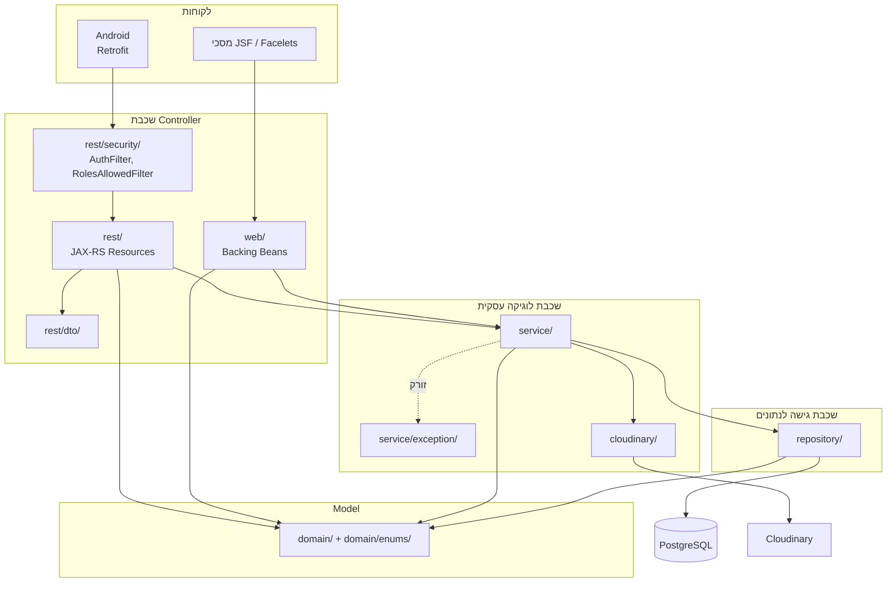
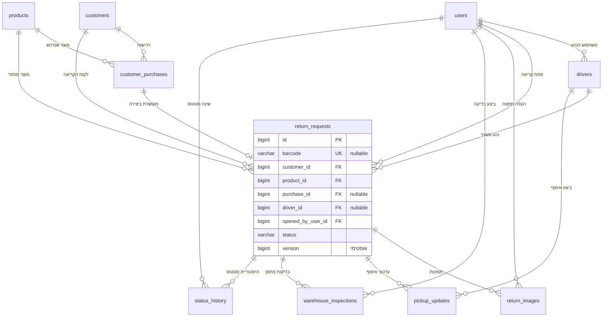

# מסמך תכנון

## מערכת Digital Returns Bridge — מבנה המערכת, המחלקות והקשרים ביניהם

---

## 1. תיאור כללי

המערכת מנהלת את תהליך החזרת המוצרים במרכז לוגיסטי, מרגע פניית הלקוח ועד לסגירת הקריאה במחסן. היא בנויה משני לקוחות מול שרת אחד: ממשק `Web` מבוסס `JSF` המשרת נציגי שירות, מחסנאים ומנהלים, ואפליקציית `Android` המשרתת נהגים ומחסנאים בשטח. שני הלקוחות עובדים מול אותה שכבת לוגיקה עסקית ואותו בסיס נתונים.

### מינוחים

| מונח | משמעות | ייצוג בקוד |
|---|---|---|
| קריאת החזרה | היחידה המרכזית במערכת — בקשה להחזרת פריט אחד מלקוח אחד | `ReturnRequest` |
| רכישה | שורה בהיסטוריית הרכישות של הלקוח, שממנה נפתחת הקריאה | `CustomerPurchase` |
| ברקוד | מדבקה פיזית שהנהג מדביק על המוצר וסורק באפליקציה | שדה `barcode` |
| סטטוס | מצב הקריאה במחזור החיים שלה | `ReturnStatus` |
| בדיקת מחסן | רשומת הבדיקה שמבצע המחסנאי בעת הקליטה | `WarehouseInspection` |
| עדכון איסוף | רשומת אישור האיסוף שיוצר הנהג בשטח | `PickupUpdate` |

## 2. טכנולוגיות בשימוש

| רכיב | טכנולוגיה |
|---|---|
| שפה ופלטפורמה | `Java 17`, `Jakarta EE 10` |
| שרת יישומים | `WildFly 36.0.1` |
| ממשק משתמש `Web` | `JSF 4` (`Facelets`) עם `PrimeFaces` |
| שירותי `API` | `JAX-RS` (`RESTEasy`) |
| התמדה | `JPA 3.1` / `Hibernate 6.6` |
| בסיס נתונים | `PostgreSQL 15` |
| הזרקת תלויות | `CDI 4` |
| ולידציה | `Jakarta Bean Validation` |
| אפליקציה ניידת | `Android` מקורי ב-`Java`, `Retrofit 2`, `Gson`, `Glide`, `ZXing` |
| אחסון תמונות | `Cloudinary` |
| בנייה | `Maven` (שרת), `Gradle` (אנדרואיד) |
| בדיקות | `JUnit 5`, `Mockito`, `AssertJ`, `Playwright` |

---

## 3. ארכיטקטורת שכבות

השרת בנוי בחמש שכבות בתוך החבילה `com.drb.server`. כל שכבה פונה כלפי מטה בלבד.

| שכבה | חבילה | תפקיד | פונה אל |
|---|---|---|---|
| **Model — דומיין** | `domain/`, `domain/enums/` | ישויות `JPA` וטקסונומיות. ללא לוגיקה עסקית | — |
| **גישה לנתונים** | `repository/` | עטיפות דקות סביב `EntityManager`, שאילתות `JPQL` | `domain/` |
| **לוגיקה עסקית** | `service/` | כללי המערכת: מעברי סטטוס, שיוך ברקוד, קישור רכישה, דוחות | `repository/`, `domain/` |
| **Controller — Web** | `web/` | `backing beans` של `JSF`, פילטר וסיוע לתצוגה | `service/`, `domain/` |
| **Controller — API** | `rest/` | משאבי `JAX-RS`, `DTOs`, ממפי חריגות ואימות | `service/`, `domain/` |
| שירות תשתית | `cloudinary/` | העלאת קבצים לספק חיצוני | ספריית `Cloudinary` |

### 3.1 דיאגרמת הרכיבים

### 3.2 הפרדת השכבות

ההפרדה נשמרת בקוד באמצעות ארבעה כללים:

1. **אף מחלקת `Controller` אינה מחזיקה `EntityManager`.** ההערה `@PersistenceContext` אינה מופיעה באף מחלקה תחת `web/` או `rest/` — היא מוגבלת לעשר מחלקות ה-`repository/`, ובנוסף ל-`ReportsService` המריץ שאילתות אגרגציה ישירות. `backing bean` או משאב `JAX-RS` שרוצה נתונים חייב לעבור דרך שירות.
2. **אף מחלקת `Repository` אינה מכילה כלל עסקי.** בדיקת חוקיות מעבר סטטוס, שיוך רכישה ללקוח וההחלטה מתי לסמן רכישה כמטופלת — כולן בשכבת השירות.
3. **שכבת הדומיין אינה יודעת דבר על השכבות שמעליה.** לישויות אין תלות ב-`JAX-RS`, ב-`JSF` או ב-`DTOs`.
4. **שני ה-`Controllers` חולקים שכבת לוגיקה אחת.** מסך קליטת המחסן ב-`JSF` ומסך הבדיקה ב-`Android` קוראים לאותו `WarehouseService`, ולכן אין שכפול של כלל עסקי בין הערוצים.

בכיוון ההפוך, השירותים אינם יודעים מיהו הקורא: הם אינם נוגעים ב-`FacesContext` ואינם בונים תשובות `HTTP`. תרגום השגיאה לפורמט הערוץ נעשה בשכבת ה-`Controller`.

---

## 4. בסיס הנתונים

הסכימה נכתבה ידנית ואינה נוצרת על ידי `Hibernate`: `persistence.xml` מגדיר `hibernate.hbm2ddl.auto=validate`, כלומר `Hibernate` רק מאמת שהמיפוי תואם לטבלאות הקיימות.

### 4.1 דיאגרמת ERD

### 4.2 הטבלאות

| הטבלה | תוכן | קשרים מרכזיים |
|---|---|---|
| `users` | משתמשי המערכת ותפקידם. הטלפון ייחודי ומשמש לזיהוי | מקור ל-`drivers` ולשדות "בוצע על ידי" |
| `customers` | לקוחות | `1:N` אל `customer_purchases` ואל `return_requests` |
| `products` | קטלוג המוצרים, כולל `SKU` ייחודי ותמונת קטלוג | `1:N` אל `customer_purchases` ואל `return_requests` |
| `drivers` | הרחבת נהג של משתמש קיים — רכב וטלפון | `N:1` אל `users` |
| `customer_purchases` | היסטוריית הרכישות; המקור לשלב 2 באשף. השדה `handled` מונע פתיחת שתי קריאות על אותה רכישה | `N:1` אל `customers` ואל `products` |
| **`return_requests`** | **הטבלה המרכזית.** פרטי הקריאה, הברקוד, הסטטוס, הסיווג ועמודת `version` לנעילה אופטימית | `N:1` אל `customers`, `products`, `customer_purchases`, `drivers`, `users` |
| `return_images` | תמונות וחתימות; מאוחסנות ב-`Cloudinary` ובטבלה נשמרת הכתובת בלבד | `N:1` אל `return_requests` |
| `pickup_updates` | רשומת אישור האיסוף של הנהג | `N:1` אל `return_requests` ואל `drivers` |
| `warehouse_inspections` | רשומת בדיקת המחסן וההחלטה | `N:1` אל `return_requests` ואל `users` |
| `status_history` | יומן ביקורת: כל מעבר סטטוס, מתי, ממה למה ועל ידי מי | `N:1` אל `return_requests` ואל `users` |

---

## 5. תיאור החבילות והמחלקות

### 5.1 `domain` — ישויות JPA

עשר ישויות. כולן משתמשות ב-`@Id @GeneratedValue(IDENTITY)`, ב-`@ManyToOne(fetch = LAZY)` לקשרים, וב-`@PrePersist`/`@PreUpdate` לניהול חותמות הזמן.

| המחלקה | אחריות | קשרים |
|---|---|---|
| `User` | משתמש המערכת ותפקידו | מפנים אליו `Driver`, `ReturnRequest`, `ReturnImage`, `WarehouseInspection`, `StatusHistory` |
| `Customer` | הלקוח שממנו נאסף המוצר | `1:N` אל `CustomerPurchase` ואל `ReturnRequest` |
| `Product` | פריט בקטלוג | `1:N` אל `CustomerPurchase` ואל `ReturnRequest` |
| `Driver` | הרחבת נהג של משתמש קיים | `N:1` אל `User`; `1:N` אל `ReturnRequest` ואל `PickupUpdate` |
| `CustomerPurchase` | שורת היסטוריית רכישות | `N:1` אל `Customer` ואל `Product` |
| **`ReturnRequest`** | **ישות הליבה.** מחזיקה את הברקוד, הסטטוס, הסיווג ואת עמודת `@Version` | `N:1` אל חמש ישויות; `1:N` אל התמונות, האיסופים, הבדיקות וההיסטוריה |
| `ReturnImage` | תמונה או חתימה, עם סוג התמונה וכתובתה ב-`Cloudinary` | `N:1` אל `ReturnRequest` ואל `User` |
| `PickupUpdate` | אישור האיסוף של הנהג | `N:1` אל `ReturnRequest` ואל `Driver` |
| `WarehouseInspection` | הבדיקה וההחלטה במחסן | `N:1` אל `ReturnRequest` ואל `User` |
| `StatusHistory` | שורה ביומן מעברי הסטטוס | `N:1` אל `ReturnRequest` ואל `User` |

### 5.2 `domain.enums` — טקסונומיות

תשעה `enums` המגדירים את אוצר המילים של המערכת: `Role` (ארבעת התפקידים), `ReturnStatus` (שמונת מצבי הקריאה), `ReturnReason`, `DefectType`, `DefectStage`, `DefectLocation`, `ItemCondition`, `WarehouseDecision` ו-`ImageType` (סוגי התמונות והחתימות). רמת הדחיפות (`priority`) אינה `enum` אלא עמודת מחרוזת חופשית. כולם ממופים ב-`@Enumerated(STRING)`, וערכיהם מגובים באילוצי `CHECK` בבסיס הנתונים כך שקוד ובסיס נתונים אינם יכולים להיפרד.

### 5.3 `repository` — שכבת הגישה לנתונים

עשר מחלקות `@ApplicationScoped`, אחת לכל ישות. כל אחת מזריקה `@PersistenceContext EntityManager` וחושפת פעולות `find`, `findAll`, `save` ו-`delete`, לצד שאילתות `JPQL` ייעודיות — למשל `findByPhoneNumber` ב-`UserRepository`, `findByBarcode` ו-`findByIdForUpdate` (נעילה פסימית) ב-`ReturnRequestRepository`, ו-`findByCustomerId` ב-`CustomerPurchaseRepository`. אין בהן שום כלל עסקי.

### 5.4 `service` — שכבת הלוגיקה העסקית

שלוש-עשרה מחלקות `@ApplicationScoped`. מתודות המשנות נתונים מסומנות `@Transactional`.

| המחלקה | אחריות |
|---|---|
| `AuthService` | התחברות לפי מספר טלפון, אימות שהמשתמש פעיל והנפקת טוקן |
| `UserService`, `CustomerService`, `ProductService`, `DriverService` | פעולות `CRUD` על נתוני הבסיס |
| `CustomerPurchaseService` | היסטוריית הרכישות עבור שלב 2 באשף |
| **`ReturnRequestService`** | **מחלקת הליבה.** מחזיקה את טבלת המעברים המותרים בין הסטטוסים, את שיוך הברקוד, את קישור הרכישה ואת גילוי התנגשויות העדכון. מזריקה תשעה מאגרים |
| `WarehouseService` | קליטת מחסן; מאצילה כל מעבר סטטוס ל-`ReturnRequestService` |
| `PickupUpdateService`, `WarehouseInspectionService` | עדכון רשומות איסוף ובדיקה קיימות |
| `ImageService` | תזמור העלאת תמונה: קריאת הקובץ, שליחה ל-`Cloudinary` ושמירת הכתובת כישות |
| `ReportsService` | חישובי הדשבורד והדוחות באמצעות שאילתות אגרגציה |
| `EnumParser` | מחלקת עזר סטטית הממירה מחרוזת ל-`enum`, ומחליפה את `IllegalArgumentException` בחריגת ולידציה הכוללת את רשימת הערכים החוקיים |

**שני התהליכים המורכבים ב-`ReturnRequestService`:**

*יצירת קריאה עם קישור לרכישה* — טוענת את הלקוח, המוצר והנהג, מוודאת שהרכישה שייכת לאותו לקוח ולאותו מוצר, משלימה מהרכישה שדות שלא נמסרו, ומסמנת את הרכישה כמטופלת — הכול בטרנזקציה אחת.

*שיוך ברקוד* — טוענת את הקריאה בנעילת כתיבה, מוודאת שהברקוד אינו ריק ואינו משויך כבר לקריאה אחרת, מעדכנת את שדות הברקוד, מעבירה את הסטטוס וכותבת רשומת היסטוריה.

### 5.5 `service.exception` — היררכיית החריגות

ארבע מחלקות היורשות מ-`RuntimeException`, כדי שלא יזהמו את חתימות שכבת השירות:

| החריגה | מתי נזרקת |
|---|---|
| `NotFoundException` | ישות לא נמצאה |
| `ValidationException` | קלט לא חוקי שאינו נתפס על ידי `Bean Validation` — ערך `enum` שגוי, ברקוד תפוס, אי-התאמת רכישה |
| `IllegalStatusTransitionException` | מעבר סטטוס שאינו בטבלת המעברים המותרים |
| `ConcurrentModificationConflictException` | משתמש אחר עדכן את השורה בין הקריאה לכתיבה |

### 5.6 `web` — backing beans של JSF

שלוש-עשרה מחלקות. ה-`beans` המחזיקים מצב בין בקשות מממשים `Serializable`.

| המחלקה | היקף | המסך ואחריותו |
|---|---|---|
| `LoginBean` | `@RequestScoped` | התחברות, שמירת המשתמש ב-`HttpSession` וניתוב לפי תפקיד |
| `DashboardBean` | `@RequestScoped` | טעינת מדדי ה-`KPI` |
| **`CreateReturnWizardBean`** | `@SessionScoped` | **ה-`bean` המורכב במערכת.** מחזיק את מצב האשף בין שלושה מסכים ושלוש בקשות, כולל שומרי סף המחזירים הפניה כשמנסים לדלג שלב |
| `ReturnListBean` | `@ViewScoped` | רשימת הקריאות עם חמישה מסננים |
| `ReturnDetailsBean` | `@ViewScoped` | טעינת הקריאה, התמונות וההיסטוריה לפי מזהה |
| `WarehouseReceivingBean` | `@ViewScoped` | קליטת מחסן: חיפוש ברקוד, סימון הגעה, בקשת מידע נוסף וביצוע בדיקה |
| `ReportsBean` | `@RequestScoped` | טעינת מערכי הדוחות |
| `UserAdminBean`, `CustomerAdminBean`, `ProductAdminBean`, `DriverAdminBean` | `@ViewScoped` | ארבעת מסכי הניהול, באותה תבנית: דיאלוג יצירה ועריכה בשורה |
| `StatusUi` | `@ApplicationScoped` | עוזר תצוגה טהור הממיר סטטוס לתווית ולמחלקת `CSS`, כדי שהמיפוי לא ישוכפל בכל מסך |
| `RoleAuthFilter` | `@WebFilter` | שומר הסף של ממשק ה-`Web`: מפנה למסך ההתחברות כשאין משתמש מחובר |

### 5.7 `rest` — משאבי JAX-RS

שתים-עשרה מחלקות משאב ומחלקת ההגדרה `JaxRsApplication` (`@ApplicationPath("/api")`). כולן עובדות ב-`JSON` ומזריקות שירותים ב-`@Inject`.

| המחלקה | הנתיב | אחריות |
|---|---|---|
| `AuthResource` | `/auth` | התחברות, שליפת המשתמש המחובר, יציאה |
| `UserResource` | `/users` | ניהול משתמשים (`@RolesAllowed("MANAGER")`) |
| `CustomerResource` | `/customers` | לקוחות, חיפוש לפי טלפון והיסטוריית רכישות — שני שלבי האשף |
| `ProductResource` | `/products` | קטלוג המוצרים |
| `DriverResource` | `/drivers` | נהגים ורשימת האיסופים של נהג |
| **`ReturnResource`** | `/returns` | **המשאב הגדול ביותר, 19 מתודות** — יצירה, עדכון, שיוך נהג וברקוד, שינוי סטטוס ועדיפות, ציר זמן, תמונות, אישורי איסוף ובדיקות מחסן |
| `ImageResource` | `/images` | שליפה ומחיקה של תמונה בודדת |
| `WarehouseResource` | `/warehouse` | שליפת התיק לפי ברקוד וסימון הגעה (`@RolesAllowed`) |
| `PickupUpdateResource` | `/pickup-updates` | עדכון רשומת איסוף קיימת |
| `WarehouseInspectionResource` | `/warehouse-inspections` | עדכון בדיקת מחסן קיימת |
| `ReportsResource` | `/reports` | שישה `endpoints` של קריאה בלבד |
| `DebugLogResource` | `/debug/logs` | קליטת יומני האפליקציה מהמכשיר — כלי פיתוח |

### 5.8 `rest.dto` ו-`rest.security`

חבילת ה-`DTO` מכילה עשרים וארבעה `POJOs` המשמשים כחוזה ה-`API`. הם קיימים כדי שהישויות עצמן לא ייחשפו החוצה: הישויות מכילות קשרים עצלים, הפניות דו-כיווניות ושדות פנימיים שאין להם מקום בחוזה. אילוצי ה-`Bean Validation` יושבים על ה-`DTOs` של בקשות היצירה.

חבילת האבטחה מכילה את `TokenStore` (מפת טוקנים בזיכרון), את `AuthFilter` המאמת כותרת `Authorization: Bearer` בכל בקשה למעט ההתחברות, את `RolesAllowedFilter` האוכף הרשאות לפי תפקיד, ואת `AuthenticatedUser` המזריק את המשתמש המחובר למשאבים.

### 5.9 `cloudinary`

שלוש מחלקות העוטפות את ספריית `Cloudinary`: `CloudinaryConfig` הקוראת את פרטי הגישה ממשתני הסביבה, `CloudinaryImageService` המבצעת את ההעלאה והמחיקה, ו-`UploadResult` הנושאת את הכתובת ואת המזהה הציבורי חזרה. שאר המערכת אינה מכירה את הספרייה כלל.

---

## 6. מודול האנדרואיד

אפליקציה רב-תפקידית אחת המשרתת נהגים ומחסנאים; הניתוב מתבצע לאחר ההתחברות לפי התפקיד המוחזר מהשרת.

### 6.1 מבנה החבילות

כל הקוד יושב תחת החבילה `com.drb.driver`:

| החבילה | תוכן |
|---|---|
| `DrbApplication` | נקודת הכניסה של האפליקציה |
| `RemoteLogger` | שליחת יומנים לשרת |
| `api/` | `ApiClient`, `DrbApi`, `ApiErrors` |
| `model/` | 14 מודלים המקבילים ל-`DTOs` של השרת |
| `session/` | `SessionManager` |
| `ui/` | עשרה `Activities` ושש מחלקות עזר |

### 6.2 שכבת התקשורת

| המחלקה | תפקיד |
|---|---|
| `DrbApi` | ממשק `Retrofit` יחיד המרכז את כל קריאות השרת |
| `ApiClient` | בונה `singleton` של `Retrofit` מעל `OkHttpClient`, ומצרף לכל בקשה כותרת `Authorization: Bearer` |
| `ApiErrors` | תרגום גוף שגיאה מהשרת להודעה למשתמש |
| `SessionManager` | עוטף `SharedPreferences`: שומר טוקן, תפקיד ומזהה נהג |

### 6.3 מסכי האפליקציה

| ה-`Activity` | תפקיד |
|---|---|
| `LoginActivity` | התחברות וניתוב לפי תפקיד |
| `PickupListActivity` | רשימת האיסופים של הנהג |
| `PickupDetailsActivity` | פרטי האיסוף וצומת הפעולות |
| `BarcodeAssignmentActivity` | סריקת ברקוד (`ZXing`) או הזנה ידנית, ושיוכו |
| `ImageCaptureActivity` | צילום שלוש תמונות הנהג והעלאתן |
| `PickupConfirmationActivity` | אישור האיסוף: מצב פריט, פרטי פגם וחתימה |
| `StorekeeperHomeActivity` | תור העבודה של המחסנאי |
| `WarehouseScanActivity` | סריקת ברקוד ושליפת תיק ההחזרה |
| `WarehouseReturnDetailsActivity` | תיק ההחזרה וסימון הגעה למחסן |
| `WarehouseInspectionActivity` | בדיקת המחסן, ההחלטה וסיווג הפריט |

### 6.4 מחלקות עזר

`DriverIdResolver` מתרגם את המשתמש המחובר למזהה הנהג שלו ושומר את התוצאה, כדי שלא תחושב מחדש. `SignatureView` הוא `View` מותאם ללכידת חתימה בכתב יד, וה-`bitmap` שלו מועלה כתמונת חתימה. `ReturnCardBinder` קושר קריאה לכרטיס ברשימה, ומשמש הן את רשימת הנהג והן את תור המחסנאי — כך שהכרטיס נראה זהה בשני התפקידים. לצידם `HeaderHelper`, `LoginChromeHelper` ו-`NavigationHelper` לעיצוב ולמעברים.

---

## 7. טיפול בשגיאות וקלט לא תקין

המערכת מטפלת בקלט לא תקין בארבע רמות, מהחיצונית לפנימית.

**רמה 1 — ולידציה בטופסי ה-`JSF`.** שדות חובה ואילוצי פורמט מוגדרים על הרכיב עצמו (`required`, `f:validateRegex`, `f:validateLength`), עם הודעה בעברית לכל שדה. השגיאה נתפסת בדפדפן ואינה מגיעה לשרת.

**רמה 2 — `Bean Validation`.** אילוצי `@NotNull`, `@Size`, `@Pattern` ו-`@Min` יושבים על ה-`DTOs` ועל הישויות, ונאכפים בשכבת ה-`REST` באמצעות `@Valid`. זו הרמה שמגינה על ה-`API` מפני לקוח שאינו הדפדפן — למשל אפליקציית האנדרואיד.

**רמה 3 — כללים עסקיים.** מה ש-`Bean Validation` אינו יכול לדעת: האם מעבר הסטטוס חוקי, האם הברקוד כבר משויך לקריאה אחרת, האם הרכישה שייכת ללקוח. כללים אלה נבדקים בשכבת השירות וזורקים את החריגות שבסעיף 5.5.

**רמה 4 — אילוצי בסיס הנתונים.** אילוצי ייחודיות, מפתחות זרים ואילוצי `CHECK` על ערכי ה-`enums`, כרשת ביטחון אחרונה.

### 7.1 מיפוי החריגות לתשובות HTTP

המחלקה `ExceptionMappers` מכילה שישה `@Provider` מקוננים, אחד לכל טיפוס חריגה:

| החריגה | הסטטוס | הקוד המוחזר |
|---|---|---|
| `NotFoundException` | `404` | `NOT_FOUND` |
| `ValidationException` | `400` | הקוד שהחריגה נושאת |
| `ConstraintViolationException` (`Bean Validation`) | `400` | `VALIDATION_FAILED`, עם מפת שדות ושגיאותיהם |
| `IllegalStatusTransitionException` | `409` | `ILLEGAL_STATUS_TRANSITION` |
| `ConcurrentModificationConflictException` | `409` | `CONCURRENT_MODIFICATION` |
| הפרת ייחודיות בבסיס הנתונים | `409` | `DUPLICATE_RESOURCE` |
| הפרת מפתח זר בבסיס הנתונים | `409` | `RESOURCE_IN_USE` |
| כל חריגה אחרת | `500` | `INTERNAL_ERROR`, עם רישום מלא ליומן |

כל תשובת שגיאה נבנית באותו מבנה אחיד (`ErrorEnvelope`), כך שהלקוחות מטפלים בשגיאות באופן זהה בכל נקודת קצה.

בממשק ה-`JSF` אותן חריגות מתורגמות ל-`FacesMessage` המוצגת מעל הטופס, ולכן אותו כלל עסקי מייצר הודעה מובנת בשני הערוצים בלי שהלוגיקה תשוכפל.
