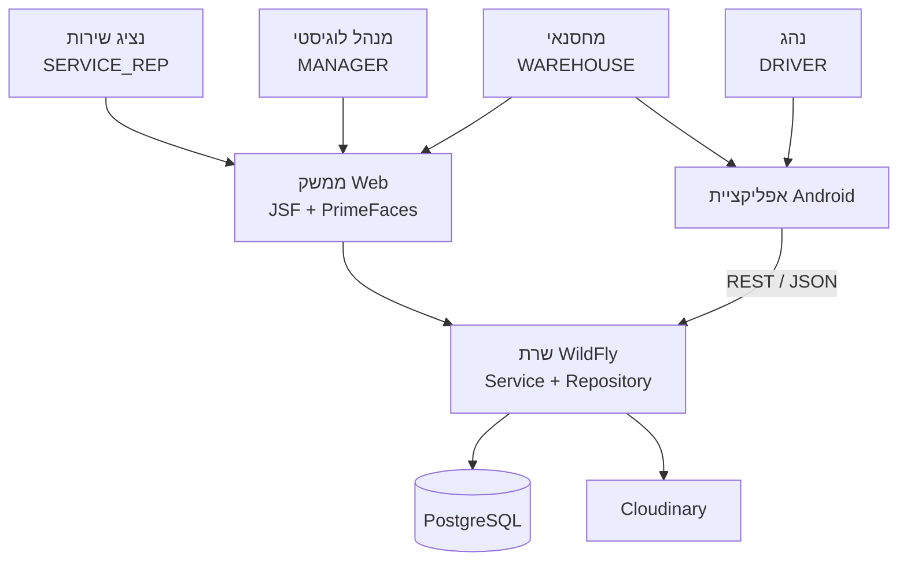
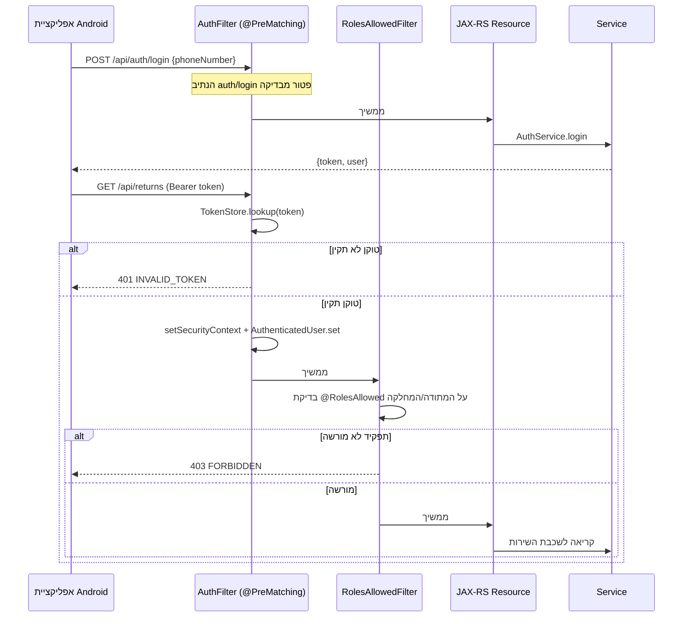
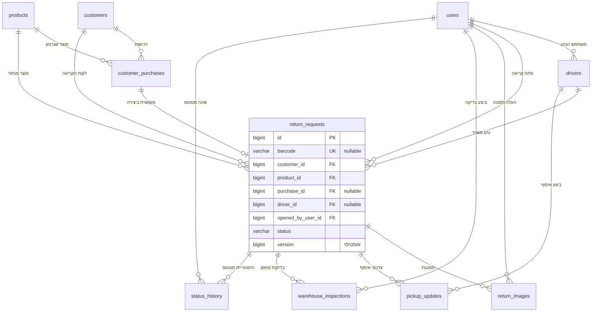
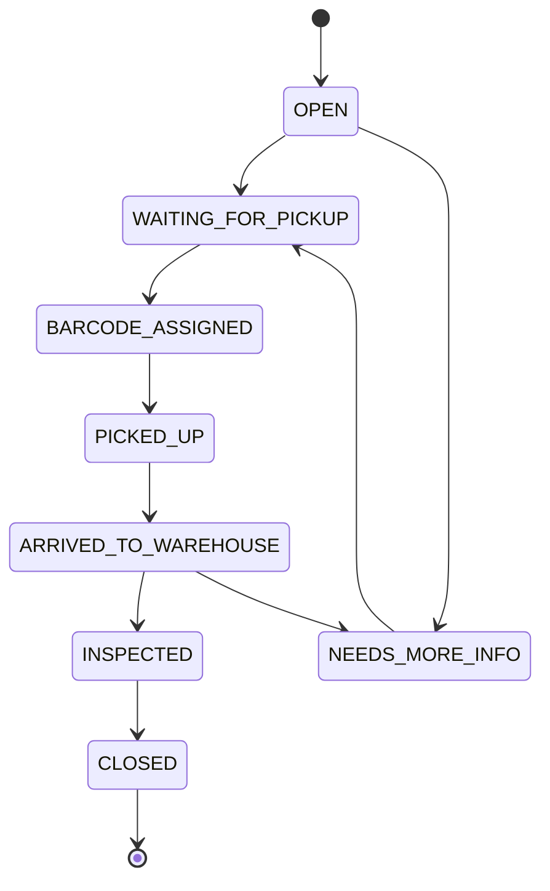
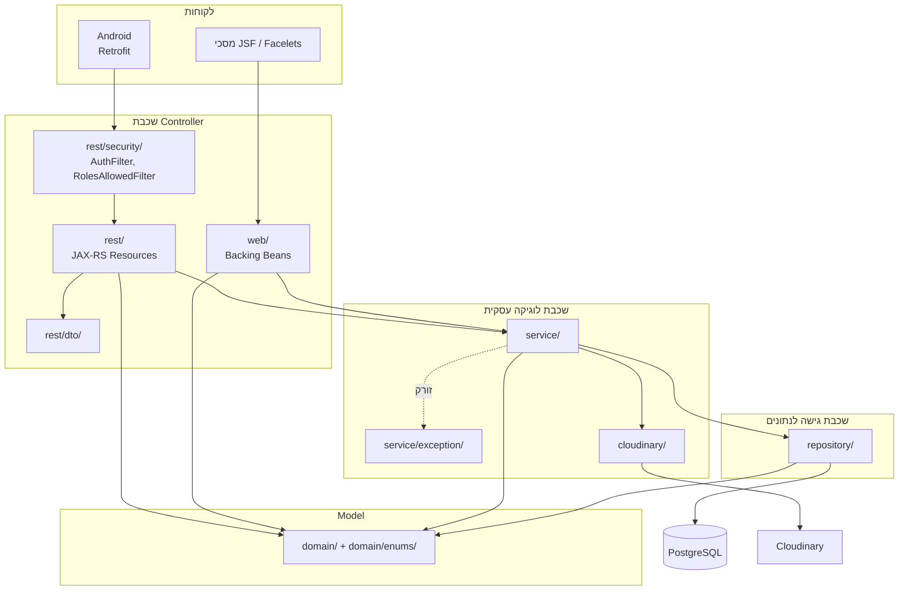
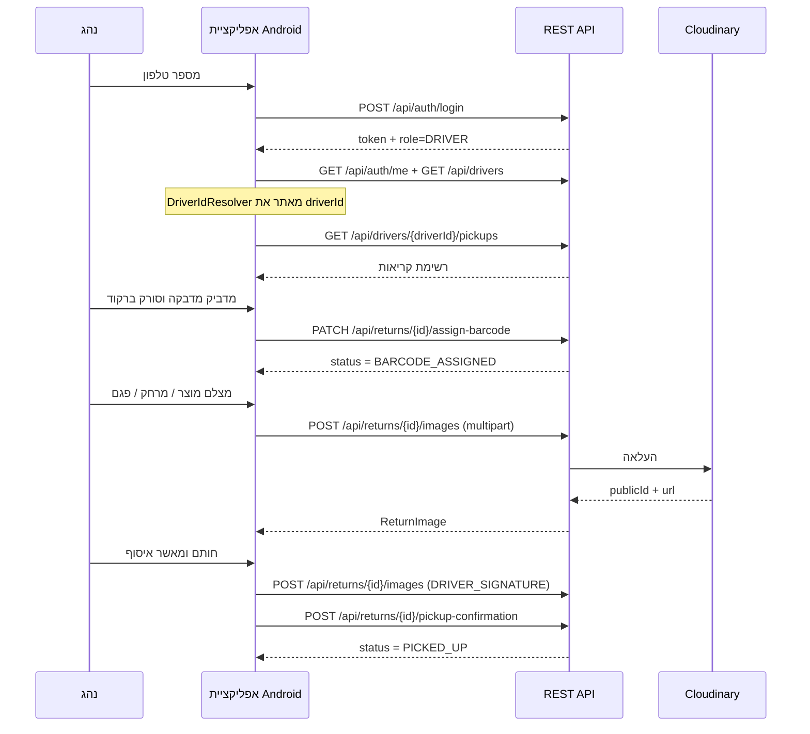
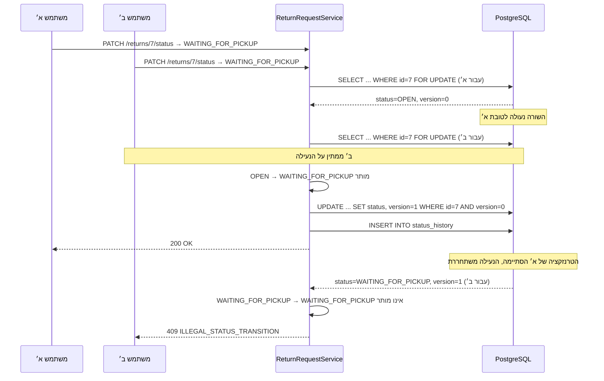
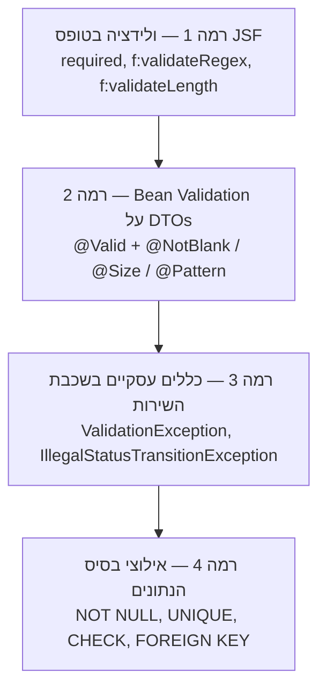

# מסמך תכנון — Digital Returns Bridge

מערכת לניהול החזרות מוצרים במרלו"ג
פרויקט בסדנה בתכנות מתקדם ב-JAVA

---

## תוכן עניינים

1. [תיאור כללי ומינוחים](#1-תיאור-כללי-ומינוחים)
2. [טכנולוגיות בשימוש](#2-טכנולוגיות-בשימוש)
3. [העלאת המערכת והרצה](#3-העלאת-המערכת-והרצה)
4. [נקודות כניסה למערכת](#4-נקודות-כניסה-למערכת)
5. [בסיס הנתונים](#5-בסיס-הנתונים)
6. [ארכיטקטורת שכבות (MVC)](#6-ארכיטקטורת-שכבות-mvc)
7. [תיאור החבילות והמחלקות](#7-תיאור-החבילות-והמחלקות)
8. [מודול האנדרואיד](#8-מודול-האנדרואיד)
9. [טיפול במקביליות](#9-טיפול-במקביליות)
10. [טיפול בשגיאות וקלט לא תקין](#10-טיפול-בשגיאות-וקלט-לא-תקין)
11. [בדיקות](#11-בדיקות)

---

## 1. תיאור כללי ומינוחים

### 1.1 מטרת המערכת

Digital Returns Bridge היא מערכת לניהול תהליך החזרות מוצרים במרכז לוגיסטי (מרלו"ג). המערכת יוצרת רצף דיגיטלי אחד בין ארבעה גורמים: מחלקת השירות, הנהגים בשטח, צוות המחסן והניהול הלוגיסטי. קריאת החזרה נפתחת על ידי נציג שירות בממשק Web, מלווה על ידי נהג באפליקציית Android בעת האיסוף מבית הלקוח, ונקלטת במחסן על ידי מחסנאי — בממשק Web או באפליקציית Android — עד לסגירתה.

המערכת בנויה משני מודולים הנפרסים בנפרד:

| מודול | תיקייה | תוצר | לקוחות |
|---|---|---|---|
| שרת | `server/` | קובץ WAR הנפרס על WildFly | ממשק ה-JSF וה-REST API |
| אפליקציית מובייל | `android-driver-app/` | קובץ APK | נהגים ומחסנאים |

בנוסף קיימות תיקיות `database/` (סכמה ונתוני זריעה), `infra/` (הרצה ב-Docker) ו-`e2e/` (בדיקות דפדפן).

### 1.2 מינוחים

הטבלה שלהלן היא אוצר המילים של המערכת. אותם מונחים חוזרים בקוד, ב-API ובמסמכי ההגשה.

| מונח בעברית | מונח בקוד | הסבר |
|---|---|---|
| קריאת החזרה | `ReturnRequest` | ישות הליבה — התיק הדיגיטלי המלווה מוצר מוחזר מרגע פתיחת הקריאה ועד סגירתה |
| ברקוד | `barcode` | מדבקה פיזית שהנהג מדביק על המוצר בשטח. אין במערכת מאגר ברקודים; שדה `barcode` הוא `nullable` עד שהנהג משייך אותו |
| רכישה | `CustomerPurchase` | שורה בהיסטוריית הרכישות של הלקוח. שדה `handled` מסמן שכבר נפתחה עבורה קריאת החזרה |
| נציג שירות | `Role.SERVICE_REP` | פותח קריאות החזרה בממשק ה-Web |
| נהג / מוביל | `Role.DRIVER` | אוסף את המוצר מהלקוח, משייך ברקוד ומצלם, באפליקציית Android |
| מחסנאי / עובד מרלו"ג | `Role.WAREHOUSE` | קולט את המוצר במחסן ומבצע בדיקת מחסן. משתמש בשני הערוצים |
| מנהל לוגיסטי | `Role.MANAGER` | צופה בדוחות ומנהל נתוני מערכת |
| סטטוס | `ReturnStatus` | מצב הקריאה במחזור החיים (8 ערכים, ראו סעיף 5.4) |
| עדכון איסוף | `PickupUpdate` | רשומת האיסוף שיוצר הנהג: מצב פריט, פרטי פגם, הערות וחתימה |
| בדיקת מחסן | `WarehouseInspection` | סיווג הפריט והחלטת המחסן בעת קליטתו |
| היסטוריית סטטוסים | `StatusHistory` | רשומת ביקורת לכל מעבר סטטוס: ממה, למה, מי ומתי |
| ציר זמן | `timeline` | תצוגה מאוחדת של היסטוריית הסטטוסים לצורכי מסכי Android ופרטי קריאה |
| אשף פתיחת קריאה | `CreateReturnWizardBean` | אשף שלושה שלבים: זיהוי לקוח, בחירת פריט, פרטי החזרה |
| התנגשות עדכון | `ConcurrentModificationConflictException` | שני משתמשים עדכנו את אותה שורה; המפסיד מקבל `409` |

### 1.3 ארבעת סוגי המשתמשים והערוץ שלהם



המחסנאי הוא היחיד המשורת על ידי שני הלקוחות. שניהם צורכים בדיוק את אותם endpoints מוגני-תפקיד (`@RolesAllowed({"WAREHOUSE","MANAGER"})`), ולכן אין כפילות לוגיקה בין הערוצים.

---

## 2. טכנולוגיות בשימוש

הטבלה מתארת מה כל טכנולוגיה עושה **במערכת הזו**, לא מהי באופן כללי.

| טכנולוגיה | גרסה | תפקידה במערכת |
|---|---|---|
| `JSF 4` (Mojarra) + Facelets | Jakarta EE 10 | 14 מסכי ה-Web של נציג השירות, המחסנאי והמנהל. כל מסך הוא `.xhtml` היורש מ-`WEB-INF/templates/layout.xhtml` ונקשר ל-backing bean מחבילת `web/` |
| `PrimeFaces 13` | 13 | רכיבי ה-UI העשירים: `p:dataTable` ברשימת הקריאות ובמסכי הניהול, `p:dialog` לדיאלוגי יצירה, `p:signature` ללכידת חתימת נציג השירות, `p:calendar`, `p:messages` להצגת שגיאות. ערכת הנושא `saga` מוגדרת ב-`web.xml` |
| `CDI 4` | Jakarta CDI | מנגנון ההרכבה היחיד במערכת. כל השירותים והמאגרים הם `@ApplicationScoped`, ה-backing beans הם `@Named` בתחומי `@RequestScoped` / `@ViewScoped` / `@SessionScoped`, וההזרקה מתבצעת ב-`@Inject` על שדות פרטיים |
| `JPA 3.1` / Hibernate 6 | | מיפוי 10 ישויות הדומיין לטבלאות. `persistence.xml` מגדיר יחידת התמדה `drbPU` מסוג `JTA` מול `java:/jdbc/DrbDS`. ההגדרה `hibernate.hbm2ddl.auto=validate` מוודאת בזמן הפריסה שהסכמה בקוד והסכמה בבסיס הנתונים זהות — כל סטייה מפילה את הפריסה |
| `JTA` | Jakarta Transactions | תיחום טרנזקציות דקלרטיבי. מתודות שירות המשנות נתונים מסומנות `@Transactional`, והקונטיינר פותח וסוגר את הטרנזקציה סביבן |
| `Bean Validation` | Jakarta Validation | אילוצי קלט על ה-DTOs (`@NotBlank`, `@Size`, `@Pattern`, `@Positive`, `@Email`) ועל שדות הישויות. מופעל אוטומטית ב-JAX-RS דרך `@Valid` על פרמטרי המתודות |
| `JAX-RS 3.1` (RESTEasy) | | 13 מחלקות משאב החושפות את ה-API תחת `/api`, בשימוש אפליקציית ה-Android. אימות והרשאה ממומשים בשני `ContainerRequestFilter` |
| `Servlet Filter` | Jakarta Servlet 6 | `web.RoleAuthFilter` (`@WebFilter("/*")`) חוסם גישה לכל `.xhtml` פרט למסך ההתחברות כאשר אין `loggedInUser` ב-`HttpSession`, ומפנה ל-`login.xhtml` |
| `PostgreSQL` | 15 מקומית / 18 בענן | בסיס הנתונים היחיד. הסכמה נכתבה ידנית ב-`database/schema.sql` ומכילה אילוצי `CHECK` המשקפים את ערכי ה-enum, מפתחות זרים ואינדקסים |
| `WildFly` | 30+ | שרת האפליקציות. מארח את ה-WAR, מספק את מימושי CDI/JPA/JTA/JAX-RS, ומנהל את מאגר החיבורים ל-PostgreSQL |
| `Android` + `Retrofit 2` + `OkHttp` | | אפליקציית המובייל הרב-תפקידית. `Retrofit` ממפה את ה-endpoints לממשק Java יחיד (`DrbApi`), `OkHttp` מוסיף אינטרספטור שמצרף `Authorization: Bearer` לכל בקשה, ו-`Gson` ממיר JSON |
| `Cloudinary` | `cloudinary-http5` | אחסון קבצי התמונות והחתימות מחוץ לבסיס הנתונים. בבסיס הנתונים נשמרים רק ה-URL ו-`cloudinary_public_id` |
| `ZXing` / `Glide` | | ב-Android: סריקת ברקוד באמצעות המצלמה, וטעינת תמונות קטלוג ותיעוד |
| `JUnit 5` + `Mockito` + `AssertJ` | | בדיקות היחידה של השרת (81 בדיקות) |
| `Playwright` | | חבילת בדיקות דפדפן לממשק ה-Web תחת `e2e/` |

---

## 3. העלאת המערכת והרצה

### 3.1 הרצה מקומית באמצעות Docker

הסביבה המקומית מורכבת משני קונטיינרים המוגדרים ב-`infra/docker-compose.yml`, ומופעלים דרך יעדי ה-`Makefile` שבשורש הפרויקט.

| קונטיינר | מקור | פורטים | תפקיד |
|---|---|---|---|
| `postgres` | `postgres:15` | `5432` | בסיס הנתונים |
| `server` | נבנה מ-`server/Dockerfile` | `8080`, `9990` | WildFly עם ה-WAR הפרוס |

הקונטיינר `postgres` מקבל שני קבצים ל-`docker-entrypoint-initdb.d`: `database/schema.sql` בשם `01_schema.sql` ו-`database/seed.sql` בשם `02_seed.sql`. PostgreSQL מריץ אותם לפי סדר אלפביתי — תחילה יצירת הטבלאות ואחריה נתוני הדוגמה — ורק על נפח נתונים חדש. קונטיינר השרת מוגדר `depends_on` עם `condition: service_healthy`, כך שהוא עולה רק לאחר ש-`pg_isready` מדווח שבסיס הנתונים מוכן.

### 3.2 פקודות ההרצה

| פקודה | מה היא עושה |
|---|---|
| `make build` | בונה את תמונת השרת (Maven בתוך ה-Dockerfile) |
| `make up` | מעתיק `infra/.env.example` ל-`infra/.env` אם אינו קיים, ומעלה את שני הקונטיינרים ברקע |
| `make logs` | עוקב אחר יומני השרת |
| `make shell` | פותח מעטפת בתוך קונטיינר השרת |
| `make down` | מוריד את הקונטיינרים |
| `make clean` | מוריד את הקונטיינרים **כולל נפח הנתונים** ומריץ `mvn clean` |

### 3.3 משתני סביבה

הערכים נקראים מ-`infra/.env` (ראו `infra/.env.example`):

| משתנה | ברירת מחדל | שימוש |
|---|---|---|
| `POSTGRES_DB` / `POSTGRES_USER` / `POSTGRES_PASSWORD` | `drb` / `drb` / `drb_secret` | פרטי החיבור לבסיס הנתונים, מוזרקים לשני הקונטיינרים |
| `CLOUDINARY_CLOUD_NAME` / `CLOUDINARY_API_KEY` / `CLOUDINARY_API_SECRET` | `placeholder` | חשבון Cloudinary. ללא ערכים אמיתיים העלאת תמונות תיכשל |
| `WILDFLY_ADMIN_USER` / `WILDFLY_ADMIN_PASSWORD` | `admin` / `admin123` | קונסולת הניהול של WildFly בפורט `9990` |

### 3.4 בנייה והרצת בדיקות

הבנייה של השרת מתבצעת מתיקיית השורש:

```
mvn -pl server -am test
```

אפליקציית ה-Android נבנית ב-Gradle מתוך `android-driver-app/`. כתובת השרת שאליה היא פונה נקבעת בשדה `BuildConfig.API_BASE_URL`.

### 3.5 פריסה בענן

המערכת פרוסה גם ב-Render (`https://digital-returns-bridge.onrender.com`). שם אין `initdb`, ולכן `schema.sql` ו-`seed.sql` נטענים פעם אחת בעזרת `psql -f` מול בסיס הנתונים המנוהל, לפני העלייה הראשונה. מאחר ש-Hibernate מוגדר `validate`, סטייה בין הסכמה שנטענה לבין הישויות תעצור את הפריסה.


---

## 4. נקודות כניסה למערכת

למערכת שתי נקודות כניסה נפרדות: מסכי ה-JSF, המוגשים על ידי `FacesServlet`, ו-ה-REST API, המוגש על ידי RESTEasy.

### 4.1 ממשק ה-Web (JSF)

`web.xml` ממפה את `jakarta.faces.webapp.FacesServlet` לתבנית `*.xhtml`, ומגדיר את `login.xhtml` כקובץ הקבלה. כל בקשה ל-`.xhtml` עוברת תחילה דרך `RoleAuthFilter`.

| # | מסך | נתיב | Backing bean | תפקידים מיועדים |
|---|---|---|---|---|
| 1 | התחברות | `/login.xhtml` | `LoginBean` | כולם |
| 2 | דשבורד | `/dashboard.xhtml` | `DashboardBean` | נציג, מחסנאי, מנהל |
| 3 | הפניה לאשף | `/returns/create.xhtml` | `CreateReturnWizardBean.redirectToStep1` | נציג שירות |
| 4 | אשף שלב 1 — זיהוי לקוח | `/returns/create/identify-customer.xhtml` | `CreateReturnWizardBean` | נציג שירות |
| 5 | אשף שלב 2 — בחירת פריט | `/returns/create/select-item.xhtml` | `CreateReturnWizardBean` | נציג שירות |
| 6 | אשף שלב 3 — קריאה חדשה | `/returns/create/new-return.xhtml` | `CreateReturnWizardBean` | נציג שירות |
| 7 | רשימת קריאות | `/returns/list.xhtml` | `ReturnListBean` | נציג, מחסנאי, מנהל |
| 8 | פרטי קריאה | `/returns/details.xhtml?id=` | `ReturnDetailsBean` | נציג, מחסנאי, מנהל |
| 9 | קליטת מחסן | `/warehouse/receiving.xhtml` | `WarehouseReceivingBean` | מחסנאי |
| 10 | דוחות ו-KPI | `/reports.xhtml` | `ReportsBean` | מנהל |
| 11 | ניהול משתמשים | `/admin/users.xhtml` | `UserAdminBean` | מנהל |
| 12 | ניהול לקוחות | `/admin/customers.xhtml` | `CustomerAdminBean` | מנהל |
| 13 | ניהול מוצרים | `/admin/products.xhtml` | `ProductAdminBean` | מנהל |
| 14 | ניהול נהגים | `/admin/drivers.xhtml` | `DriverAdminBean` | מנהל |

בנוסף קיימים שני קבצי Facelets שאינם מסכים עצמאיים: `WEB-INF/templates/layout.xhtml` (התבנית המשותפת — כותרת, ניווט, סרגל משתמש) ו-`WEB-INF/includes/wizard-steps.xhtml` (פס ההתקדמות של האשף).

> הערה: `RoleAuthFilter` במימושו הנוכחי בודק **קיום** משתמש מחובר ב-session, אך אינו בודק את `user.getRole()`. עמודת "תפקידים מיועדים" בטבלה משקפת את התכנון; פערי האכיפה מתועדים ב-`docs/e2e-findings.md`.

### 4.2 ה-REST API

`rest/JaxRsApplication` מסומן `@ApplicationPath("/api")` ואינו מגדיר דבר מעבר לכך — הסריקה האוטומטית של RESTEasy מגלה את מחלקות המשאב וה-providers. כתובת הבסיס המלאה היא `<host>/<context>/api`.

| משאב | נתיב בסיס | תוכן |
|---|---|---|
| `AuthResource` | `/api/auth` | `login`, `me`, `logout` |
| `UserResource` | `/api/users` | ניהול משתמשים (`@RolesAllowed("MANAGER")` ברמת המחלקה) |
| `CustomerResource` | `/api/customers` | לקוחות, חיפוש לפי טלפון, היסטוריית רכישות |
| `ProductResource` | `/api/products` | מוצרים |
| `DriverResource` | `/api/drivers` | נהגים ורשימת האיסופים שלהם |
| `ReturnResource` | `/api/returns` | קריאות החזרה — הליבה: יצירה, שיוך נהג/ברקוד, סטטוס, עדיפות, תמונות, עדכוני איסוף, ציר זמן, בדיקות מחסן |
| `ImageResource` | `/api/images` | שליפה ומחיקה של תמונה בודדת |
| `PickupUpdateResource` | `/api/pickup-updates` | עדכון רשומת איסוף קיימת |
| `WarehouseResource` | `/api/warehouse` | תיק מחסן לפי ברקוד וסימון הגעה (`@RolesAllowed({"WAREHOUSE","MANAGER"})`) |
| `WarehouseInspectionResource` | `/api/warehouse-inspections` | עדכון בדיקת מחסן קיימת |
| `ReportsResource` | `/api/reports` | דשבורד, החזרות לפי סטטוס, החלטות מחסן, מידע חסר, ביצועי נהגים, החזרות יומיות |
| `DebugLogResource` | `/api/debug/logs` | קליטת יומני האפליקציה מהמכשיר; פטור מאימות |

הרשימה המלאה של ה-endpoints, על גוף הבקשה והתשובה של כל אחד, מופיעה ב-`docs/api.md`.

### 4.3 שרשרת האימות ב-REST



---

## 5. בסיס הנתונים

בסיס הנתונים הוא PostgreSQL, והסכמה נכתבה ידנית בקובץ `database/schema.sql`. אין מסגרת מיגרציות: הקובץ תמיד משקף את המצב הרצוי, ובנוסף קיימת תיקיית `database/migrations/` עם סקריפט `ALTER TABLE` נקודתי אחד (`001-add-version.sql`) עבור בסיסי נתונים קיימים שהוקמו לפני הוספת עמודת `version`.

### 5.1 דיאגרמת ERD



### 5.2 תיאור הטבלאות

**`users` — משתמשי המערכת**

| עמודה | טיפוס | אילוצים |
|---|---|---|
| `id` | `BIGSERIAL` | מפתח ראשי |
| `phone_number` | `VARCHAR(30)` | `NOT NULL UNIQUE` — זהו מזהה ההתחברות |
| `full_name` | `VARCHAR(120)` | `NOT NULL` |
| `role` | `VARCHAR(30)` | `CHECK` על ארבעת ערכי `Role` |
| `active` | `BOOLEAN` | `NOT NULL DEFAULT TRUE` — משתמש לא פעיל אינו יכול להתחבר |
| `created_at`, `updated_at` | `TIMESTAMP` | `NOT NULL DEFAULT NOW()` |

**`customers` — לקוחות**

`id`, `full_name` (`NOT NULL`), `phone`, `email`, `address`, וחותמות זמן. הטלפון הוא שדה החיפוש בשלב 1 של האשף.

**`products` — קטלוג המוצרים**

`id`, `sku` (`NOT NULL UNIQUE`), `name` (`NOT NULL`), `category`, `description`, `price NUMERIC(12,2)`, `image_url VARCHAR(500)` (תמונת קטלוג המוצגת לנהג ולמחסנאי), וחותמות זמן.

**`drivers` — נהגים**

`id`, `user_id` (`NOT NULL`, מפתח זר ל-`users`), `vehicle_number`, `phone`, `active`, וחותמות זמן. רשומת נהג היא הרחבה של משתמש קיים בעל `role = DRIVER`, ולא ישות נפרדת ממנו.

**`customer_purchases` — היסטוריית רכישות**

| עמודה | טיפוס | הערה |
|---|---|---|
| `id` | `BIGSERIAL` | מפתח ראשי |
| `customer_id`, `product_id` | `BIGINT` | `NOT NULL`, מפתחות זרים |
| `order_number` | `VARCHAR(60)` | מספר ההזמנה המקורי |
| `quantity` | `INT` | |
| `original_delivery_date` | `DATE` | |
| `under_warranty` | `BOOLEAN` | |
| `handled` | `BOOLEAN` | `NOT NULL DEFAULT FALSE`. נקבע ל-`TRUE` באותה טרנזקציה שבה נפתחת קריאת החזרה על הרכישה, כדי שהפריט לא ייבחר פעמיים |

**`return_requests` — קריאות החזרה (טבלת הליבה)**

| קבוצת שדות | עמודות | הערות |
|---|---|---|
| ברקוד | `barcode VARCHAR(60) UNIQUE`, `barcode_assigned_at`, `barcode_assigned_by_driver_id` | כולן `nullable`. האינדקס הייחודי הוא קו ההגנה האחרון מפני שיוך כפול של אותה מדבקה |
| קשרים | `customer_id`, `product_id` (`NOT NULL`), `purchase_id`, `driver_id`, `opened_by_user_id` (`NOT NULL`) | |
| טקסט חופשי | `order_number`, `reason`, `defect_description`, `priority` | |
| מחזור חיים | `status VARCHAR(30) NOT NULL DEFAULT 'OPEN'` | `CHECK` על שמונת ערכי `ReturnStatus` |
| צ'קליסט נציג השירות | `original_delivery_date`, `quantity`, `under_warranty`, `was_used` | |
| טקסונומיית פגם | `return_reason`, `defect_type`, `defect_stage`, `defect_location_text` | שלוש הראשונות תחת `CHECK` המשקף את ה-enum המתאים |
| תשתית | `created_at`, `updated_at`, `version BIGINT NOT NULL DEFAULT 0` | `version` היא עמודת ה-`@Version` המשמשת לנעילה אופטימית (סעיף 9) |

**`return_images` — תמונות וחתימות**

`return_request_id` ו-`uploaded_by_user_id` (שניהם `NOT NULL`), `cloudinary_public_id VARCHAR(255) NOT NULL`, `image_url VARCHAR(500) NOT NULL`, ו-`image_type` תחת `CHECK` על שמונת ערכי `ImageType`. הבינארי עצמו אינו נשמר בבסיס הנתונים.

**`pickup_updates` — עדכוני איסוף**

`return_request_id`, `driver_id` (`NOT NULL`), `item_condition VARCHAR(40) NOT NULL` (`CHECK` על `ItemCondition`), `defect_type`, `defect_location`, `defect_location_other`, `signature_image_url` (העתק מנורמל של כתובת חתימת הנהג), `item_collected BOOLEAN NOT NULL DEFAULT FALSE`, `driver_notes`.

**`warehouse_inspections` — בדיקות מחסן**

`return_request_id`, `inspected_by_user_id` (`NOT NULL`), `item_condition`, `warehouse_decision` (`CHECK` על שבעת ערכי `WarehouseDecision`), `call_fully_handled BOOLEAN`, `warehouse_notes`.

**`status_history` — יומן מעברי סטטוס**

`return_request_id` (`NOT NULL`), `changed_by_user_id` (`nullable` — מעברים שיזמה המערכת), `old_status` (`nullable` — הרשומה הראשונה), `new_status` (`NOT NULL`), `comment`, ו-`created_at` המשמש כחותמת המעבר.

### 5.3 אינדקסים

מלבד המפתחות הראשוניים והייחודיים, הסכמה מגדירה 12 אינדקסים על עמודות המפתחות הזרים ועל עמודות הסינון הנפוצות: `return_requests(status)`, `return_requests(driver_id)`, `return_requests(customer_id)`, `return_requests(barcode)`, `customer_purchases(handled)` ואינדקסי ה-`return_request_id` של ארבע טבלאות הבנים.

### 5.4 מחזור החיים של קריאת החזרה



טבלת המעברים המותרים מקודדת כמפה בלתי משתנה `ALLOWED_TRANSITIONS` בתוך `ReturnRequestService`, ו-`CLOSED` ממופה לקבוצה ריקה — כלומר מצב סופי. כל ניסיון מעבר שאינו בטבלה נדחה ב-`IllegalStatusTransitionException` וממופה ל-`409`.

---

## 6. ארכיטקטורת שכבות (MVC)

### 6.1 השכבות

השרת בנוי בחמש שכבות בתוך החבילה `com.drb.server`:

| שכבה | חבילה | תפקיד | מותר לה לפנות אל |
|---|---|---|---|
| **Model — דומיין** | `domain/`, `domain/enums/` | ישויות JPA וטקסונומיות. אין בהן לוגיקה עסקית מלבד `@PrePersist`/`@PreUpdate` לחותמות זמן | — |
| **גישה לנתונים** | `repository/` | עטיפות דקות סביב `EntityManager`. שאילתות JPQL, `find`, `persist`/`merge` | `domain/` |
| **לוגיקה עסקית** | `service/`, `service/exception/` | כללי המערכת: מעברי סטטוס, שיוך ברקוד, קישור רכישה, חישובי דוחות | `repository/`, `domain/` |
| **Controller — Web** | `web/` | backing beans של JSF, פילטר ה-Servlet ועוזרי תצוגה | `service/`, `domain/` |
| **Controller — API** | `rest/`, `rest/dto/`, `rest/exception/`, `rest/security/` | משאבי JAX-RS, DTOs, ממפי חריגות ואימות | `service/`, `domain/` |
| שירות תשתית | `cloudinary/` | העלאת קבצים לספק חיצוני | ספריית Cloudinary |

### 6.2 דיאגרמת הרכיבים



### 6.3 הפרדת השכבות — עמידה בדרישת הקורס

הקורס דורש הפרדה ברורה בין שכבת התצוגה, שכבת הלוגיקה ושכבת הנתונים. המערכת עומדת בכך באמצעות ארבעה כללים הנשמרים בכל הקוד:

1. **אף מחלקת Controller אינה מחזיקה `EntityManager`.** ההערה `@PersistenceContext` מופיעה אך ורק בעשר מחלקות ה-`repository/`. backing bean או משאב JAX-RS שרוצה נתונים חייב לעבור דרך שירות.
2. **אף מחלקת Repository אינה מכילה כלל עסקי.** בדיקת חוקיות מעבר סטטוס, בדיקת שיוך רכישה ללקוח, ההחלטה מתי לסמן `handled` — כולן ב-`ReturnRequestService`. ה-Repository רק שולף ושומר.
3. **שכבת הדומיין אינה יודעת דבר על השכבות שמעליה.** לישויות אין תלות ב-JAX-RS, ב-JSF או ב-DTOs; ההמרה לייצוג ה-API מרוכזת ב-`rest/dto/` ומופעלת ממחלקות המשאב.
4. **שני ה-Controllers חולקים שכבת לוגיקה אחת.** מסך קליטת המחסן ב-JSF (`WarehouseReceivingBean`) ומסך בדיקת המחסן ב-Android (`WarehouseInspectionActivity` דרך `WarehouseResource`) קוראים לאותו `WarehouseService`. אין שכפול של כלל עסקי בין הערוצים, וזו ההוכחה המעשית לכך שהלוגיקה אינה יושבת בשכבת התצוגה.

בכיוון ההפוך, השירותים לא יודעים מיהו הקורא: הם מקבלים ומחזירים ישויות דומיין ו-DTOs, אינם נוגעים ב-`FacesContext` ואינם בונים תשובות HTTP. תרגום השגיאה לפורמט של הערוץ מתבצע בשכבת ה-Controller — ב-`ExceptionMappers` עבור REST וב-`FacesMessage` עבור JSF.

---

## 7. תיאור החבילות והמחלקות

### 7.1 `com.drb.server.domain` — ישויות JPA

עשר הישויות. כולן משתמשות ב-`@Id @GeneratedValue(strategy = IDENTITY)`, ב-`@ManyToOne(fetch = LAZY)` לקשרים, וב-`@PrePersist`/`@PreUpdate` לניהול `createdAt`/`updatedAt`. הכתיבה היא ללא Lombok — getters ו-setters ידניים.

| מחלקה | טבלה | אחריות | שדות מרכזיים | קשרים |
|---|---|---|---|---|
| `User` | `users` | משתמש המערכת ותפקידו | `phoneNumber` (`@NotNull @Size(max=30)`, ייחודי), `fullName`, `role` (`@Enumerated(STRING)`), `active` | מפנה אליו: `Driver`, `ReturnRequest.openedByUser`, `ReturnImage.uploadedByUser`, `WarehouseInspection.inspectedByUser`, `StatusHistory.changedByUser` |
| `Customer` | `customers` | הלקוח שממנו נאסף המוצר | `fullName` (`@NotNull @Size(max=120)`), `phone`, `email`, `address` | `1:N` אל `CustomerPurchase` ואל `ReturnRequest` |
| `Product` | `products` | פריט בקטלוג | `sku` (ייחודי, `@NotNull`), `name`, `category`, `description`, `price` (`BigDecimal`), `imageUrl` | `1:N` אל `CustomerPurchase` ואל `ReturnRequest` |
| `Driver` | `drivers` | הרחבת נהג של משתמש קיים | `user` (`@NotNull`, `@ManyToOne`), `vehicleNumber`, `phone`, `active` | `N:1` אל `User`; `1:N` אל `ReturnRequest` ואל `PickupUpdate` |
| `CustomerPurchase` | `customer_purchases` | שורת היסטוריית רכישות; המקור לשלב 2 באשף | `orderNumber`, `quantity`, `originalDeliveryDate`, `underWarranty`, `handled` | `N:1` אל `Customer` ואל `Product` (שניהם `optional = false`) |
| `ReturnRequest` | `return_requests` | **ישות הליבה** — התיק הדיגיטלי של ההחזרה | `barcode` (ייחודי, `nullable`), `barcodeAssignedAt`, `status` (`@NotNull`, ברירת מחדל `OPEN`), צ'קליסט נציג השירות, טקסונומיית פגם, `version` (`@Version`) | `N:1` אל `Customer`, `Product`, `CustomerPurchase`, `Driver` (פעמיים: `driver` ו-`barcodeAssignedByDriver`) ו-`User`; `1:N` אל ארבע טבלאות הבנים |
| `ReturnImage` | `return_images` | הפניה לתמונה או חתימה המאוחסנת ב-Cloudinary | `cloudinaryPublicId`, `imageUrl`, `imageType` (`@Enumerated(STRING)`) | `N:1` אל `ReturnRequest` ואל `User` |
| `PickupUpdate` | `pickup_updates` | דיווח הנהג בשטח | `itemCondition`, `defectType`, `defectLocation`, `defectLocationOther`, `signatureImageUrl`, `itemCollected`, `driverNotes` | `N:1` אל `ReturnRequest` ואל `Driver` |
| `WarehouseInspection` | `warehouse_inspections` | סיווג הפריט והחלטת המחסן | `warehouseDecision`, `itemCondition`, `callFullyHandled`, `warehouseNotes` | `N:1` אל `ReturnRequest` ואל `User` |
| `StatusHistory` | `status_history` | רשומת ביקורת למעבר סטטוס יחיד | `oldStatus`, `newStatus`, `comment`, `createdAt` כחותמת המעבר | `N:1` אל `ReturnRequest` ואל `User` |

### 7.2 `com.drb.server.domain.enums` — טקסונומיות

תשעה enums. ערכי המחרוזת שלהם משותפים לארבעה מקומות: אילוצי ה-`CHECK` ב-SQL, ה-`@Enumerated(EnumType.STRING)` בישויות, רשימות הבחירה ב-JSF וה-spinners ב-Android. מאחר ש-Hibernate מוגדר `validate`, כל סטייה בין הקוד לסכמה נחשפת בזמן פריסה ולא בזמן ריצה.

| Enum | ערכים | שימוש |
|---|---|---|
| `Role` | `SERVICE_REP`, `DRIVER`, `WAREHOUSE`, `MANAGER` | תפקיד המשתמש; מוזן ל-`@RolesAllowed` ולניתוב לאחר התחברות |
| `ReturnStatus` | `OPEN`, `WAITING_FOR_PICKUP`, `BARCODE_ASSIGNED`, `PICKED_UP`, `ARRIVED_TO_WAREHOUSE`, `INSPECTED`, `CLOSED`, `NEEDS_MORE_INFO` | מחזור החיים של הקריאה |
| `ReturnReason` | `NOT_AS_EXPECTED`, `DELIVERY_ERROR`, `SELLER_ERROR`, `SUPPLIER_ERROR`, `WAREHOUSE_ERROR`, `DRIVER_ERROR`, `CUSTOMER_NOT_HOME`, `PRODUCT_DEFECT` | סיבת ההחזרה, נקבעת על ידי נציג השירות |
| `DefectType` | `TEAR`, `SCRATCH`, `BREAK`, `MISSING_PART`, `FADED_COLOR`, `RUST`, `DENT`, `REVERSED_SIDE`, `ELECTRONIC_FAULT` | סוג הפגם; משותף לנציג השירות ולנהג |
| `DefectStage` | `INITIAL_SHIPPING`, `AFTER_USE`, `MISSING_PART` | השלב שבו נוצר הפגם |
| `DefectLocation` | `RIGHT_SEAT`, `LEFT_SEAT`, `SEAT`, `LEGS`, `BACK`, `OTHER` | מיקום הפגם בדיווח הנהג |
| `ItemCondition` | `LIKE_NEW_ORIGINAL_PACKAGING`, `LIKE_NEW_NO_PACKAGING`, `USED`, `USED_MINOR_DEFECT`, `SIGNIFICANTLY_DEFECTIVE` | מצב הפריט; משותף ל-`PickupUpdate` ול-`WarehouseInspection` |
| `WarehouseDecision` | `STOCK_AS_NEW_114`, `CLASS_B`, `SHAPIIM_155`, `REDESIGN_208`, `FROZEN_FURTHER_HANDLING`, `REPAIR`, `DISPOSE` | אופן הטיפול בפריט לאחר הבדיקה |
| `ImageType` | `SERVICE_GENERAL_IMAGE`, `SERVICE_DEFECT_IMAGE`, `SERVICE_REP_SIGNATURE`, `DRIVER_PRODUCT_IMAGE`, `DRIVER_DISTANT_IMAGE`, `DRIVER_DEFECT_IMAGE`, `DRIVER_SIGNATURE`, `WAREHOUSE_IMAGE` | סיווג התמונה לפי מקורה; חתימות נשמרות כתמונות לכל דבר |

### 7.3 `com.drb.server.repository` — שכבת הגישה לנתונים

עשר מחלקות, כולן `@ApplicationScoped` עם `@PersistenceContext private EntityManager em`. כל אחת חושפת `save` המבצע `persist` כאשר המזהה `null` ו-`merge` אחרת.

| מחלקה | ישות | מתודות מעבר ל-`save`/`findById` |
|---|---|---|
| `UserRepository` | `User` | `findAll`, `findByPhoneNumber` |
| `CustomerRepository` | `Customer` | `findAll`, `search`, `findByPhone` |
| `ProductRepository` | `Product` | `findAll`, `search` |
| `DriverRepository` | `Driver` | `findAllWithUser` (עם `JOIN FETCH` על המשתמש) |
| `CustomerPurchaseRepository` | `CustomerPurchase` | `findByIdWithRefs`, `findByCustomerId` |
| `ReturnRequestRepository` | `ReturnRequest` | הרחב ביותר: `findByIdForUpdate` (נעילה פסימית), `findAllWithRefs`, `findByStatusWithRefs`, `findByDriverIdWithRefs`, `findByCustomerIdWithRefs`, `findByIdWithRefs`, `findByBarcode`, `findByBarcodeWithRefs`, `countByBarcodeIsNull` |
| `ReturnImageRepository` | `ReturnImage` | `findByReturnRequestId`, `delete` |
| `PickupUpdateRepository` | `PickupUpdate` | `findByReturnRequestId`, `update` |
| `WarehouseInspectionRepository` | `WarehouseInspection` | `findAll`, `findByReturnRequestId`, `update` |
| `StatusHistoryRepository` | `StatusHistory` | `findByReturnRequestId`, `findByReturnRequestIdWithUser` |

שתי הערות תכנוניות:

- **וריאנטי `WithRefs`.** ישויות `ReturnRequest` מוצגות במסכים שדורשים גם את הלקוח, המוצר, הנהג והמשתמש הפותח. כדי להימנע מבעיית `N+1` ומ-`LazyInitializationException` מחוץ לטרנזקציה, כל שאילתה המשרתת מסך מבצעת `JOIN FETCH` מפורש. השאילתות ה"רזות" (`findAll`, `findById`) נותרו לשימוש פנימי בתוך טרנזקציה.
- **`findByIdForUpdate`.** קוראת ל-`em.find(..., LockModeType.PESSIMISTIC_WRITE)` ומשמשת רק בנתיבי בדיקה-ואז-פעולה. פירוט בסעיף 9.

### 7.4 `com.drb.server.service` — שכבת הלוגיקה העסקית

שתים-עשרה מחלקות `@ApplicationScoped`. מתודות המשנות נתונים מסומנות `@Transactional`; מתודות קריאה אינן.

| מחלקה | אחריות | מתודות מרכזיות | תלויות מוזרקות |
|---|---|---|---|
| `AuthService` | התחברות לפי מספר טלפון בלבד. מאמתת שהמשתמש קיים ושהוא `active`, ומנפיקה טוקן | `login(phoneNumber)`, `getByToken(token)`, `logout(token)` | `UserRepository`, `TokenStore` |
| `UserService` | ניהול משתמשים | `findAll`, `findById`, `create`, `save`, `update`, `setActive`, `delete` | `UserRepository` |
| `CustomerService` | לקוחות וחיפוש | `findAll`, `search`, `findById`, `findByPhone`, `create`, `update`, `delete` | `CustomerRepository` |
| `CustomerPurchaseService` | היסטוריית רכישות לשלב 2 באשף | `findByCustomerId` | `CustomerPurchaseRepository` |
| `ProductService` | קטלוג המוצרים | `findAll`, `search`, `findById`, `create`, `update`, `delete` | `ProductRepository` |
| `DriverService` | נהגים | `findAll`, `findActive`, `findById`, `save`, `delete` | `DriverRepository` |
| **`ReturnRequestService`** | **מחלקת הליבה של המערכת.** מחזיקה את טבלת המעברים המותרים, את שיוך הברקוד, את קישור הרכישה ואת גילוי התנגשויות העדכון | `createReturnRequest`, `assignDriver`, `assignBarcode`, `changeStatus`, `transitionStatus`, `changePriority`, `confirmPickup`, `createPickupUpdate`, `createWarehouseInspection`, `getStatusHistory`, `getImages`, `getPickupUpdates` | תשעה מאגרים |
| `PickupUpdateService` | עדכון רשומת איסוף קיימת | `findById`, `update` | `PickupUpdateRepository` |
| `WarehouseService` | קליטת מחסן; מאצילה כל מעבר סטטוס ל-`ReturnRequestService` | `findByBarcode`, `markArrived`, `requestMoreInfo`, `createInspection` | `ReturnRequestRepository`, `WarehouseInspectionRepository`, `ReturnRequestService` |
| `WarehouseInspectionService` | עדכון בדיקת מחסן קיימת | `update` | `WarehouseInspectionRepository` |
| `ImageService` | תזמור העלאת תמונה: קריאת הקובץ, שליחה ל-Cloudinary, שמירת ה-URL כישות | `upload(EntityPart)`, `upload(byte[])`, `findByReturnRequestId`, `findById`, `delete` | `CloudinaryImageService`, `ReturnImageRepository`, `ReturnRequestService` |
| `ReportsService` | חישובי דשבורד ודוחות באמצעות שאילתות אגרגציה | `getDashboard`, `getReturnsByStatus`, `getWarehouseDecisions`, `getMissingInfo`, `getDriverPerformance`, `getDailyReturns`, `getTopReturnReasons`, `getMonthlyVolume` | `EntityManager`, `ReturnRequestRepository` |

בנוסף קיימת בחבילה מחלקת עזר אחת:

| מחלקה | תפקיד |
|---|---|
| `EnumParser` | מחלקה `final` עם בנאי פרטי ומתודה סטטית אחת: `parse(Class<E>, String value, String fieldName)`. מחזירה `null` על ערך ריק, ומחליפה את `IllegalArgumentException` של `Enum.valueOf` ב-`ValidationException("INVALID_ENUM")` הכולל את רשימת הערכים החוקיים. בלעדיה ערך enum שגוי מלקוח היה מתורגם ל-`500` במקום ל-`400`. כל 30 אתרי הקריאה בשכבות `service/`, `web/` ו-`rest/` עוברים דרכה |

**שני התהליכים המורכבים ב-`ReturnRequestService`:**

*יצירת קריאה עם קישור לרכישה* (`createReturnRequest`) — מאפסת ברקוד וסטטוס לערכי הפתיחה, טוענת את הלקוח, המוצר והנהג לפי המזהים שב-DTO, ואם נמסר `purchaseId` היא מוודאת שהרכישה שייכת לאותו לקוח ולאותו מוצר (`PURCHASE_CUSTOMER_MISMATCH` / `PURCHASE_PRODUCT_MISMATCH`), משלימה מהרכישה שדות שלא נמסרו (מספר הזמנה, תאריך מסירה, כמות, אחריות), ומסמנת `purchase.setHandled(true)` — הכול בטרנזקציה אחת.

*שיוך ברקוד* (`assignBarcode`) — טוענת את הקריאה בנעילת כתיבה, מוודאת שהברקוד אינו ריק ושהנהג קיים, בודקת שהברקוד אינו משויך כבר לקריאה אחרת, מעדכנת את שלושת שדות הברקוד, מעבירה את הסטטוס ל-`BARCODE_ASSIGNED` וכותבת רשומת `StatusHistory`.

### 7.5 `com.drb.server.service.exception` — היררכיית החריגות

ארבע מחלקות, כולן יורשות מ-`RuntimeException` כדי שלא יזהמו את חתימות שכבת השירות.

| חריגה | מתי נזרקת | מידע נוסף שהיא נושאת |
|---|---|---|
| `NotFoundException` | ישות לא נמצאה. בנאי נוח `(entityType, id)` מרכיב את ההודעה | — |
| `ValidationException` | קלט לא חוקי שאינו נתפס על ידי Bean Validation: ערך enum שגוי, ברקוד ריק, ברקוד תפוס, אי-התאמת רכישה | `code` — מזהה שגיאה קצר המוחזר ללקוח |
| `IllegalStatusTransitionException` | מעבר סטטוס שאינו בטבלת `ALLOWED_TRANSITIONS` | `from`, `to` |
| `ConcurrentModificationConflictException` | הנעילה האופטימית זיהתה שמשתמש אחר עדכן את השורה בין הקריאה לכתיבה | `entity`, `identifier`, והחריגה המקורית כ-`cause` |

### 7.6 `com.drb.server.web` — backing beans של JSF

שלוש-עשרה מחלקות. ה-beans המחזיקים מצב בין בקשות מממשים `Serializable` כנדרש מ-`@ViewScoped`/`@SessionScoped`.

| מחלקה | תחום | מסך | אחריות | מתודות מרכזיות |
|---|---|---|---|---|
| `LoginBean` | `@RequestScoped` | `login.xhtml` | התחברות, שמירת `loggedInUser` ו-`authToken` ב-`HttpSession`, וניתוב לפי תפקיד: `WAREHOUSE` נשלח ל-`warehouse/receiving.xhtml`, השאר לדשבורד | `login()`, `logout()` |
| `DashboardBean` | `@RequestScoped` | `dashboard.xhtml` | טעינת מדדי ה-KPI פעם אחת ב-`@PostConstruct` | `init()`, `get(key)` |
| `CreateReturnWizardBean` | `@SessionScoped` | שלושת מסכי האשף | ה-bean המורכב במערכת. מחזיק את מצב האשף בין שלושה מסכים ושלוש בקשות: חיפוש לקוח, בחירת רכישה, מילוי הצ'קליסט, העלאת תמונות וחתימה, ושמירה. `ensureStep1/2/3` הם שומרי סף המחזירים הפניה כשמנסים לדלג שלב | `lookupCustomer()`, `selectPurchase(id)`, `backToStep1/2()`, `create()`, `resetWizard()` |
| `ReturnListBean` | `@ViewScoped` | `returns/list.xhtml` | רשימת הקריאות עם חמישה מסננים: סטטוס, נהג, לקוח, ברקוד, ו"ללא ברקוד" | `init()`, `load()` |
| `ReturnDetailsBean` | `@ViewScoped` | `returns/details.xhtml` | טעינת הקריאה, התמונות והיסטוריית הסטטוסים לפי פרמטר `id` | `init()` |
| `WarehouseReceivingBean` | `@ViewScoped` | `warehouse/receiving.xhtml` | מסך קליטת המחסן: חיפוש לפי ברקוד, סימון הגעה, בקשת מידע נוסף, וביצוע בדיקת מחסן. כן מפריד את גלריית התמונות מחתימות הנהג ונציג השירות | `searchByBarcode()`, `markArrived()`, `requestMoreInfo()`, `createInspection()`, `getGalleryImages()` |
| `ReportsBean` | `@RequestScoped` | `reports.xhtml` | טעינת כל מערכי הדוחות ב-`@PostConstruct` | `init()`, `getDashboardValue(key)` |
| `UserAdminBean` | `@ViewScoped` | `admin/users.xhtml` | CRUD משתמשים בדיאלוג יצירה ובעריכה בשורה | `prepareCreate()`, `saveNew()`, `saveSelected()`, `deleteUser(id)` |
| `CustomerAdminBean` | `@ViewScoped` | `admin/customers.xhtml` | CRUD לקוחות | אותה תבנית |
| `ProductAdminBean` | `@ViewScoped` | `admin/products.xhtml` | CRUD מוצרים כולל העלאת תמונת קטלוג (`jakarta.servlet.http.Part`) | אותה תבנית + `uploadedImage` |
| `DriverAdminBean` | `@ViewScoped` | `admin/drivers.xhtml` | CRUD נהגים. יצירת נהג היא שיוך `User` קיים בעל `role = DRIVER` יחד עם פרטי רכב | אותה תבנית |
| `StatusUi` | `@Named("statusUi")` `@ApplicationScoped` | כל המסכים | עוזר תצוגה טהור: ממיר `ReturnStatus` לתווית קריאה ולמחלקת CSS של הצ'יפ. קיים כדי שהמיפוי לא ישוכפל בכל `.xhtml` | `label(status)`, `chipClass(status)` |
| `RoleAuthFilter` | `@WebFilter("/*")` | — | שומר הסף של ממשק ה-Web. מדלג על משאבים סטטיים ועל `login.xhtml`, ומפנה למסך ההתחברות כשאין `loggedInUser` ב-session | `doFilter()` |


### 7.7 `com.drb.server.rest` — משאבי JAX-RS

שתים-עשרה מחלקות משאב ומחלקת ההגדרה `JaxRsApplication`. כולן `@Produces`/`@Consumes` של `application/json`, מזריקות שירותים ב-`@Inject`, ומקבלות את המשתמש המחובר דרך `@Inject AuthenticatedUser`.

| מחלקה | נתיב | אחריות | הערות |
|---|---|---|---|
| `AuthResource` | `/auth` | התחברות, שליפת המשתמש המחובר, יציאה | `login` הוא ה-endpoint היחיד שהפילטר מדלג עליו |
| `UserResource` | `/users` | ניהול משתמשים | `@RolesAllowed("MANAGER")` ברמת המחלקה |
| `CustomerResource` | `/customers` | לקוחות, `by-phone/{phone}` לשלב 1 באשף, `{id}/purchases` לשלב 2 | |
| `ProductResource` | `/products` | קטלוג | |
| `DriverResource` | `/drivers` | נהגים ו-`{id}/pickups` — רשימת האיסופים של הנהג | |
| **`ReturnResource`** | `/returns` | **המשאב הגדול ביותר, 19 מתודות.** יצירה ועדכון, `by-barcode/{barcode}`, `assign-driver`, `assign-barcode`, `status`, `priority`, `timeline`, `images` (`GET` ו-`POST` מסוג `multipart`), `pickup-updates`, `pickup-confirmation`, `status-history`, `warehouse-inspections` | יצירת בדיקת מחסן מוגנת ב-`@RolesAllowed({"WAREHOUSE","MANAGER"})` |
| `ImageResource` | `/images` | שליפה ומחיקה של תמונה בודדת | |
| `PickupUpdateResource` | `/pickup-updates` | `PUT` על רשומת איסוף קיימת | |
| `WarehouseResource` | `/warehouse` | `returns/{barcode}` לשליפת התיק, `arrivals/{barcode}` לסימון הגעה | `@RolesAllowed({"WAREHOUSE","MANAGER"})` ברמת המחלקה |
| `WarehouseInspectionResource` | `/warehouse-inspections` | `PUT` על בדיקה קיימת | |
| `ReportsResource` | `/reports` | שישה endpoints של קריאה בלבד: `dashboard`, `returns-by-status`, `warehouse-decisions`, `missing-info`, `driver-performance`, `daily-returns` | |
| `DebugLogResource` | `/debug/logs` | קליטה, שליפה וניקוי של יומני האפליקציה מהמכשיר | פטור מאימות, ככלי פיתוח |
| `JaxRsApplication` | `@ApplicationPath("/api")` | הגדרת בסיס ה-API | מחלקה ריקה; RESTEasy סורק אוטומטית |

### 7.8 `com.drb.server.rest.dto` — אובייקטי העברה

עשרים וארבעה POJOs עם שדות ציבוריים, ללא getters/setters, בהתאם לסגנון הפרויקט. הם קיימים כדי שהישויות עצמן לא ייחשפו החוצה: הן מכילות קשרים עצלים, הפניות דו-כיווניות ושדות פנימיים (כמו `version`) שאין להם מקום בחוזה ה-API.

| קבוצה | מחלקות | הערה |
|---|---|---|
| בקשות יצירה/עדכון | `CreateUserRequest`, `CreateCustomerRequest`, `CreateProductRequest`, `CreateReturnRequest` | נושאות את מרבית אילוצי ה-Bean Validation |
| בקשות פעולה | `LoginRequest`, `AssignBarcodeRequest`, `AssignDriverRequest`, `StatusChangeRequest`, `PriorityChangeRequest`, `PickupConfirmationRequest`, `WarehouseInspectionRequest`, `ManualStatusHistoryRequest` | פעולה ממוקדת אחת כל אחת |
| תשובות | `LoginResponse`, `UserDto`, `CustomerDto`, `CustomerPurchaseDto`, `ProductDto`, `DriverDto`, `ReturnRequestDto`, `ReturnImageDto`, `PickupUpdateDto`, `WarehouseInspectionDto`, `StatusHistoryDto`, `DashboardDto` | נבנות במחלקות המשאב מתוך הישויות |

כל 19 פרמטרי הגוף במחלקות המשאב מסומנים `@Valid`, כך ש-Bean Validation מופעל לפני שהמתודה מתחילה לרוץ.

### 7.9 `com.drb.server.rest.security` — אימות והרשאה

| מחלקה | סוג | תפקיד |
|---|---|---|
| `TokenStore` | `@ApplicationScoped` | מפת `ConcurrentHashMap<String, User>` בזיכרון. `issue` מייצר `UUID` אקראי, `lookup` מאתר, `invalidate` מוחק. הטוקנים אובדים בהפעלה מחדש של השרת — החלטה מודעת לפרויקט סדנה; במערכת ייצור היה מוחלף ב-JWT חתום או באחסון מתמיד |
| `AuthFilter` | `@Provider @PreMatching` | מיירט כל בקשה. מנרמל את הנתיב, מדלג על `auth/login` ו-`debug/logs`, דורש כותרת `Authorization: Bearer`, מאמת מול `TokenStore`, ובהצלחה מתקין `SecurityContext` ומאכלס את `AuthenticatedUser`. בכישלון מחזיר `401` עם קוד `UNAUTHORIZED` או `INVALID_TOKEN` |
| `RolesAllowedFilter` | `@Provider @Priority(AUTHORIZATION)` | אוכף את `@RolesAllowed` / `@PermitAll` / `@DenyAll`. בודק תחילה את המתודה, ואם אין עליה הערה — את המחלקה. מחזיר `401` כשאין משתמש מזוהה ו-`403` כשהתפקיד אינו מורשה |
| `AuthenticatedUser` | `@RequestScoped` | מחזיק ה-`User` של הבקשה הנוכחית. מאפשר למחלקות המשאב לקבל את המשתמש בהזרקה במקום לחלץ אותו מ-`ContainerRequestContext` |

### 7.10 `com.drb.server.rest.exception` — מיפוי שגיאות ל-HTTP

| מחלקה | תפקיד |
|---|---|
| `ErrorEnvelope` | מבנה התשובה האחיד לכל שגיאה: `{"error": {"code", "message", "fields"}}`. השדה `fields` מאוכלס רק בשגיאות `VALIDATION_FAILED` |
| `ExceptionMappers` | מחלקת מעטפת המכילה שישה `@Provider` מקוננים, אחד לכל טיפוס חריגה. הפירוט בסעיף 10.3 |

### 7.11 `com.drb.server.cloudinary` — אחסון תמונות

| מחלקה | סוג | תפקיד |
|---|---|---|
| `CloudinaryConfig` | `@ApplicationScoped` | `@Produces` של ה-bean מסוג `Cloudinary`, מאותחל ממשתני הסביבה `CLOUDINARY_CLOUD_NAME` / `API_KEY` / `API_SECRET` |
| `CloudinaryImageService` | `@ApplicationScoped` | `upload(InputStream, ImageType, returnId)` — מעלה לתיקייה `digital-returns-bridge` ומחזיר `UploadResult`; `destroy(publicId)` — מוחק |
| `UploadResult` | POJO בלתי משתנה | זוג `publicId` ו-`url` המוחזר מהעלאה מוצלחת |

---

## 8. מודול האנדרואיד

אפליקציית `android-driver-app` היא אפליקציה רב-תפקידית אחת המשרתת נהגים ומחסנאים. הניתוב מתבצע לאחר ההתחברות לפי `role` המוחזר מהשרת.

### 8.1 מבנה החבילות

```
com.drb.driver
├── DrbApplication         נקודת הכניסה של האפליקציה
├── RemoteLogger           שליחת יומנים לשרת (POST /api/debug/logs)
├── api/                   ApiClient, DrbApi, ApiErrors
├── model/                 12 מודלים המקבילים ל-DTOs של השרת
├── session/               SessionManager
└── ui/                    10 Activities + 6 מחלקות עזר
```

### 8.2 שכבת התקשורת

| מחלקה | תפקיד |
|---|---|
| `DrbApi` | ממשק Retrofit יחיד המרכז את כל 19 קריאות השרת. כל מתודה מוחזרת כ-`Call<T>` ומופעלת אסינכרונית ב-`enqueue` |
| `ApiClient` | בונה singleton של `Retrofit` מעל `OkHttpClient`. מוסיף שני אינטרספטורים: `HttpLoggingInterceptor` ברמת `BODY`, ואינטרספטור המצרף `Authorization: Bearer <token>` מ-`SessionManager` לכל בקשה שיש עבורה טוקן. כתובת הבסיס נלקחת מ-`BuildConfig.API_BASE_URL`. `reset()` מאפס את ה-singleton ביציאה מהמערכת |
| `ApiErrors` | תרגום גוף שגיאה מהשרת להודעה למשתמש |
| `SessionManager` | עוטף `SharedPreferences`: שומר טוקן, תפקיד ומזהה נהג; חושף `isLoggedIn()` ו-`clearSession()` |

**מיפוי ה-endpoints ב-`DrbApi`:**

| קבוצה | מתודות |
|---|---|
| אימות | `login`, `me`, `logout` |
| נהג | `listDrivers`, `myPickups`, `assignBarcode`, `pickupConfirmation` |
| מחסנאי | `warehouseReturnByBarcode`, `markArrived`, `createWarehouseInspection` |
| משותף | `returnDetails`, `getTimeline`, `getReturnsByStatus`, `updateStatus`, `getImages`, `getPickupUpdates`, `getStatusHistory`, `uploadImage` (`@Multipart`) |
| תשתית | `postLog` |

### 8.3 מודלי הנתונים

שנים-עשר מודלים תחת `model/`, ממופים מ-JSON באמצעות Gson. `ReturnRequestModel`, `UserModel`, `DriverModel`, `PickupUpdateModel`, `ReturnImageModel`, `WarehouseInspectionModel`, `TimelineEntry`, `LoginResponse` הם מודלי קריאה; `LoginRequest`, `AssignBarcodeRequest`, `PickupConfirmationRequest`, `StatusUpdateRequest`, `WarehouseInspectionRequest`, `LogRequest` הם מודלי בקשה. שמות השדות זהים לאלה של ה-DTOs בשרת, ולכן אין צורך ב-`@SerializedName`.

### 8.4 מסכי האפליקציה

| Activity | תפקיד | מסך | קריאות שרת עיקריות |
|---|---|---|---|
| `LoginActivity` | התחברות לפי טלפון, שמירת הטוקן והתפקיד, וניתוב: `DRIVER` ל-`PickupListActivity`, `WAREHOUSE` ל-`StorekeeperHomeActivity` | 14 / 20 | `login` |
| `PickupListActivity` | רשימת האיסופים של הנהג ב-`RecyclerView` פנימי | 15 | `myPickups` |
| `PickupDetailsActivity` | פרטי האיסוף: לקוח, כתובת, מוצר, תמונת קטלוג וציר זמן | 16 | `returnDetails`, `getTimeline` |
| `BarcodeAssignmentActivity` | סריקת הברקוד במצלמה (ZXing) או הזנה ידנית, ושיוכו לקריאה | 17 | `assignBarcode` |
| `ImageCaptureActivity` | צילום שלוש התמונות של הנהג והעלאתן | 18 | `uploadImage` |
| `PickupConfirmationActivity` | אישור האיסוף: מצב פריט, פרטי פגם, הערות וחתימה | 19 | `uploadImage` (חתימה), `pickupConfirmation` |
| `StorekeeperHomeActivity` | תור העבודה של המחסנאי — שתי רשימות: `PICKED_UP` ו-`ARRIVED_TO_WAREHOUSE` | 21 | `getReturnsByStatus` |
| `WarehouseScanActivity` | סריקת הברקוד ושליפת תיק ההחזרה | 22 | `warehouseReturnByBarcode` |
| `WarehouseReturnDetailsActivity` | תיק ההחזרה המלא וסימון "הגיע למחסן" | 23 | `returnDetails`, `markArrived`, `getTimeline` |
| `WarehouseInspectionActivity` | בדיקת המחסן: מספיק מידע? אם לא — `NEEDS_MORE_INFO`; אם כן — סיווג, החלטה וסימון "טופל במלואו" | 24 | `getImages`, `getPickupUpdates`, `updateStatus`, `createWarehouseInspection` |

### 8.5 מחלקות עזר של ה-UI

| מחלקה | תפקיד |
|---|---|
| `DriverIdResolver` | מתרגם את המשתמש המחובר למזהה הנהג שלו: קורא ל-`me` לקבלת `userId`, ואז ל-`listDrivers` כדי לאתר את רשומת הנהג המתאימה. התוצאה נשמרת ב-`SessionManager` כדי שלא תחושב מחדש |
| `SignatureView` | `View` מותאם ללכידת חתימה בכתב יד. חושף `isEmpty()`, `clear()` ו-`getSignatureBitmap()`; ה-bitmap מועלה כתמונה מסוג `DRIVER_SIGNATURE` |
| `ReturnCardBinder` | קושר `ReturnRequestModel` לכרטיס ברשימה — שם לקוח, מוצר, צ'יפ סטטוס וצ'יפ ברקוד. משותף לרשימת הנהג ולתור המחסנאי |
| `HeaderHelper` | כותרת אחידה בכל המסכים |
| `LoginChromeHelper` | עיצוב מסך ההתחברות בהתאם ל-Figma |
| `NavigationHelper` | מעברים בין Activities ופעולת היציאה |

ה-Adapters של שתי הרשימות (`PickupListActivity.Adapter` ו-`StorekeeperHomeActivity.Adapter`) מוגדרים כמחלקות פנימיות ב-Activity שלהן, עם `ViewHolder` פנימי, ושניהם משתמשים ב-`ReturnCardBinder` כדי שהכרטיס ייראה זהה בשני התפקידים.


### 8.6 זרימת הנהג מקצה לקצה



---

## 9. טיפול במקביליות

זהו הסעיף העונה לדרישת הקורס בדבר תמיכה במספר משתמשים בו-זמנית. המערכת מטפלת במקביליות בשלוש רמות: תיחום טרנזקציות, נעילה אופטימית ונעילה פסימית בנתיבי בדיקה-ואז-פעולה.

### 9.1 מדוע יש בעיה

תרחיש אמיתי: שני עובדי מחסן פותחים את אותה קריאה במצב `OPEN` ולוחצים "שלח לאיסוף" באותו רגע. ללא הגנה, שני התהליכים קוראים `status = OPEN`, שניהם עוברים את בדיקת המעברים המותרים, ושניהם כותבים `WAITING_FOR_PICKUP` — התוצאה היא **שתי** רשומות ב-`status_history` עבור אותו מעבר, כלומר יומן ביקורת שקרי. תרחיש חמור יותר הוא שני נהגים המשייכים את אותו ברקוד לשתי קריאות שונות.

### 9.2 שכבה 1 — תיחום טרנזקציות

כל מתודת שירות המשנה נתונים מסומנת `@Transactional`, ו-WildFly פותח טרנזקציית JTA סביבה. כל השינויים בתוך המתודה — עדכון הקריאה, כתיבת `StatusHistory`, סימון `handled` על הרכישה — נכתבים יחד או לא נכתבים כלל.

### 9.3 שכבה 2 — נעילה אופטימית (`@Version`)

הישות `ReturnRequest` מחזיקה:

```java
@Version
@Column(name = "version", nullable = false)
private Long version;
```

ובסכמה, `return_requests.version BIGINT NOT NULL DEFAULT 0`. Hibernate מוסיף אוטומטית את `version` לתנאי ה-`WHERE` של כל `UPDATE` ומעלה אותו ב-1. אם התהליך השני מנסה לכתוב עם `version` שכבר התיישן, ה-`UPDATE` מעדכן אפס שורות ו-Hibernate זורק `OptimisticLockException`.

הישות `ReturnRequest` היא היחידה שקיבלה `@Version`, וזאת במכוון: היא הישות היחידה שמספר תפקידים מעדכנים במקביל. `ReturnImage`, `PickupUpdate`, `StatusHistory` ו-`WarehouseInspection` נכתבות בהוספה בלבד ולכן אינן חשופות לאותו מרוץ.

### 9.4 שכבה 3 — נעילה פסימית בנתיבי בדיקה-ואז-פעולה

נעילה אופטימית מגלה התנגשות **אחרי** שהתרחשה. בנתיבים שבהם הקריאה קובעת האם הכתיבה חוקית — "האם הסטטוס הנוכחי מאפשר את המעבר?", "האם הברקוד פנוי?" — עדיף לסדר את התהליכים כבר בשלב הקריאה. לשם כך:

```java
public Optional<ReturnRequest> findByIdForUpdate(Long id) {
    return Optional.ofNullable(em.find(ReturnRequest.class, id, LockModeType.PESSIMISTIC_WRITE));
}
```

מתודה זו נקראת בארבעה נתיבים: `doTransitionStatus`, `doAssignBarcode`, `doAssignDriver` ו-`doChangePriority`. הנעילה משתחררת עם סיום הטרנזקציה, כך שהתהליך השני ממתין, ואז קורא את המצב **המעודכן** ונדחה על ידי אותו שומר סף עצמו.

### 9.5 תרגום ההתנגשות לתשובה שהמשתמש מבין

כל ארבע הפעולות המשנות עטופות ב-`withConflictDetection`:

```java
private <T> T withConflictDetection(Long returnId, Supplier<T> action) {
    try {
        return action.get();
    } catch (OptimisticLockException e) {
        throw new ConcurrentModificationConflictException("ReturnRequest", returnId, e);
    } catch (RuntimeException e) {
        if (isStaleState(e)) {
            throw new ConcurrentModificationConflictException("ReturnRequest", returnId, e);
        }
        throw e;
    }
}
```

הבדיקה `isStaleState` סורקת את שרשרת ה-`cause` ומחפשת את `org.hibernate.StaleStateException` ו-`StaleObjectStateException` **לפי שם המחלקה** ולא בהזרקת import. הסיבה: Hibernate אינו על ה-compile classpath של המודול (רק `jakarta.jakartaee-api` בהיקף `provided`), ולכן אי אפשר לייבא את המחלקות שלו בזמן קומפילציה.

התוצאה מגיעה ללקוח כ-`409` עם קוד `CONCURRENT_MODIFICATION`. בממשק ה-JSF, `CreateReturnWizardBean` ו-`WarehouseReceivingBean` תופסים את אותה חריגה ומציגים הודעת `FacesMessage` המבקשת לרענן ולנסות שוב.

### 9.6 דיאגרמת המרוץ



אם התזמון שונה — ב׳ הספיק לקרוא לפני ש-א׳ ביצע commit — ההתנגשות נתפסת על ידי ה-`@Version` וב׳ מקבל `409 CONCURRENT_MODIFICATION`. בשני המסלולים: מעבר אחד בלבד נכתב, ורשומת `status_history` אחת בלבד נוצרת. סעיף 11.2 מתאר את הבדיקה המוכיחה זאת בשני תהליכונים אמיתיים.

### 9.7 הגנות נוספות ברמת בסיס הנתונים

| הגנה | מה היא מונעת |
|---|---|
| `UNIQUE` על `return_requests.barcode` | שיוך אותה מדבקה פיזית לשתי קריאות, גם אם שתי בדיקות ה"האם פנוי" עברו במקביל |
| `UNIQUE` על `users.phone_number` | שני משתמשים עם אותו מזהה התחברות |
| `UNIQUE` על `products.sku` | כפילות במק"ט |
| `ConcurrentHashMap` ב-`TokenStore` | קריאות במקביל ממספר מכשירים לאותה מפת טוקנים |

---

## 10. טיפול בשגיאות וקלט לא תקין

הטיפול בקלט לא תקין מרובד בארבע רמות. ככל שהשגיאה נתפסת מוקדם יותר, כך התגובה למשתמש טובה יותר; הרמות הפנימיות קיימות כרשת ביטחון.



### 10.1 רמה 1 — ולידציה בטפסי ה-JSF

הקלט נבדק בשרת עוד לפני שה-backing bean מתעדכן, וההודעות מוצגות בעברית ליד השדה באמצעות `p:message`, בעוד שגיאות כלליות מוצגות ב-`p:messages` בראש הטופס.

| מסך | שדה | אילוץ | הודעה |
|---|---|---|---|
| זיהוי לקוח | `phone` | `required="true"` + `f:validateRegex pattern="^0\d{8,9}$"` | "מספר טלפון לא תקין (לדוגמה 0501234567)" |
| קריאה חדשה | `orderNumber` | `f:validateLength maximum="60"` | "מספר הזמנה ארוך מדי (עד 60 תווים)" |
| קריאה חדשה | `quantity` | `f:validateLongRange minimum="1"` | "הכמות חייבת להיות לפחות 1" |
| קריאה חדשה | `returnReason` | `required="true"` | "יש לבחור סיבת החזרה" |
| קריאה חדשה | `reason` | `required="true"` | "יש להזין הערות חופשיות" |

מעבר לכך, `CreateReturnWizardBean.create()` אוכף כלל עסקי שאינו ניתן לביטוי כאילוץ שדה: פריט פגום או משומש מחייב לפחות תמונה אחת. ללא תמונה, הפעולה נעצרת עם הודעת שגיאה ולא נשלחת לשרת.

### 10.2 רמה 2 — Bean Validation

כל 19 פרמטרי הגוף במחלקות המשאב מסומנים `@Valid`, ולכן ההפרות נתפסות לפני שהמתודה מתחילה.

| אילוץ | דוגמאות מהקוד |
|---|---|
| `@NotBlank` | `LoginRequest.phoneNumber`, `AssignBarcodeRequest.barcode`, `CreateProductRequest.sku` ו-`name`, `CreateUserRequest.role`, `StatusChangeRequest.status` |
| `@NotNull` | `CreateReturnRequest.customerId` ו-`productId`, `AssignDriverRequest.driverId`, `AssignBarcodeRequest.driverId` |
| `@Size` | על כל שדה טקסט, בהתאמה מדויקת לרוחב העמודה בסכמה (למשל `barcode` עד 60, `fullName` עד 120, שדות הערות עד 2000) |
| `@Pattern` | `CreateUserRequest.phoneNumber` ו-`CreateCustomerRequest.phone` — תבנית מספר טלפון ישראלי `^(\+?972\|0)[\s-]?\d{1,2}[\s-]?\d{3}[\s-]?\d{4}$`; `CreateReturnRequest.originalDeliveryDate` — תבנית ISO `^\d{4}-\d{2}-\d{2}$` |
| `@Positive` / `@PositiveOrZero` | `CreateReturnRequest.quantity`, `CreateProductRequest.price` |
| `@Email` | `CreateCustomerRequest.email` |

אילוצים מקבילים מופיעים גם על שדות הישויות (`@NotNull`, `@Size`), כרשת ביטחון עבור נתיבי כתיבה שאינם עוברים דרך DTO — למשל שמירת ישות ממסך ניהול ב-JSF. רוחבי ה-`@Size` תואמים בדיוק את רוחבי העמודות בסכמה, כך שאילוץ בקוד לעולם אינו מחמיר מהאילוץ בבסיס הנתונים.

### 10.3 רמה 3 — כללים עסקיים ומיפויים ל-HTTP

`ExceptionMappers` מכילה שישה `@Provider` מקוננים, בדיוק אחד לכל טיפוס חריגה:

| חריגה | Mapper | סטטוס | קוד ב-`ErrorEnvelope` |
|---|---|---|---|
| `NotFoundException` | `NotFoundMapper` | `404` | `NOT_FOUND` |
| `ValidationException` | `ValidationMapper` | `400` | הקוד שנשא בחריגה: `INVALID_ENUM`, `BARCODE_BLANK`, `BARCODE_ALREADY_ASSIGNED`, `PURCHASE_CUSTOMER_MISMATCH`, `PURCHASE_PRODUCT_MISMATCH`, `STATUS_BLANK`, `IMAGE_TYPE_BLANK` |
| `IllegalStatusTransitionException` | `IllegalStatusTransitionMapper` | `409` | `ILLEGAL_STATUS_TRANSITION` |
| `ConcurrentModificationConflictException` | `ConcurrentModificationMapper` | `409` | `CONCURRENT_MODIFICATION` |
| `ConstraintViolationException` | `ConstraintViolationMapper` | `400` | `VALIDATION_FAILED` — כולל מפת `fields` המצמידה לכל שדה את הודעתו |
| כל `Exception` אחרת | `GenericMapper` | `500` | `INTERNAL_ERROR`, עם רישום מלא ליומן בדרגת `SEVERE` והודעה כללית ללקוח |

`ConstraintViolationMapper` מקצר את נתיב המאפיין ש-Bean Validation מדווח (למשל `create.arg0.fullName`) לשם השדה בלבד, כדי שהלקוח יקבל `{"fullName": "fullName is required"}` ולא נתיב פנימי של המימוש.

שני הפילטרים ב-`rest/security/` מייצרים תשובות שגיאה משלהם, באותו פורמט מעטפת: `401 UNAUTHORIZED`, `401 INVALID_TOKEN`, `403 FORBIDDEN`.

### 10.4 רמה 4 — אילוצי בסיס הנתונים

הסכמה היא הסמכות האחרונה. `NOT NULL` על כל שדות החובה, `UNIQUE` על `users.phone_number`, `products.sku` ו-`return_requests.barcode`, `FOREIGN KEY` על כל קשר, ו-`CHECK` על כל עמודת enum. מאחר ש-Hibernate מוגדר `validate`, אילוץ שנוסף בקוד ולא בסכמה (או להפך) מפיל את הפריסה במקום לגרום להתנהגות שגויה בזמן ריצה.

### 10.5 שגיאות בממשק ה-JSF

ה-backing beans אינם מציגים stack trace. הם תופסים את חריגות שכבת השירות וממירים אותן ל-`FacesMessage`:

- `LoginBean.login()` תופס `NotFoundException` ו-`ValidationException` ומציג "Login failed" עם ההודעה.
- `CreateReturnWizardBean.create()` תופס `ConcurrentModificationConflictException` בנפרד ומציג הודעת "רענן ונסה שוב", וכל חריגה אחרת מוצגת כשגיאת יצירה.
- `WarehouseReceivingBean` מציג `barcodeNotFoundError` כאשר החיפוש לפי ברקוד לא מצא תיק.

---

## 11. בדיקות

### 11.1 בדיקות היחידה של השרת

חבילת הבדיקות נכתבה ב-JUnit 5 עם Mockito ל-mocks ו-AssertJ לטענות. סך הכול **81 בדיקות ב-14 מחלקות**, כולן עוברות.

| מחלקת בדיקה | מספר בדיקות | מה היא מכסה |
|---|---|---|
| `ReturnRequestServiceTest` | 21 | ליבת הלוגיקה: טבלת המעברים המותרים, שיוך ברקוד וברקוד תפוס, קישור רכישה ואי-התאמות, אישור איסוף, בדיקת מחסן |
| `EntityAnnotationTest` | 12 | תקינות ההערות על הישויות: שמות טבלאות ועמודות, `@Enumerated(STRING)`, נוכחות `@Version` |
| `EnumValuesTest` | 9 | ערכי תשעת ה-enums — ההגנה מפני סטייה בין הקוד לאילוצי ה-`CHECK` |
| `AuthServiceTest` | 6 | התחברות, משתמש לא קיים, משתמש לא פעיל, הנפקת טוקן ויציאה |
| `TokenStoreTest` | 6 | `issue` / `lookup` / `invalidate`, כולל טוקן `null` וטוקן לא קיים |
| `ReturnEntityTest` | 5 | התנהגות `ReturnRequest`, כולל חותמות הזמן ב-`@PrePersist`/`@PreUpdate` |
| `ReturnResourceTest` | 5 | שכבת ה-REST של הקריאות |
| `SimpleEntityTest` | 4 | `User`, `Customer`, `Product`, `Driver` |
| `AuthResourceTest` | 3 | `login`, `me`, `logout` |
| `OperationalEntityTest` | 3 | `PickupUpdate`, `WarehouseInspection`, `StatusHistory` |
| `WarehouseReceivingBeanTest` | 2 | ה-backing bean של קליטת המחסן |
| `LoginBeanTest` | 2 | ההתחברות ב-JSF, כולל הניתוב לפי תפקיד |
| `CloudinaryImageServiceTest` | 2 | העלאה ומחיקה מול Cloudinary מדומה |
| `ReturnRequestServiceConcurrencyTest` | 1 | בדיקת המקביליות המתוארת להלן |

הרצה: `mvn -pl server -am test`.

### 11.2 בדיקת המקביליות בשני תהליכונים

זוהי הבדיקה המוכיחה את סעיף 9. היא אינה מדמה מרוץ אלא מייצרת מרוץ אמיתי.

**המערך.** שני תהליכונים, שני `EntityManager` נפרדים על שני חיבורים פיזיים נפרדים, ושורה אחת ב-H2 במצב תאימות ל-PostgreSQL (יחידת התמדה ייעודית לבדיקות בשם `drbTestPU`, נפרדת מ-`drbPU` של הייצור). שני התהליכונים נחסמים על `CyclicBarrier` ומשוחררים יחד, ושניהם מנסים את אותו מעבר `OPEN → WAITING_FOR_PICKUP` על אותה קריאה.

**מה נבדק.** האובייקט הנבדק הוא `ReturnRequestService` האמיתי — שומר המעברים האמיתי, ה-`findByIdForUpdate` הפסימי האמיתי, העטיפה `withConflictDetection` האמיתית ועמודת ה-`@Version` האמיתית. דבר אינו מוחלף ב-mock.

**הטענות.** בדיוק תהליכון אחד מצליח; השני נדחה באחת מארבע חריגות המקביליות הצפויות ולא ב-`NullPointerException` או בשגיאת SQL גולמית; הסטטוס הסופי הוא `WAITING_FOR_PICKUP`; עמודת `version` שווה ל-`1` — כלומר השורה עודכנה בדיוק פעם אחת; ובטבלת `status_history` נוצרה **רשומה אחת בלבד**, המתעדת את המעבר `OPEN → WAITING_FOR_PICKUP`.

**מדוע הבדיקה אינה טאוטולוגית.** היא אומתה במוטציה: הסרת ה-`@Version` **יחד עם** החזרת `findByIdForUpdate` ל-`findById` מפילה את הבדיקה בהודעה "Expected size: 1 but was: 2" — שני התהליכונים כותבים את המעבר ויומן הביקורת מקבל שתי רשומות. החזרת כל אחת מההגנות בנפרד מחזירה את הבדיקה למצב עובר, כל אחת דרך חריגה אחרת — ולכן הטענה על החריגה מקבלת יותר מטיפוס אחד.

**מה הבדיקה אינה מכסה.** `ReturnRequestService` משתמש בהזרקת שדות `@Inject` וב-`@Transactional` מנוהל-קונטיינר, ששניהם אינם קיימים ב-JVM של JUnit. לכן המאגרים וה-`EntityManager` מוזרקים ברפלקציה, וכל טרנזקציה מתוחמת ידנית ב-`begin()`/`commit()`. הבדיקה מאששת את הנעילה ואת שומר הסף, לא את תיחום הטרנזקציות של WildFly ולא את המיפוי ל-`409` — האחרון מכוסה בבדיקות היחידה של שכבת ה-REST.

### 11.3 בדיקות קצה-לקצה בדפדפן

תחת `e2e/` קיימת חבילת Playwright לממשק ה-Web, הכוללת עשרה קבצי מפרט: `auth`, `wizard`, `list`, `details`, `warehouse`, `reports`, `admin`, `roles`, `routes.smoke` ו-`coverage`. שני המפרטים האחרונים נשענים על מלאי מסלולים ופקדים שנכתב ידנית ב-`e2e/inventory/routes-and-controls.ts`, אשר מונה כל כפתור וכל קישור בכל אחד מ-14 המסלולים: `routes.smoke` מוודא שכל מסלול נטען לכל תפקיד מורשה ללא `5xx` וללא שגיאות, ו-`coverage` נכשל אם נמצא בדף פקד שאינו מופיע במלאי — "ערובת כל כפתור".

החבילה אינה חלק מבניית Maven ומורצת בנפרד (`npm test` מתוך `e2e/`). נכון להגשה זו היא אינה עוברת במלואה; הממצאים והפערים מתועדים ב-`docs/e2e-findings.md` ותוכנית הבדיקות ב-`docs/e2e-test-plan.md`. צילומי המסך במסמך זה הם ממלאי מקום מסיבה זו.

---

## נספח — סיכום כמותי

| קטגוריה | כמות |
|---|---|
| ישויות JPA | 10 |
| enums של הדומיין | 9 |
| מחלקות Repository | 10 |
| מחלקות Service (כולל `EnumParser`) | 13 |
| מחלקות חריגה בשכבת השירות | 4 |
| מחלקות משאב JAX-RS (כולל `JaxRsApplication`) | 13 |
| DTOs | 24 |
| מחלקות אבטחה ומיפוי שגיאות | 6 |
| מחלקות Cloudinary | 3 |
| backing beans ופילטר של JSF | 13 |
| מסכי Web (`.xhtml`) | 14 + 2 קבצי תבנית |
| מחלקות אנדרואיד (Activities, עזרים, API, session) | 22 |
| מודלים באנדרואיד | 12 |
| טבלאות בבסיס הנתונים | 10 |
| בדיקות יחידה | 81 ב-14 מחלקות |
