# מסמך תיאור פונקציונליות מנקודת מבטו של המשתמש

**Digital Returns Bridge — מערכת לניהול החזרות מוצרים במרלו"ג**
סדנה בתכנות מתקדם ב-`JAVA` — מסמך הגשה

---

## תוכן עניינים

1. [מטרת המערכת ומינוחים](#1-מטרת-המערכת-ומינוחים)
2. [תפקידים במערכת](#2-תפקידים-במערכת)
3. [מסך התחברות](#3-מסך-התחברות)
4. [מודול נציג שירות](#4-מודול-נציג-שירות)
   - [4.1 אשף פתיחת קריאת החזרה — שלב 1: זיהוי לקוח](#41-אשף-פתיחת-קריאת-החזרה--שלב-1-זיהוי-לקוח)
   - [4.2 אשף פתיחת קריאת החזרה — שלב 2: בחירת פריט](#42-אשף-פתיחת-קריאת-החזרה--שלב-2-בחירת-פריט)
   - [4.3 אשף פתיחת קריאת החזרה — שלב 3: קריאה חדשה](#43-אשף-פתיחת-קריאת-החזרה--שלב-3-קריאה-חדשה)
   - [4.4 מסך רשימת קריאות](#44-מסך-רשימת-קריאות)
   - [4.5 מסך פרטי קריאה](#45-מסך-פרטי-קריאה)
   - [4.6 מסך הדשבורד](#46-מסך-הדשבורד)
5. [מודול נהג — אפליקציית Android](#5-מודול-נהג--אפליקציית-android)
   - [5.1 רשימת האיסופים](#51-רשימת-האיסופים)
   - [5.2 מסך פרטי איסוף](#52-מסך-פרטי-איסוף)
   - [5.3 שיוך ברקוד](#53-שיוך-ברקוד)
   - [5.4 צילום תמונות](#54-צילום-תמונות)
   - [5.5 אישור איסוף וחתימה](#55-אישור-איסוף-וחתימה)
6. [מודול מחסן](#6-מודול-מחסן)
   - [6.1 קליטה לפי ברקוד בממשק ה-Web](#61-קליטה-לפי-ברקוד-בממשק-ה-web)
   - [6.2 התיק הדיגיטלי](#62-התיק-הדיגיטלי)
   - [6.3 בדיקה והחלטה בממשק ה-Web](#63-בדיקה-והחלטה-בממשק-ה-web)
   - [6.4 מסכי המחסנאי באפליקציית Android](#64-מסכי-המחסנאי-באפליקציית-android)
7. [מודול מנהל](#7-מודול-מנהל)
   - [7.1 מסך דוחות ו-KPI](#71-מסך-דוחות-ו-kpi)
   - [7.2 מסכי ניהול נתוני מערכת](#72-מסכי-ניהול-נתוני-מערכת)
8. [מפת מעברי הסטטוסים](#8-מפת-מעברי-הסטטוסים)
9. [טיפול בשגיאות מנקודת מבט המשתמש](#9-טיפול-בשגיאות-מנקודת-מבט-המשתמש)

---

## 1. מטרת המערכת ומינוחים

המערכת מנהלת את תהליך החזרת המוצרים במרכז לוגיסטי (מרלו"ג), מרגע פניית הלקוח לשירות ועד לסגירת הקריאה במחסן. מטרתה ליצור תהליך דיגיטלי רציף וניתן למעקב בין ארבעה גורמים: מחלקת השירות, הנהג בשטח, צוות המחסן והניהול הלוגיסטי.

המערכת מורכבת משני לקוחות: ממשק **`Web`** מבוסס `JSF` (נציג שירות, מחסנאי, מנהל) ואפליקציית **`Android`** רב-תפקידית (נהג ומחסנאי בשטח).

### מינוחים

| מונח | משמעות | ייצוג בקוד |
|---|---|---|
| קריאת החזרה | היחידה המרכזית במערכת — בקשה להחזרת פריט אחד מלקוח אחד | `ReturnRequest` |
| רכישה | שורה בהיסטוריית הרכישות של הלקוח, שממנה נפתחת הקריאה | `CustomerPurchase` |
| ברקוד | מדבקה פיזית שהנהג מדביק על המוצר בבית הלקוח וסורק באפליקציה | שדה `barcode` ב-`ReturnRequest` |
| סטטוס | מצב הקריאה במחזור החיים שלה | `ReturnStatus` |
| תיק דיגיטלי | תצוגה מרוכזת של כל המידע על קריאה — פרטים, תמונות, חתימות, ציר זמן | מסך קליטת מחסן |
| בדיקת מחסן | רשומת הבדיקה שמבצע המחסנאי בעת קליטת הפריט | `WarehouseInspection` |
| עדכון איסוף | רשומת אישור האיסוף שיוצר הנהג בשטח | `PickupUpdate` |

**הערה עקרונית על הברקוד:** המערכת אינה מנהלת מאגר ברקודים. הברקודים קיימים כמדבקות פיזיות אצל הנהג, והמערכת מכירה ברקוד רק לאחר שהנהג סרק אותו ושייך אותו לקריאה קיימת. עד לאותו רגע השדה ריק, והמסכים מציגים `Not assigned`.

---

## 2. תפקידים במערכת

ארבעת התפקידים מוגדרים ב-`enum` בשם `Role`:

| ערך ה-`enum` | התפקיד | ערוץ עבודה עיקרי |
|---|---|---|
| `SERVICE_REP` | נציג שירות | ממשק `Web` |
| `DRIVER` | נהג / מוביל | אפליקציית `Android` |
| `WAREHOUSE` | מחסנאי / עובד מרלו"ג | ממשק `Web` + אפליקציית `Android` |
| `MANAGER` | מנהל מערכת / מנהל לוגיסטי | ממשק `Web` |

### ניתוב לפי תפקיד

**בממשק ה-`Web`:** לאחר התחברות מוצלחת, `LoginBean` מנתב משתמש בתפקיד `WAREHOUSE` ישירות למסך קליטת המחסן (`/warehouse/receiving.xhtml`); כל שאר התפקידים מנותבים לדשבורד (`/dashboard.xhtml`).

**באפליקציית `Android`:** `NavigationHelper.routeAfterLogin` מנתב משתמש בתפקיד `WAREHOUSE` ל-`StorekeeperHomeActivity` (תור עבודה של המחסן), וכל תפקיד אחר — כולל `DRIVER` — ל-`PickupListActivity` (רשימת האיסופים).

### היקף האכיפה בפועל

הסינון בממשק ה-`Web` מתבצע על ידי `RoleAuthFilter`, שמופעל על כל בקשה לקובץ `.xhtml`. הפילטר בודק **קיום משתמש מחובר** ב-`HttpSession` ומפנה ל-`/login.xhtml` כאשר אין כזה. הפילטר **אינו** בודק את `user.getRole()`, ותפריט הניווט ב-`layout.xhtml` מציג את כל הקישורים — כולל תפריט ה-`Admin` — לכל משתמש מחובר. כלומר: החלוקה לתפקידים המתוארת בהמשך המסמך היא חלוקה **תפעולית** (מי אמור לעבוד באיזה מסך), ולא הרשאה נאכפת ברמת המסך. בשכבת ה-`REST` האימות מתבצע בנפרד באמצעות `Bearer token` על ידי `AuthFilter`.

---

## 3. מסך התחברות

**נתיב:** `/login.xhtml` | **תפקידים:** כל התפקידים

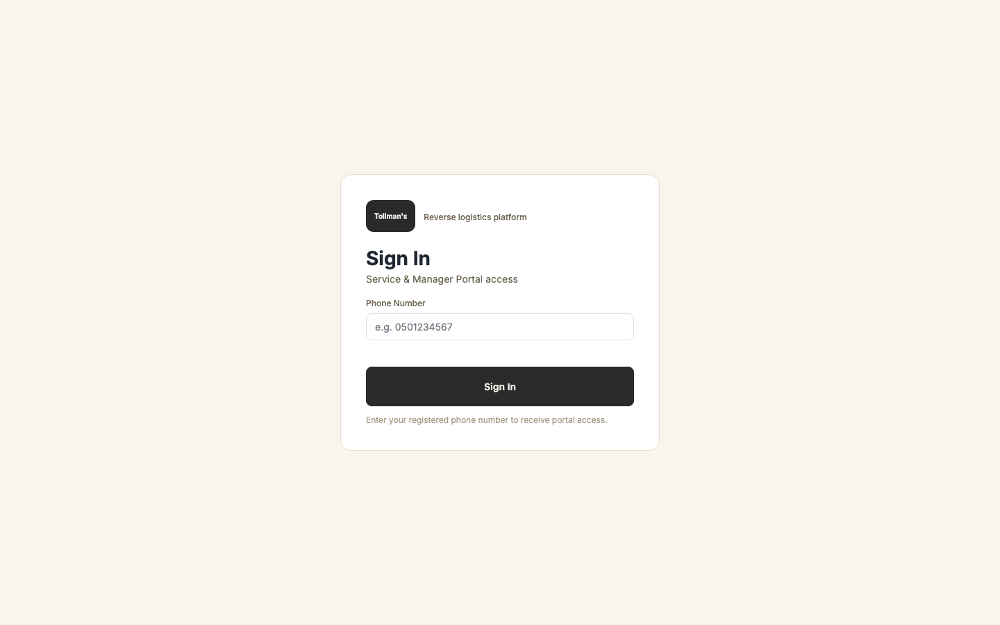

מסך ההתחברות הוא המסך היחיד שאינו דורש הרשאה. הוא מוצג ללא סרגל הניווט העליון, כדף עצמאי.

### מה המשתמש ממלא

| שדה | חובה | הערות |
|---|---|---|
| `Phone Number` | כן | מספר טלפון רשום במערכת. שדה זה הוא אמצעי האימות היחיד — אין סיסמה |

### מה קורה בלחיצה על `Sign In`

1. המערכת מאמתת את המספר מול טבלת המשתמשים.
2. המשתמש נשמר ב-`HttpSession` תחת המפתח `loggedInUser`, ולצידו נשמר טוקן הגישה.
3. המשתמש מנותב לפי תפקידו (ראו סעיף 2).

### הודעות שגיאה אפשריות

| מצב | ההודעה שהמשתמש רואה |
|---|---|
| השדה נשאר ריק | `יש להזין מספר טלפון` |
| הפורמט אינו תקין (הביטוי הנדרש: `^0\d{8,9}$`) | `מספר טלפון לא תקין (לדוגמה 0501234567)` |
| מספר שאינו רשום במערכת | הודעה על כך שהמשתמש לא נמצא, תחת הכותרת `Login failed` |
| המשתמש קיים אך מסומן כלא-פעיל | `User account is inactive` |

**הערה:** אימות הפורמט מתבצע בצד הלקוח לפני שליחה (`f:validateRegex`), ולכן שגיאת פורמט אינה מגיעה כלל לשרת.

### יציאה מהמערכת

בכל מסך פנימי, קישור `Logout` בפינת סרגל הניווט מבטל את הטוקן, מנקה את ה-`HttpSession` ומחזיר את המשתמש למסך ההתחברות.

---

## 4. מודול נציג שירות

נציג השירות עובד בממשק ה-`Web`. תפקידו העיקרי הוא פתיחת קריאות החזרה חדשות באמצעות **אשף בן שלושה שלבים**, ומעקב אחריהן.

הכניסה לאשף היא דרך הקישור `New Return` בסרגל הניווט (או הכפתור בדשבורד). הקישור מוביל לנתיב `/returns/create.xhtml`, שהוא דף מעבר בלבד — הוא מפנה מיידית לשלב 1 של האשף.

מצב האשף נשמר ב-`Session` (`CreateReturnWizardBean` הוא `@SessionScoped`). לכן, ניסיון להיכנס ישירות לשלב 2 או 3 ללא השלמת השלבים הקודמים מחזיר את המשתמש אוטומטית לשלב המתאים: כניסה לשלב 2 בלי לקוח נבחר מחזירה לשלב 1, וכניסה לשלב 3 בלי רכישה נבחרת מחזירה לשלב 2.

### 4.1 אשף פתיחת קריאת החזרה — שלב 1: זיהוי לקוח

**נתיב:** `/returns/create/identify-customer.xhtml`

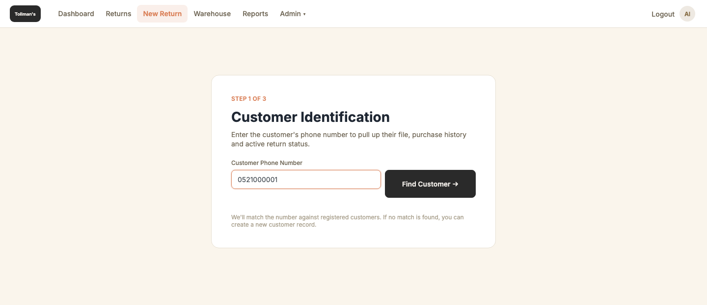

המסך מציג כרטיס יחיד ובו מחוון `STEP 1 OF 3`.

**מה המשתמש ממלא:** שדה `Customer Phone Number` אחד.

**מה קורה בלחיצה על `Find Customer →`:** המערכת מחפשת לקוח לפי מספר הטלפון. אם נמצא — המערכת טוענת את היסטוריית הרכישות שלו ומעבירה אותו לשלב 2. אם לא נמצא — המשתמש נשאר בשלב 1 ומוצגת הודעה.

**הודעות שגיאה:**

| מצב | ההודעה |
|---|---|
| השדה ריק | `יש להזין מספר טלפון` |
| פורמט לא תקין | `מספר טלפון לא תקין (לדוגמה 0501234567)` |
| אין לקוח עם המספר הזה | `Customer not found for phone: <המספר שהוזן>` |

### 4.2 אשף פתיחת קריאת החזרה — שלב 2: בחירת פריט

**נתיב:** `/returns/create/select-item.xhtml`

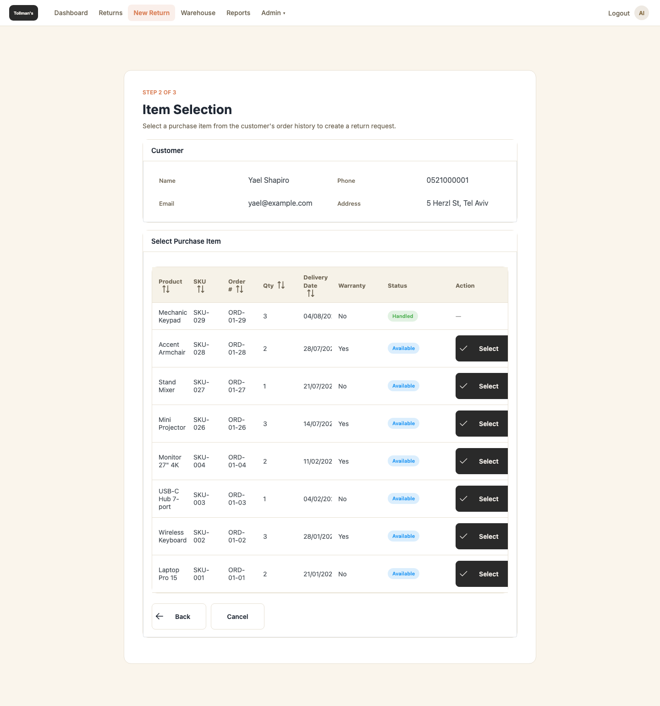

בראש המסך מוצג כרטיס `Customer` לקריאה בלבד, עם שם הלקוח, טלפון, דוא"ל וכתובת. מתחתיו טבלת היסטוריית הרכישות.

**עמודות הטבלה:** `Product`, `SKU`, `Order #`, `Qty`, `Delivery Date` (בפורמט `dd/MM/yyyy`), `Warranty` (`Yes`/`No`), `Status`, `Action`.

**חיווי הסטטוס** בעמודת `Status` הוא הלוגיקה המרכזית של המסך:

- רכישה שטרם נפתחה עבורה קריאה מסומנת `Available`, ולצידה מופיע כפתור `Select`.
- רכישה שכבר טופלה מסומנת `Handled`, ובעמודת הפעולה מופיע קו מפריד (`—`) במקום כפתור. **לא ניתן לפתוח שתי קריאות על אותה רכישה.**

**מה קורה בלחיצה על `Select`:** פרטי הרכישה מועתקים אוטומטית לטופס של שלב 3 — מזהה המוצר, מספר ההזמנה, תאריך המסירה המקורי, הכמות ומצב האחריות — והמשתמש מועבר לשלב 3.

**כפתורים נוספים:** `Back` מחזיר לשלב 1, `Cancel` יוצא מהאשף לרשימת הקריאות.

**הודעות שגיאה:**

| מצב | ההודעה |
|---|---|
| ללקוח אין היסטוריית רכישות | `No purchase history found for this customer.` (הודעת טבלה ריקה) |
| הרכישה כבר טופלה בינתיים | `This purchase has already been handled` |
| הרכישה לא נמצאה ברשימה | `Please select a purchase row` |

### 4.3 אשף פתיחת קריאת החזרה — שלב 3: קריאה חדשה

**נתיב:** `/returns/create/new-return.xhtml`

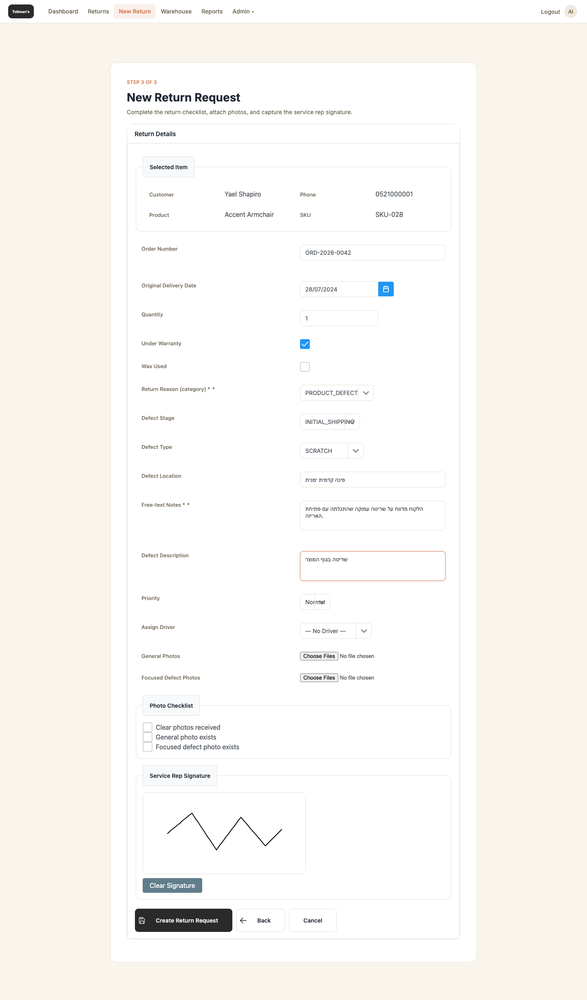

זהו המסך העמוס ביותר בממשק. הוא נפתח בקטע `Selected Item` לקריאה בלבד (לקוח, טלפון, מוצר, `SKU`), ומתחתיו טופס מלא.

#### שדות הטופס

| שדה | חובה | ברירת מחדל / הערות |
|---|---|---|
| `Order Number` | לא | ממולא מהרכישה. עד 60 תווים |
| `Original Delivery Date` | לא | ממולא מהרכישה. בורר תאריכים בפורמט `dd/MM/yyyy` |
| `Quantity` | לא | ממולא מהרכישה. ערך מינימלי 1 |
| `Under Warranty` | — | תיבת סימון, ממולאת מהרכישה |
| `Was Used` | — | תיבת סימון |
| `Return Reason (category)` | **כן** | רשימה נפתחת מערכי `ReturnReason` |
| `Defect Stage` | לא | רשימה נפתחת מערכי `DefectStage` |
| `Defect Type` | לא | רשימה נפתחת מערכי `DefectType` |
| `Defect Location` | לא | טקסט חופשי |
| `Free-text Notes` | **כן** | תיבת טקסט רב-שורתית |
| `Defect Description` | לא | תיבת טקסט רב-שורתית |
| `Priority` | — | `Normal` (ברירת מחדל) / `High` / `Urgent` |
| `Assign Driver` | לא | רשימת הנהגים הפעילים; ברירת המחדל `— No Driver —` |
| `General Photos` | לא | העלאת קבצים מרובה |
| `Focused Defect Photos` | לא | העלאת קבצים מרובה |

מתחת לשדות מופיעים שני קטעים נוספים:

- **`Photo Checklist`** — שלוש תיבות סימון לתיעוד עצמי של הנציג: `Clear photos received`, `General photo exists`, `Focused defect photo exists`.
- **`Service Rep Signature`** — משטח חתימה. כפתור `Clear Signature` מנקה אותו.

#### הכללים העסקיים שהמסך אוכף

**כלל התיעוד החזותי:** אם הפריט סומן `Was Used`, או שנבחר `Defect Type` כלשהו, או שסיבת ההחזרה היא `PRODUCT_DEFECT` — חובה להעלות **לפחות תמונה אחת** (כללית או ממוקדת פגם). ניסיון לשמור בלעדיה נחסם.

#### מה קורה בלחיצה על `Create Return Request`

1. הקריאה נוצרת בסטטוס `OPEN`, ללא ברקוד.
2. הרכישה שנבחרה בשלב 2 מסומנת `handled = true` ולא תוצע שוב.
3. אם נבחר נהג — הנהג משויך לקריאה, והסטטוס עובר אוטומטית ל-`WAITING_FOR_PICKUP`. **אם לא נבחר נהג, הקריאה נשארת ב-`OPEN`** וממתינה לשיוך נהג.
4. התמונות הכלליות נשמרות כ-`SERVICE_GENERAL_IMAGE`, תמונות הפגם כ-`SERVICE_DEFECT_IMAGE`, והחתימה כ-`SERVICE_REP_SIGNATURE` — כולן ל-`Cloudinary`.
5. האשף מתאפס והמשתמש מנותב למסך פרטי הקריאה שנוצרה.

**כפתורים נוספים:** `Back` מחזיר לשלב 2, `Cancel` יוצא לרשימת הקריאות.

#### הודעות שגיאה

| מצב | ההודעה |
|---|---|
| לא נבחרה סיבת החזרה | `יש לבחור סיבת החזרה` |
| שדה ההערות ריק | `יש להזין הערות חופשיות` |
| מספר הזמנה ארוך מ-60 תווים | `מספר הזמנה ארוך מדי (עד 60 תווים)` |
| כמות קטנה מ-1 | `הכמות חייבת להיות לפחות 1` |
| נדרש תיעוד חזותי ולא הועלתה תמונה | `Defective or used items require at least one general or focused-defect photo.` |
| משתמש אחר עדכן את אותה קריאה במקביל | `הרשומה עודכנה על ידי משתמש אחר. רענן את הדף ונסה שוב` |

### 4.4 מסך רשימת קריאות

**נתיב:** `/returns/list.xhtml` | **תפקידים:** נציג שירות, מחסנאי, מנהל

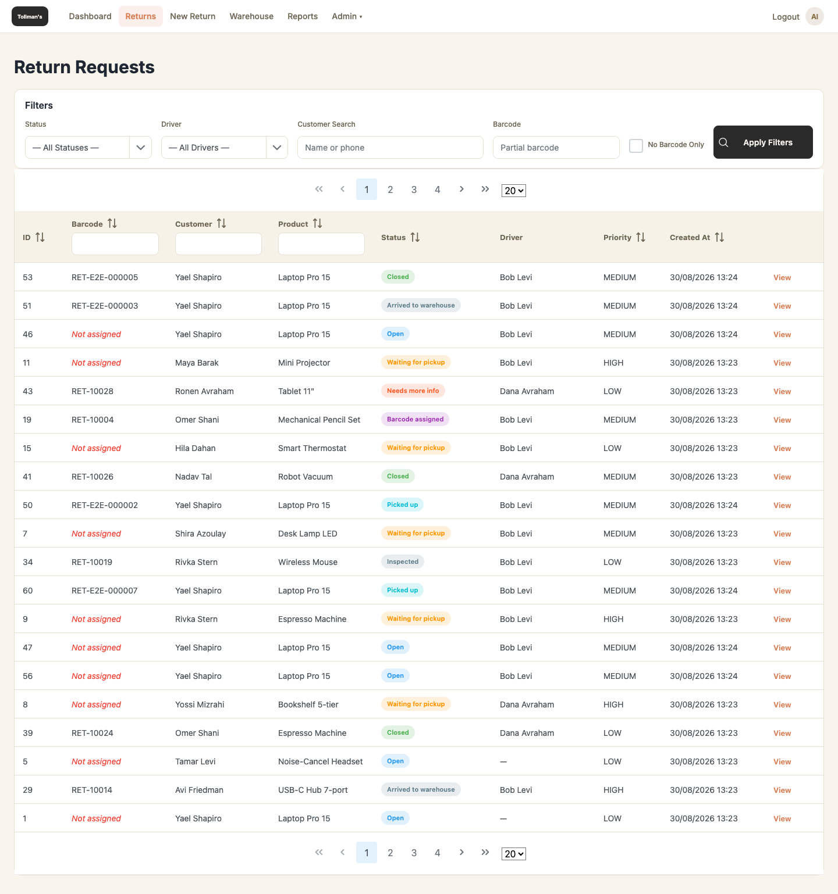

המסך מורכב משני חלקים: כרטיס `Filters` בראש הדף, ומתחתיו טבלת הקריאות.

#### סרגל הסינון

| פקד | תיאור |
|---|---|
| `Status` | רשימה נפתחת של כל ערכי `ReturnStatus`, בתוספת `— All Statuses —` |
| `Driver` | רשימת הנהגים הפעילים, בתוספת `— All Drivers —` |
| `Customer Search` | טקסט חופשי — מתאים לשם הלקוח **או** למספר הטלפון שלו (ללא תלות ברישיות) |
| `Barcode` | חיפוש לפי ברקוד חלקי |
| `No Barcode Only` | תיבת סימון — מציגה רק קריאות שטרם שויך להן ברקוד |
| `Apply Filters` | מפעיל את הסינון |

**התנהגות ראויה לציון:** סינון לפי סטטוס וסינון לפי נהג נבדקים בזה אחר זה ולא במקביל — כאשר נבחר סטטוס, בחירת הנהג מתעלמת. שדות `Customer Search`, `Barcode` ו-`No Barcode Only` מסננים את התוצאה המתקבלת ולכן כן מצטברים.

#### הטבלה

עמודות: `ID`, `Barcode`, `Customer`, `Product`, `Status`, `Driver`, `Priority`, `Created At`, ועמודת פעולה עם קישור `View`.

- קריאה ללא ברקוד מציגה בעמודת `Barcode` את הטקסט `Not assigned`.
- עמודת `Status` מציגה תווית צבעונית (`chip`) עם שם קריא של הסטטוס — למשל `Waiting for pickup` במקום `WAITING_FOR_PICKUP`.
- קריאה ללא נהג מציגה `—`.
- הטבלה עמודית (20 שורות בעמוד, ניתן לשנות ל-10 / 20 / 50), וניתנת למיון לפי מספר עמודות במקביל.
- כאשר אין תוצאות: `No return requests found.`

### 4.5 מסך פרטי קריאה

**נתיב:** `/returns/details.xhtml?id=<מזהה>` | **תפקידים:** נציג שירות, מחסנאי, מנהל

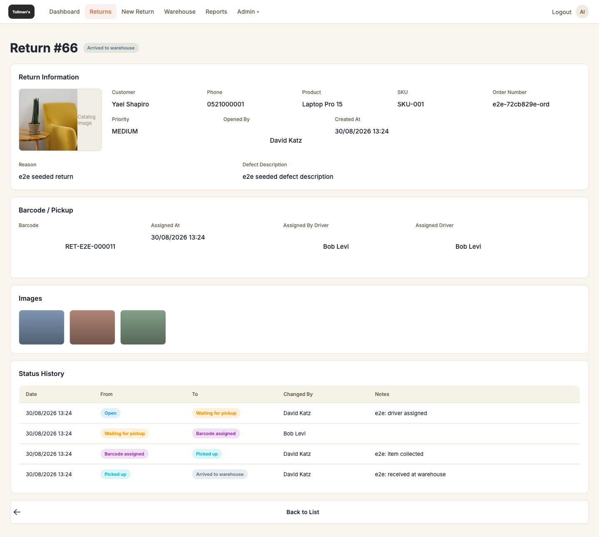

המסך מציג את מלוא המידע על קריאה אחת, לקריאה בלבד. בראשו כותרת `Return #<מזהה>` לצד תווית הסטטוס הנוכחי.

**כרטיס `Return Information`:** תמונת הקטלוג של המוצר (או ריבוע `Catalog image` כשאין תמונה), ולצידה שם הלקוח, טלפון, שם המוצר, `SKU`, מספר הזמנה, עדיפות, שם פותח הקריאה ומועד הפתיחה. מתחתיהם, לרוחב מלא: `Reason` ו-`Defect Description`.

**כרטיס `Barcode / Pickup`:** כאשר טרם שויך ברקוד, מוצגת התראה `Barcode not assigned` עם ההסבר `No barcode has been assigned to this return request yet.`, וכל השדות מציגים `—`. לאחר השיוך מוצגים: הברקוד עצמו, מועד השיוך, שם הנהג ששייך אותו, ושם הנהג המשויך לקריאה.

**כרטיס `Images`:** מוצג רק כאשר קיימות תמונות. גלריית תמונות ממוזערות של כל התמונות שהועלו לקריאה — משירות, מהנהג וכן החתימות.

**כרטיס `Status History`:** מוצג רק כאשר קיימת היסטוריה. טבלה עם העמודות `Date`, `From`, `To`, `Changed By`, `Notes`. עמודות `From` ו-`To` מציגות תוויות סטטוס צבעוניות; במעבר הראשון עמודת `From` מציגה `—`.

**כפתור `Back to List`** מחזיר לרשימת הקריאות.

**כאשר המזהה אינו תקין או אינו קיים,** כל התוכן מוחלף בהודעה: `Return request not found.` עם ההסבר `Please check the ID parameter.`

### 4.6 מסך הדשבורד

**נתיב:** `/dashboard.xhtml` | **תפקידים:** נציג שירות, מחסנאי, מנהל

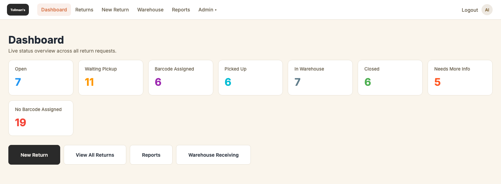

מסך הבית של רוב המשתמשים. הוא מציג שמונה כרטיסי `KPI` בזמן אמת:

| הכרטיס | מה הוא סופר |
|---|---|
| `Open` | קריאות פתוחות שטרם שויך להן נהג |
| `Waiting Pickup` | קריאות שממתינות לאיסוף |
| `Barcode Assigned` | קריאות שהנהג שייך להן ברקוד |
| `Picked Up` | קריאות שנאספו מהלקוח |
| `In Warehouse` | קריאות שהגיעו למחסן |
| `Closed` | קריאות שנסגרו |
| `Needs More Info` | קריאות שהמחסן ביקש עליהן מידע נוסף |
| `No Barcode Assigned` | קריאות שטרם שויך להן ברקוד כלל |

מתחת לכרטיסים ארבעה כפתורי ניווט: `New Return`, `View All Returns`, `Reports`, `Warehouse Receiving`.

---

## 5. מודול נהג — אפליקציית `Android`

הנהג עובד באפליקציית `Android` בזמן האיסוף מהלקוח. האפליקציה מתקשרת עם השרת ב-`REST API` בלבד ואינה ניגשת לבסיס הנתונים.

### 5.0 התחברות

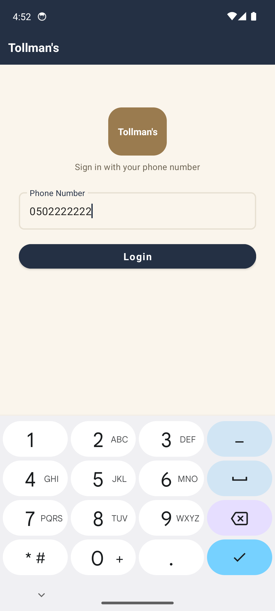

מסך ההתחברות (`LoginActivity`) זהה במהותו לזה שבממשק ה-`Web`: שדה מספר טלפון וכפתור `Login`. אם קיים כבר `session` שמור במכשיר, האפליקציה מדלגת על המסך ומנתבת ישירות.

**הודעות שגיאה:** `Please enter phone number` (שדה ריק), `Login failed. Check phone number.` (מספר לא מזוהה), `Network error: <פירוט>` (אין תקשורת עם השרת).

### 5.1 רשימת האיסופים

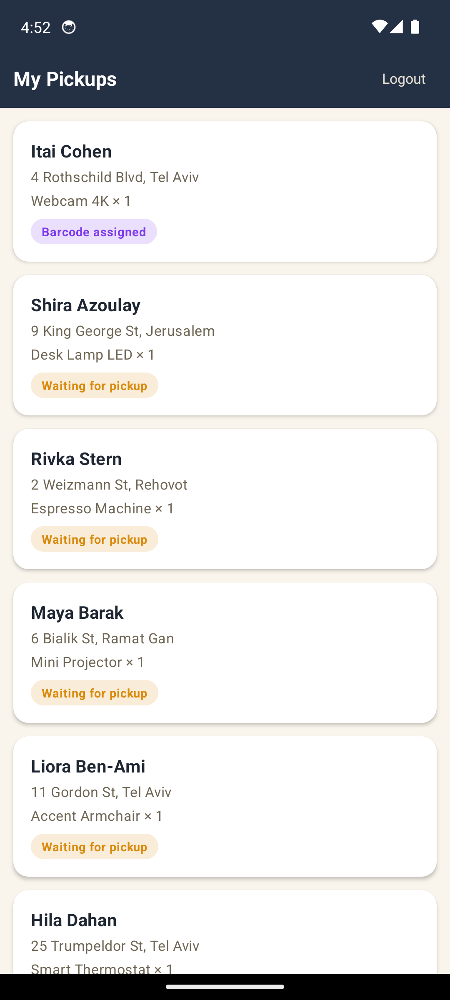

מסך הבית של הנהג (`PickupListActivity`) — כותרת `My Pickups`. הוא מציג רשימת כרטיסים של הקריאות שהוקצו לנהג המחובר: שם הלקוח, הכתובת, שם המוצר וכמות, וכן תוויות סטטוס וסטטוס ברקוד.

הרשימה נטענת מחדש במשיכה כלפי מטה (`swipe to refresh`). לחיצה על כרטיס פותחת את מסך פרטי האיסוף. בפינת הכותרת קיים `Logout`.

כאשר אין איסופים מוקצים, מוצגת הודעת ריק. בכשל טעינה מוצג `Failed to load pickups`.

### 5.2 מסך פרטי איסוף

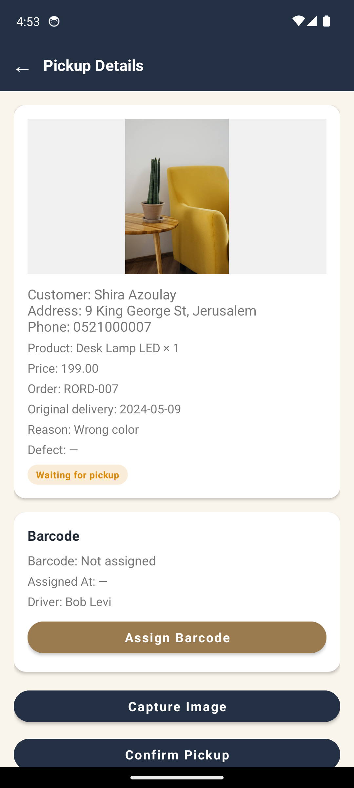

מסך `Pickup Details` הוא צומת הפעולה של הנהג. הוא מציג:

- **פרטי לקוח:** שם, כתובת, טלפון.
- **פרטי מוצר:** שם וכמות, מחיר, מספר הזמנה, תאריך מסירה מקורי, ותמונת קטלוג.
- **סיבת ההחזרה ופרטי הפגם** כפי שהוזנו על ידי נציג השירות.
- **קטע הברקוד:** הברקוד המשויך, מועד השיוך והנהג ששייך אותו — או הנחיה לשיוך כאשר עדיין אין ברקוד.

**הפעולות במסך:** `Assign Barcode`, `Capture Image`, `Confirm Pickup`, `View History` (מציג את ציר הזמן של הקריאה).

המסך נטען מחדש בכל חזרה אליו, כך שהברקוד והתמונות שנוספו מתעדכנים מיידית.

### 5.3 שיוך ברקוד

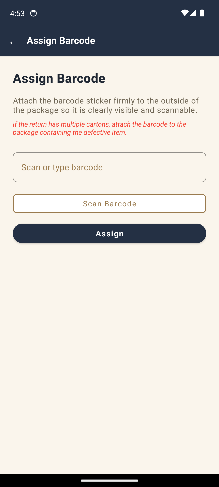

לפני השיוך, הנהג מדביק פיזית על האריזה מדבקת ברקוד פנויה. המסך מציג את הנחיות ההדבקה: להדביק היטב על החלק החיצוני של האריזה כך שהברקוד יהיה גלוי וניתן לסריקה, וכאשר ההחזרה כוללת מספר קרטונים — להדביק על האריזה שמכילה את הפריט הפגום.

**שתי דרכי הזנה:** כפתור `Scan` פותח את סורק המצלמה עם ההנחיה `Scan the barcode sticker on the item`; לחלופין ניתן להקליד את הקוד ידנית בשדה ולהקיש `Assign`. סריקה מוצלחת ממלאת את השדה ומפעילה את השיוך אוטומטית.

**מה קורה בשיוך מוצלח:** מוצגת ההודעה `Barcode assigned successfully!`, הקריאה עוברת לסטטוס `BARCODE_ASSIGNED`, נרשמת שורה בהיסטוריית הסטטוסים על שם הנהג, והמסך נסגר בחזרה לפרטי האיסוף.

**הודעות שגיאה:**

| מצב | ההודעה |
|---|---|
| השדה ריק | `Barcode cannot be empty` |
| הסריקה בוטלה | `Scan cancelled` |
| הקריאה או הנהג לא נמצאו | `Return or driver not found` |
| הברקוד כבר משויך לקריאה אחרת | `Barcode already used by another return` |
| עדכון מקבילי | `This return was just updated by another user. Refresh and try again.` |

### 5.4 צילום תמונות

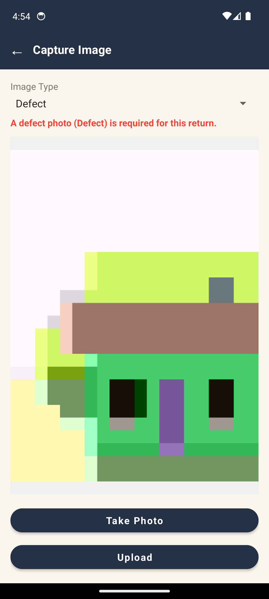

מסך `Capture Image` מאפשר צילום והעלאה של שלושה סוגי תמונות, הנבחרים ברשימה נפתחת:

| התווית במסך | הערך הנשלח לשרת |
|---|---|
| `Product` | `DRIVER_PRODUCT_IMAGE` |
| `Distant` | `DRIVER_DISTANT_IMAGE` |
| `Defect` | `DRIVER_DEFECT_IMAGE` |

**סדר חובה:** תמונת הפגם היא חובה, והאפליקציה אוכפת אותה כתנאי מקדים — **לא ניתן להעלות תמונת מוצר או תמונה ממרחק לפני שהועלתה תמונת פגם**. ניסיון לעשות זאת מציג: `Please capture and upload the required defect photo first.`

הזרימה במסך: `Take Photo` פותח את מצלמת המכשיר, התמונה מוצגת בתצוגה מקדימה ומוקטנת אוטומטית לרוחב או גובה מרביים של 1600 פיקסלים, ולאחר מכן `Upload` שולח אותה לשרת ומשם ל-`Cloudinary`.

**הודעות שגיאה נוספות:** `No photo to upload` (לחיצה על העלאה ללא תמונה), `No camera app available`, `Upload failed: <קוד>`, `Network error: <פירוט>`.

### 5.5 אישור איסוף וחתימה

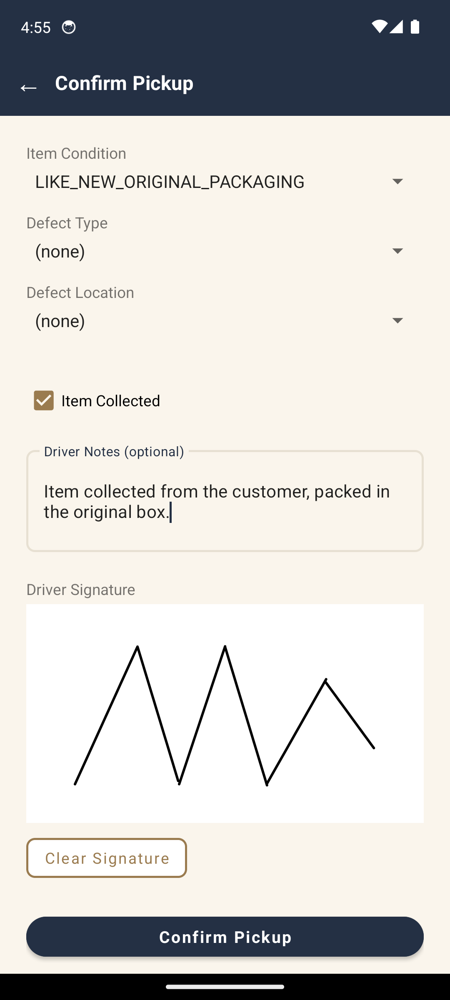

מסך `Confirm Pickup` הוא השלב האחרון בעבודת הנהג.

**תנאי סף לפתיחת הפעולה:** כפתור האישור **מושבת** עד ששני התנאים מתקיימים — לקריאה שויך ברקוד, ולקריאה קיימת לפחות תמונה אחת של הנהג. כשהתנאי אינו מתקיים מוצגת הודעה מסבירה: `Confirm disabled: barcode not yet assigned` או `Confirm disabled: capture a photo first`.

**מה הנהג ממלא:**

| שדה | חובה | ערכים |
|---|---|---|
| `Item Condition` | כן | חמשת ערכי `ItemCondition` |
| `Defect Type` | לא | תשעת ערכי `DefectType`, בתוספת `(none)` |
| `Defect Location` | לא | ששת ערכי `DefectLocation`, בתוספת `(none)` |
| שדה מיקום חופשי | מותנה | מופיע **רק** כאשר נבחר `OTHER` במיקום הפגם |
| `Item Collected` | — | תיבת סימון: האם הפריט נאסף פיזית |
| הערות נהג | לא | טקסט חופשי |
| `Driver Signature` | **כן** | משטח חתימה; `Clear Signature` מנקה |

**מה קורה בלחיצה על אישור:**

1. החתימה נשמרת כקובץ `PNG` ומועלית לשרת כתמונה מסוג `DRIVER_SIGNATURE`.
2. רק לאחר שההעלאה הצליחה, נשלח אישור האיסוף עם כל השדות.
3. נוצרת רשומת `PickupUpdate`, והקריאה עוברת ל-`PICKED_UP`.
4. מוצגת ההודעה `Pickup confirmed!` והמסך נסגר.

**הודעות שגיאה:**

| מצב | ההודעה |
|---|---|
| נבחר `OTHER` אך לא הוזן תיאור מיקום | `Please describe the defect location` |
| משטח החתימה ריק | `A driver signature is required` |
| כשל בשמירת החתימה | `Failed to capture signature` |
| כשל בהעלאת החתימה | `Signature upload failed: <קוד>` |
| הסטטוס אינו מאפשר את המעבר | `Cannot confirm pickup — barcode not yet assigned` |
| עדכון מקבילי | `This return was just updated by another user. Refresh and try again.` |

---

## 6. מודול מחסן

המחסנאי הוא המשתמש היחיד שעובד בשני ערוצים במקביל: ממשק ה-`Web` ואפליקציית ה-`Android`. שני הערוצים חולקים את אותם נתונים ואותם מעברי סטטוס.

### 6.1 קליטה לפי ברקוד בממשק ה-`Web`

**נתיב:** `/warehouse/receiving.xhtml` | **תפקיד:** מחסנאי

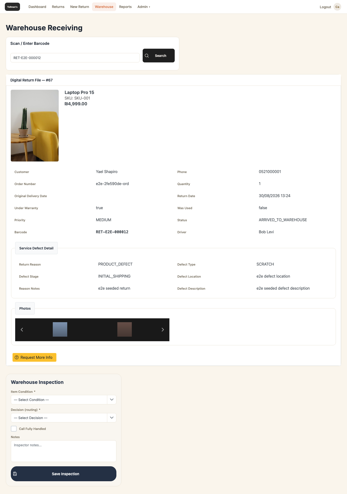

זהו מסך הבית של המחסנאי — הוא מנותב אליו אוטומטית מיד לאחר ההתחברות.

בראש המסך כרטיס `Scan / Enter Barcode` ובו שדה יחיד (חובה) וכפתור `Search`. השדה מיועד לקלט של סורק ברקודים פיזי, אך ניתן גם להקליד ידנית.

**מה קורה בחיפוש מוצלח:** התיק הדיגיטלי המלא של הקריאה נפתח מתחת לשדה החיפוש.

**כאשר הברקוד אינו נמצא:** `Barcode not found` עם ההסבר `No return request found with barcode: <הברקוד שהוזן>`.

### 6.2 התיק הדיגיטלי

התיק הדיגיטלי (`Digital Return File — #<מזהה>`) מרכז את כל מה שנאסף על הקריאה לאורך התהליך:

| הקטע | מה מוצג |
|---|---|
| כותרת המוצר | תמונת קטלוג, שם המוצר, `SKU`, ומחיר בשקלים |
| פרטי ליבה | שם לקוח, טלפון, מספר הזמנה, כמות, תאריך מסירה מקורי, תאריך פתיחת הקריאה, אחריות, האם היה בשימוש, עדיפות, סטטוס, ברקוד ונהג |
| `Service Defect Detail` | סיבת ההחזרה, סוג הפגם, שלב הפגם, מיקום הפגם, הערות הנציג ותיאור הפגם |
| `Photos` | גלריה של כל תמונות השירות והנהג. **החתימות מוחרגות מהגלריה** ומוצגות בנפרד |
| `Driver Pickup Assessment` | טבלה עם הערכת הנהג: מצב הפריט, סוג הפגם, מיקום הפגם (כולל התיאור החופשי בסוגריים), האם נאסף, והערות |
| חתימות | חתימת נציג השירות וחתימת הנהג זו לצד זו |

הקטעים `Photos` ו-`Driver Pickup Assessment` מוצגים רק כאשר קיים בהם תוכן.

#### שתי פעולות מותנות סטטוס

בתחתית התיק מופיעים כפתורים לפי הסטטוס הנוכחי — **בכל רגע נתון לכל היותר אחד מהם מוצג**:

| הכפתור | מוצג כאשר | הפעולה | אישור נדרש |
|---|---|---|---|
| `Mark as Arrived` | הסטטוס הוא `PICKED_UP` | מעביר את הקריאה ל-`ARRIVED_TO_WAREHOUSE` | `Mark this return as arrived at warehouse?` |
| `Request More Info` | הסטטוס הוא `ARRIVED_TO_WAREHOUSE` | מעביר את הקריאה ל-`NEEDS_MORE_INFO` | `Send this return back for more info?` |

לאחר סימון הגעה מוצגת ההודעה `Marked as arrived`; לאחר בקשת מידע נוסף — `More info requested`.

### 6.3 בדיקה והחלטה בממשק ה-`Web`

טופס `Warehouse Inspection` מוצג בתחתית המסך **רק כאשר** הסטטוס הוא `ARRIVED_TO_WAREHOUSE` או `INSPECTED`.

| שדה | חובה | ערכים |
|---|---|---|
| `Item Condition` | **כן** | חמשת ערכי `ItemCondition` |
| `Decision (routing)` | **כן** | שבעת ערכי `WarehouseDecision` — מלאי כחדש, סיווג `B`, שפיים, עיצוב מחדש, הקפאה לטיפול נוסף, תיקון, השמדה |
| `Call Fully Handled` | — | תיבת סימון |
| `Notes` | לא | הערות המחסנאי |

**מה קורה בלחיצה על `Save Inspection`:** נשמרת רשומת בדיקה עם המשתמש המחובר כבודק, והקריאה עוברת אוטומטית לסטטוס `INSPECTED`. מוצגת ההודעה `Inspection saved`.

**הערה חשובה על סגירת הקריאה:** בממשק ה-`Web` סימון `Call Fully Handled` נשמר ברשומת הבדיקה, אך **המסך אינו מבצע בעצמו את המעבר ל-`CLOSED`**. סגירת הקריאה מתבצעת ממסך בדיקת המחסן באפליקציית ה-`Android` (סעיף 6.4).

### 6.4 מסכי המחסנאי באפליקציית `Android`

#### תור העבודה

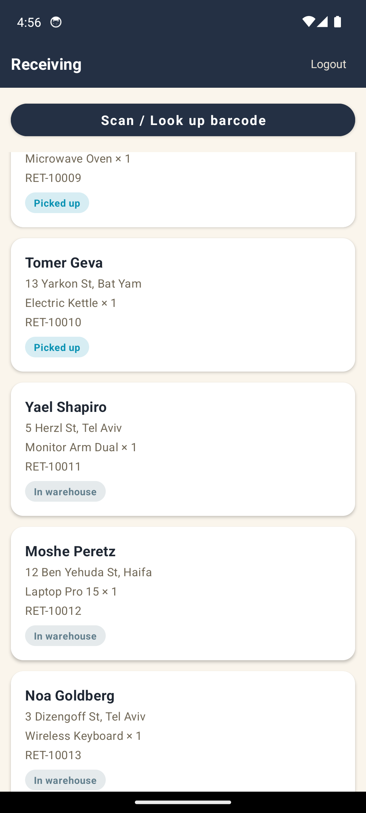

מסך `Storekeeper Queue` הוא מסך הבית של המחסנאי באפליקציה. הוא מציג רשימה מאוחדת של קריאות בשני סטטוסים — `PICKED_UP` (בדרך למחסן) ו-`ARRIVED_TO_WAREHOUSE` (הגיעו וממתינות לבדיקה). הרשימה מתרעננת במשיכה כלפי מטה.

בראש המסך כפתור `Scan / Look up barcode`. כשאין פריטים בתור מוצג `No returns awaiting handling`.

#### סריקת ברקוד

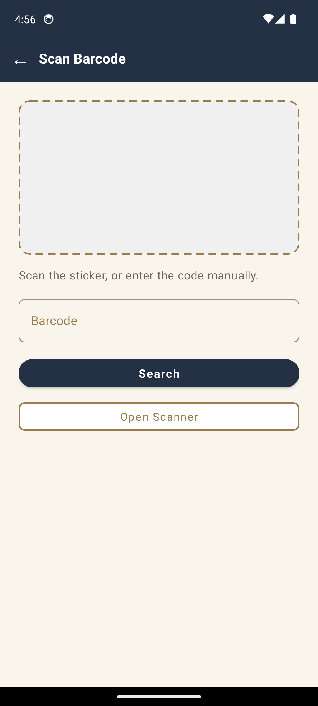

מסך `Scan Barcode` עם ההנחיה `Scan the sticker, or enter the code manually.` — כפתור `Open Scanner` פותח את מצלמת המכשיר, ולחלופין ניתן להקליד את הקוד ולהקיש `Look up`. סריקה מוצלחת מובילה ישירות לתיק ההחזרה.

**הודעות שגיאה:** `Barcode cannot be empty`, `Scan cancelled`, `No return found for this barcode`, `Lookup failed (<קוד>)`.

#### תיק ההחזרה

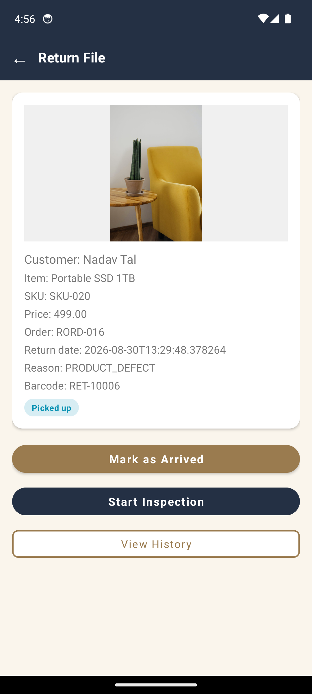

מסך `Return File` מציג את פרטי הקריאה, ובתחתיתו שלושה כפתורים: `Mark as Arrived`, `Inspect` ו-`View History`. שני הכפתורים הראשונים מופעלים או מושבתים לפי הסטטוס הנוכחי, באותה לוגיקה כמו בממשק ה-`Web`.

`Mark as Arrived` מציג בהצלחה `Marked as arrived to warehouse`.

#### בדיקת מחסן והחלטה

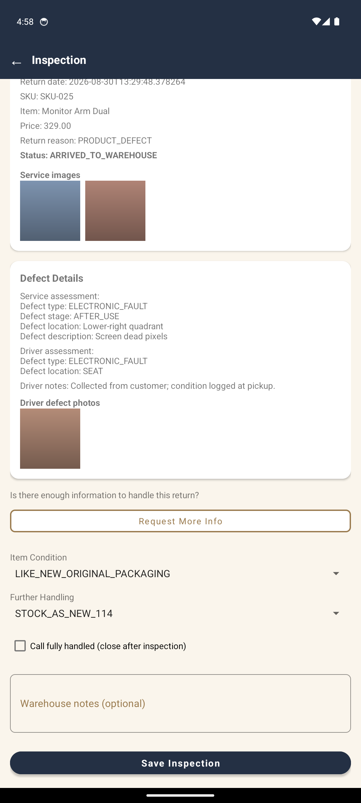

מסך `Warehouse Inspection` הוא המסך שמסיים את מחזור החיים של הקריאה. הוא בנוי סביב שאלה מנחה אחת:

> **`Is there enough information to handle this return?`**

**בחלק העליון — מידע לקריאה בלבד:** פרטי הקריאה, תמונות השירות (`Service images`), פרטי הפגם (`Defect Details`), תמונות הפגם של הנהג (`Driver defect photos`), הערכת הנהג והערותיו.

**אם המידע אינו מספיק:** כפתור `Request More Info` פותח חלון עם שדה חופשי (`What information is missing? (optional)`) וכפתור `Send`. שליחה מעבירה את הקריאה ל-`NEEDS_MORE_INFO` ומציגה `Requested more info`.

**אם המידע מספיק:** המחסנאי ממלא את טופס הבדיקה — `Item Condition`, `Further Handling` (החלטת המחסן), הערות, ותיבת הסימון `Call fully handled (close after inspection)` — ולוחץ `Save Inspection`.

**סדר הפעולות בשמירה:**

1. רשומת הבדיקה נשמרת והקריאה עוברת ל-`INSPECTED`.
2. אם `Call fully handled` **לא** סומן — מוצג `Inspection saved` והמסך נסגר.
3. אם סומן — נשלחת מיד בקשה נוספת שמעבירה את הקריאה ל-`CLOSED`, ומוצג `Inspection saved and request closed`.

**מצב כשל חלקי:** אם הבדיקה נשמרה אך הסגירה נכשלה, ההודעה משקפת זאת במפורש — `Inspection saved, but closing failed (<קוד>)` — כדי שהמחסנאי לא יחשוב שהבדיקה אבדה.

---

## 7. מודול מנהל

### 7.1 מסך דוחות ו-`KPI`

**נתיב:** `/reports.xhtml` | **תפקיד:** מנהל

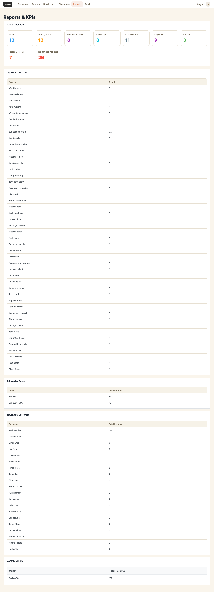

המסך נפתח בפאנל `Status Overview` עם תשעה כרטיסי `KPI` — שמונת הכרטיסים של הדשבורד, בתוספת `Inspected` (פריטים שנבדקו במחסן).

מתחתיו ארבעה פאנלים של דוחות. **כל פאנל מוצג רק כאשר יש בו נתונים** — פאנל ריק אינו מרונדר כלל:

| הפאנל | העמודות |
|---|---|
| `Top Return Reasons` | `Reason`, `Count` |
| `Returns by Driver` | `Driver`, `Total Returns` |
| `Returns by Customer` | `Customer`, `Total Returns` |
| `Monthly Volume` | `Month`, `Total Returns` |

### 7.2 מסכי ניהול נתוני מערכת

ארבעת מסכי הניהול בנויים באותה תבנית בדיוק, ולכן מתוארים כאן במשותף.

| המסך | הנתיב | התמונה |
|---|---|---|
| ניהול משתמשים | `/admin/users.xhtml` | 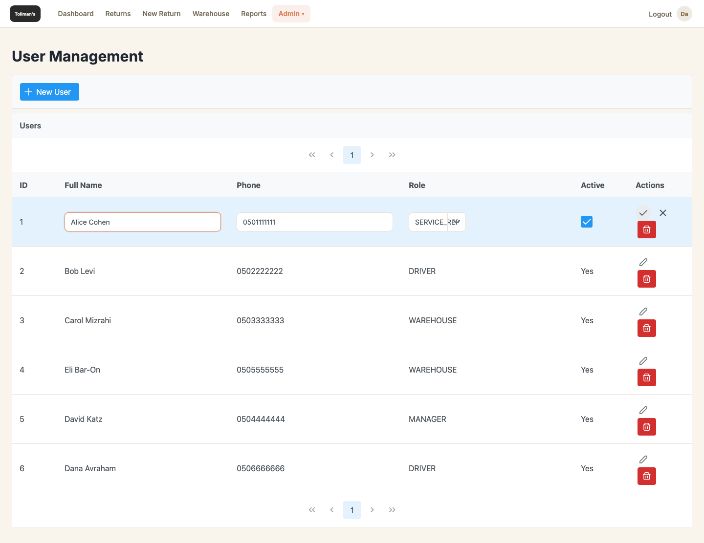 |
| ניהול לקוחות | `/admin/customers.xhtml` | 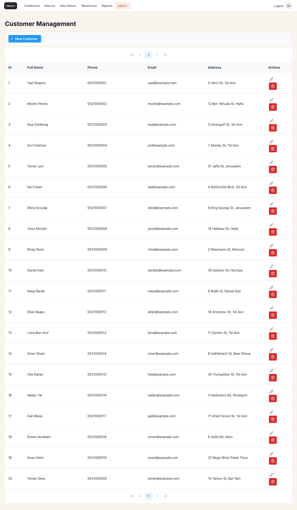 |
| ניהול מוצרים | `/admin/products.xhtml` | 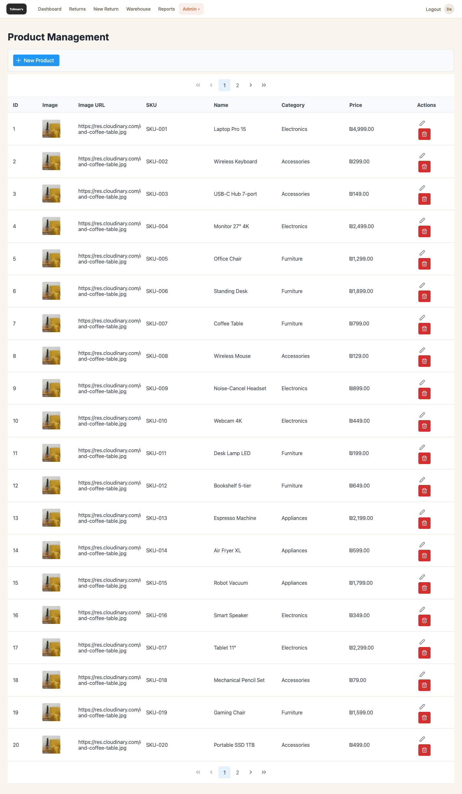 |
| ניהול נהגים | `/admin/drivers.xhtml` | 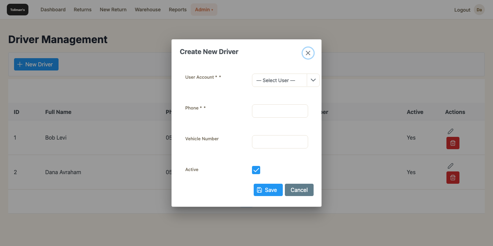 |

#### תבנית העבודה המשותפת

**עריכה בשורה:** בעמודת `Actions` של כל שורה מופיע עיפרון עריכה. לחיצה עליו הופכת את תאי השורה לשדות קלט; לאחר מכן ניתן לשמור (`Save`) או לבטל (`Cancel`). השמירה מתבצעת מיידית בשרת ומרעננת את הטבלה.

**יצירת רשומה חדשה:** כפתור בראש המסך (`New User` / `New Customer` / `New Product` / `New Driver`) פותח חלון דו-שיח נפרד עם הטופס המלא, וכפתורי `Save` ו-`Cancel`. הטופס בחלון עומד בפני עצמו, כך ששדות החובה שבו אינם משפיעים על שמירת שורות בטבלה הראשית.

**מחיקה:** אייקון פח אשפה בעמודת `Actions`. **כל מחיקה מוגנת בחלון אישור** של הדפדפן — למשל `Delete user <שם המשתמש>?` או `Delete this driver?`.

#### השדות ובדיקות התקינות לפי מסך

| המסך | שדות חובה | בדיקות תקינות ותקרות אורך |
|---|---|---|
| משתמשים | שם מלא, טלפון, תפקיד | שם מלא עד 120 תווים; טלפון בפורמט `0XXXXXXXX(X)`; תפקיד מתוך `Role` |
| לקוחות | שם מלא, טלפון | שם מלא עד 120; דוא"ל עד 120 ובפורמט תקין; כתובת עד 255 |
| מוצרים | `SKU`, שם מוצר | `SKU` עד 60; שם עד 120; קטגוריה עד 80; מחיר מספר לא-שלילי; כתובת תמונה עד 500. ניתן גם להעלות קובץ תמונה במקום להזין כתובת |
| נהגים | חשבון משתמש קיים, טלפון | מספר רכב עד 30; טלפון בפורמט `0XXXXXXXX(X)` |

**הערה על יצירת נהג:** רשומת נהג אינה נוצרת "מאפס" — היא נוצרת על ידי **שיוך משתמש קיים** מהרשימה הנפתחת `User Account`, בתוספת פרטי רכב וטלפון. לכן יש ליצור תחילה את המשתמש במסך ניהול המשתמשים.

#### הודעות השגיאה במסכי הניהול

| השדה | ההודעה |
|---|---|
| שם מלא ריק | `יש להזין שם מלא` |
| שם מלא ארוך מדי | `שם מלא ארוך מדי (עד 120 תווים)` |
| טלפון ריק | `יש להזין מספר טלפון` |
| טלפון לא תקין | `מספר טלפון לא תקין (לדוגמה 0501234567)` |
| לא נבחר תפקיד | `יש לבחור תפקיד` |
| דוא"ל לא תקין | `כתובת אימייל לא תקינה (עד 120 תווים)` |
| כתובת ארוכה מדי | `הכתובת ארוכה מדי (עד 255 תווים)` |
| `SKU` ריק | `יש להזין SKU` |
| שם מוצר ריק | `יש להזין שם מוצר` |
| מחיר שלילי | `המחיר חייב להיות מספר לא שלילי` |
| מספר רכב ארוך מדי | `מספר הרכב ארוך מדי (עד 30 תווים)` |
| לא נבחר משתמש לנהג | `יש לבחור משתמש` |

---

## 8. מפת מעברי הסטטוסים

מחזור החיים של קריאת החזרה נאכף בשרת על ידי מפת מעברים מותרים (`ALLOWED_TRANSITIONS` ב-`ReturnRequestService`). כל ניסיון לבצע מעבר שאינו במפה נדחה, והמשתמש מקבל שגיאה במקום שינוי סטטוס.

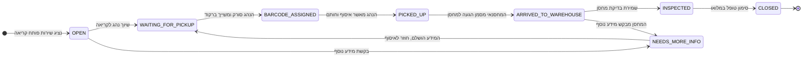
```mermaid
stateDiagram-v2
    direction LR
    [*] --> OPEN : נציג שירות פותח קריאה

    OPEN --> WAITING_FOR_PICKUP : שיוך נהג לקריאה
    OPEN --> NEEDS_MORE_INFO : בקשת מידע נוסף

    WAITING_FOR_PICKUP --> BARCODE_ASSIGNED : הנהג סורק ומשייך ברקוד

    BARCODE_ASSIGNED --> PICKED_UP : הנהג מאשר איסוף וחותם

    PICKED_UP --> ARRIVED_TO_WAREHOUSE : המחסנאי מסמן הגעה למחסן

    ARRIVED_TO_WAREHOUSE --> INSPECTED : שמירת בדיקת מחסן
    ARRIVED_TO_WAREHOUSE --> NEEDS_MORE_INFO : המחסן מבקש מידע נוסף

    INSPECTED --> CLOSED : סימון טופל במלואו

    NEEDS_MORE_INFO --> WAITING_FOR_PICKUP : המידע הושלם, חוזר לאיסוף

    CLOSED --> [*]
```

### קריאת המפה מנקודת מבט המשתמש

| הסטטוס | מה זה אומר למשתמש | מי מוציא אותו מהמצב הזה |
|---|---|---|
| `OPEN` | הקריאה נפתחה אך אין לה נהג | נציג שירות — שיוך נהג |
| `WAITING_FOR_PICKUP` | הנהג יודע על הקריאה וממתין לאסוף | נהג — שיוך ברקוד באפליקציה |
| `BARCODE_ASSIGNED` | המדבקה על האריזה והמערכת מכירה אותה | נהג — אישור איסוף |
| `PICKED_UP` | הפריט אצל הנהג, בדרך למחסן | מחסנאי — סימון הגעה |
| `ARRIVED_TO_WAREHOUSE` | הפריט במחסן וממתין לבדיקה | מחסנאי — שמירת בדיקה או בקשת מידע |
| `INSPECTED` | הבדיקה בוצעה והתקבלה החלטת טיפול | מחסנאי — סימון "טופל במלואו" |
| `NEEDS_MORE_INFO` | חסר מידע; הקריאה חוזרת אחורה | נציג שירות / נהג — השלמת המידע |
| `CLOSED` | סוף התהליך. **מצב סופי — לא ניתן לצאת ממנו** | — |

### שתי הערות מדויקות על אכיפת המפה

1. **`CLOSED` הוא מצב סופי מוחלט.** במפה הוא ממופה לקבוצת מעברים ריקה, ולכן כל ניסיון לשנות סטטוס של קריאה סגורה נדחה.

2. **שיוך ברקוד אינו עובר דרך מפת המעברים.** פעולת `assignBarcode` מציבה את הסטטוס `BARCODE_ASSIGNED` ישירות, ורושמת בעצמה שורה בהיסטוריית הסטטוסים. משמעות מעשית: שיוך ברקוד יצליח גם מסטטוס שאינו `WAITING_FOR_PICKUP`. לעומת זאת, המעבר ל-`PICKED_UP` שמבוצע מיד לאחר אישור האיסוף **כן** נבדק מול המפה, ולכן ניסיון לאשר איסוף מסטטוס שגוי נכשל בשלב הזה.

---

## 9. טיפול בשגיאות מנקודת מבט המשתמש

המערכת מבחינה בין ארבע משפחות של שגיאות, וכל אחת מוצגת למשתמש בדרך אחרת.

### 9.1 שגיאות קלט — נתפסות בדפדפן, לפני השרת

בדיקות התקינות בממשק ה-`Web` (`required`, `f:validateRegex`, `f:validateLength`, `f:validateLongRange`) פועלות לפני שהבקשה נשלחת לשרת. ההודעה מופיעה **מתחת לשדה עצמו** בטקסט אדום, והשדה נשאר עם הערך שהוזן כדי שניתן יהיה לתקן ולא להקליד מחדש.

כל הודעות הקלט במערכת נוסחו בעברית. ריכוז מלא שלהן מופיע בסעיפים 3, 4.1, 4.3 ו-7.2.

### 9.2 שגיאות עסקיות — כללי התהליך

אלו שגיאות שהמשתמש קיבל בהן החלטה סבירה, אך היא סותרת כלל של התהליך:

| הכלל | מתי מופיעה | ההודעה |
|---|---|---|
| רכישה נפתחת פעם אחת | ניסיון לפתוח קריאה שנייה על אותה רכישה | `This purchase has already been handled` |
| תיעוד חזותי לפריט פגום או משומש | שמירת קריאה כזו ללא תמונה | `Defective or used items require at least one general or focused-defect photo.` |
| ברקוד ייחודי | הנהג משייך ברקוד שכבר בשימוש | `Barcode already used by another return` |
| תמונת פגם קודמת לשאר | הנהג מעלה תמונת מוצר לפני תמונת פגם | `Please capture and upload the required defect photo first.` |
| חתימת נהג חובה | אישור איסוף ללא חתימה | `A driver signature is required` |
| מעבר סטטוס לא חוקי | פעולה שאינה מותרת מהסטטוס הנוכחי | באפליקציה: `Cannot confirm pickup — barcode not yet assigned`. ב-`REST`: קוד `ILLEGAL_STATUS_TRANSITION` עם סטטוס `409` |

בממשק ה-`Web` הודעות אלו מוצגות ברכיב `p:messages` בראש הטופס. באפליקציית ה-`Android` הן מוצגות כ-`Toast`.

### 9.3 עריכה מקבילה — שני משתמשים על אותה קריאה

זהו המקרה העדין ביותר, והוא מקבל טיפול ייעודי. כאשר שני משתמשים פותחים את אותה קריאה ומעדכנים אותה כמעט בו-זמנית — למשל שני מחסנאים שסורקים את אותה אריזה — העדכון השני היה נכשל בעבר בשגיאה טכנית כללית.

**המנגנון:** ל-`ReturnRequest` הוסף שדה `version` (נעילה אופטימית של `JPA`). כאשר משתמש מנסה לשמור על גבי גרסה שכבר הוחלפה, השרת מזהה זאת ומחזיר שגיאה ייעודית עם הקוד `CONCURRENT_MODIFICATION` וסטטוס `409`, במקום שגיאת שרת פנימית (`500`).

**מה המשתמש רואה:**

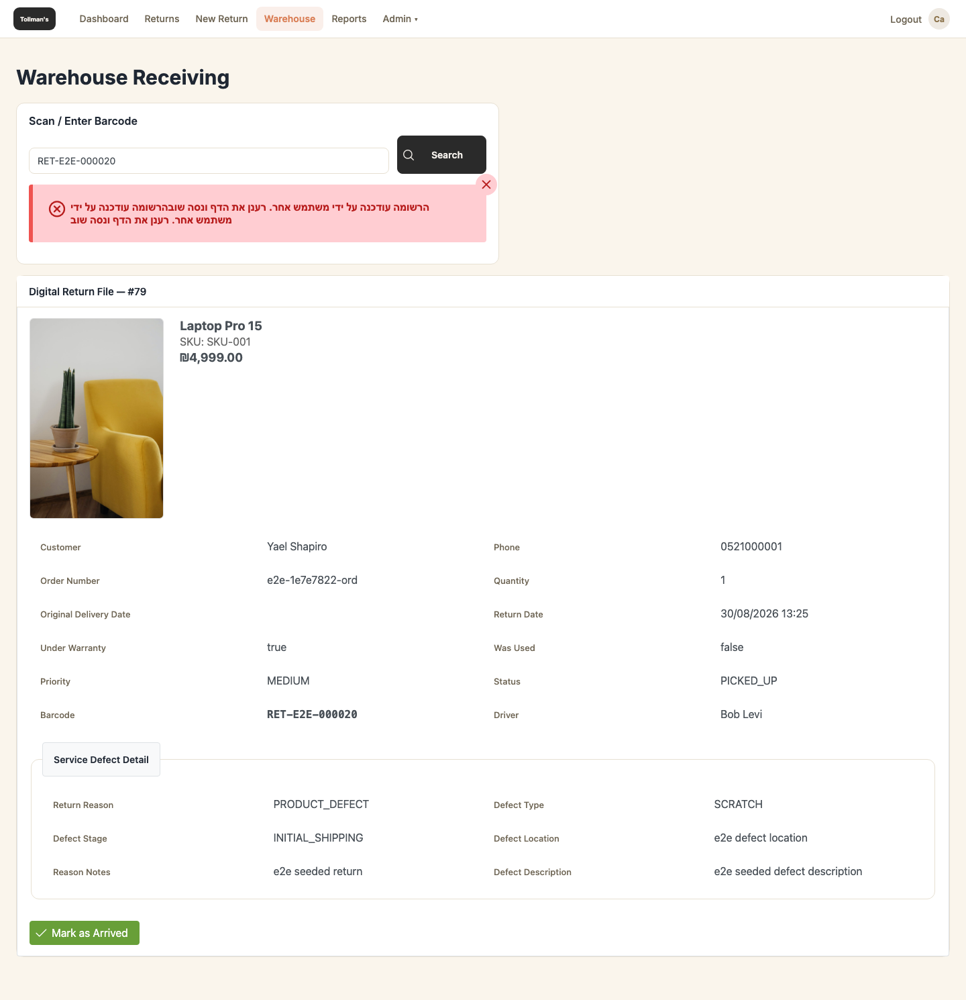

| הערוץ | ההודעה |
|---|---|
| ממשק ה-`Web` (אשף יצירת קריאה, קליטת מחסן) | **`הרשומה עודכנה על ידי משתמש אחר. רענן את הדף ונסה שוב`** |
| אפליקציית ה-`Android` | `This return was just updated by another user. Refresh and try again.` |

ההודעה מנוסחת כהנחיה ולא כתלונה: היא אומרת למשתמש בדיוק מה לעשות — לרענן ולנסות שוב — משום שלאחר הרענון הוא יראה את השינוי שהמשתמש האחר ביצע, ויוכל להחליט אם פעולתו עדיין נדרשת.

**היכן ההודעה מופיעה בפועל:** בממשק ה-`Web` — בשמירת קריאה חדשה מהאשף, בסימון הגעה למחסן, בבקשת מידע נוסף ובשמירת בדיקת מחסן. באפליקציה — בשיוך ברקוד, באישור איסוף, בסימון הגעה למחסן, בבקשת מידע נוסף, בשמירת הבדיקה ובסגירת הקריאה.

**מקרה מיוחד שראוי לציון:** אם בדיקת המחסן נשמרה בהצלחה אך **סגירת** הקריאה נתקלה בהתנגשות, האפליקציה מציגה `Inspection saved.` ולאחריו את הודעת ההתנגשות. הניסוח מבהיר שהבדיקה לא אבדה ושרק הסגירה נכשלה.

### 9.4 שגיאות טכניות

| הסוג | מה המשתמש רואה |
|---|---|
| אין תקשורת עם השרת (`Android`) | `Network error: <פירוט>` |
| רשומה שאינה קיימת | `Return request not found.` / `No return found for this barcode` |
| שגיאת שרת בלתי צפויה | ב-`REST`: קוד `INTERNAL_ERROR` עם סטטוס `500` והודעה גנרית (`An unexpected error occurred`). פרטי החריגה נרשמים ליומן השרת ואינם נחשפים למשתמש |

**עיקרון מנחה:** המערכת אינה חושפת למשתמש הודעות חריגה טכניות. שגיאה בלתי מזוהה מוצגת כהודעה גנרית, ופרטיה נשמרים ביומן לצורך תחקור.

---

*סוף המסמך.*
